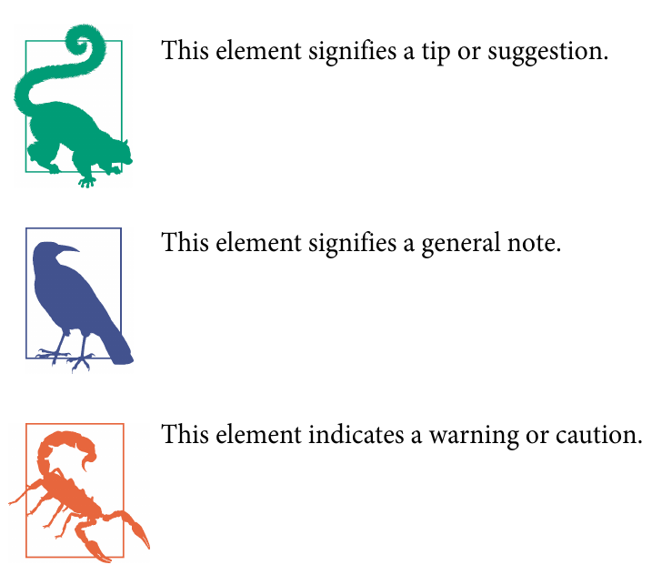

# 前言
在云原生社区及其他领域，eBPF 已成为近年来最热门的技术话题之一。在网络、安全、可观察性等领域，新一代强大的工具和项目已经使用eBPF作为平台构建（并且更多工具和项目还在继续创建中），相比从前，提供了更好的性能和准确性。BPF 相关会议（例如 eBPF Summit 和 Cloud Native eBPF Day）吸引了数千名与会者和观众，在撰写本文时，eBPF Slack 社区拥有超过 14,000 名成员。

为什么 eBPF 被选择作为这么多基础设施工具的底层技术？它如何实现所承诺的性能改进？ 从性能跟踪到网络流量加密，eBPF 在这些不同的技术领域有何用处？

本书旨在通过让读者了解 eBPF 的工作原理并介绍如何编写 eBPF 代码来回答这些问题。

## 这本书适合谁
本书适合对 eBPF 感到好奇并想了解更多其工作原理的开发人员、系统管理员、操作员和学生。它将为那些想要探索自己编写 eBPF 程序的人提供基础。由于 eBPF 为全新一代的基础设施和工具提供了一个出色的平台，因此 eBPF 开发人员在未来几年可能会获得有酬就业。

但您不一定需要计划自己编写 eBPF 代码才能使本书对您有用。如果您在运营、安全或任何其他涉及软件基础设施的角色中工作，您现在或未来几年可能会遇到基于 eBPF 的工具。如果您了解这些工具的内部原理，您将能够更好地有效地使用它们。例如，如果您知道事件如何触发 eBPF 程序，您就会有一个更好的思维模型，准确了解基于 eBPF 的工具在向您显示性能指标时真正测量的内容。如果您是应用程序开发人员，您可能还会接触到其中一些基于 eBPF 的工具 - 例如，如果您正在调整应用程序的性能，您可能会使用像 Parca 这样的工具来生成火焰图，显示哪些函数正在使用最多的时间。如果您正在评估安全工具，本书将帮助您了解 eBPF 的优势所在，以及如何避免以幼稚的方式使用它，从而降低对抗攻击的效果。

即使您现在没有使用eBPF工具，我也希望这本书能给您带来有趣的见解，让您了解您以前可能没有考虑过的Linux领域。大多数开发者认为内核是理所当然的，因为他们使用的编程语言具有方便的高层抽象，使他们能够专注于应用开发的工作——这已经够难的了！他们使用调试器和性能分析器等工具帮助他们！他们使用调试器和性能分析器等工具来帮助他们有效地完成工作。了解调试器或性能工具的内部工作原理可能很有趣，但这并不是必须的。然而，对我们中的许多人来说，深入了解更多信息是有趣和充实的。同样，大多数人在使用eBPF工具时，不必担心它们是如何构建的。阿瑟-克拉克（Arthur C. Clarke）写道："任何足够先进的技术都与魔术无异。"但就我个人而言，我喜欢深入研究并找出魔术的原理。您可能和我一样，觉得有必要探索 eBPF 编程，以更好地感受这项技术的可能性。如果是这样，我想您会喜欢这本书。

# 这本书涵盖的内容
eBPF继续以相当快的速度发展，这使得编写不需要不断更新的综合参考变得相当困难。然而，有一些基本原理和基本原则不太可能发生重大变化，而这正是本书讨论的内容。

第 1 章介绍了为什么eBPF这项技术如此强大，并解释了在操作系统内核中运行自定义程序的能力如何实现许多令人兴奋的功能。

在第 2 章中，事情变得更加具体，您将看到一些“Hello World”示例，向您介绍 eBPF 程序和映射（maps）的概念。

第 3 章更详细地介绍了 eBPF 程序以及它们如何在内核中运行，第 4 章探讨了用户空间应用程序和 eBPF 程序之间的接口。

近年来 eBPF 面临的一大挑战是跨内核版本的兼容性问题。第 5 章着眼于解决此问题的“一次编译，到处运行”（CO-RE）方法。

验证过程可能是区分 eBPF 和内核模块的最重要特征。我将在第 6 章中向您介绍 eBPF 验证器。

在第 7 章中，您将了解许多不同类型的 eBPF 程序及其附着点（attachment points）。其中许多附着点都位于网络堆栈内，第 8 章更详细地探讨了 eBPF 在网络功能中的应用。第 9 章着眼于如何使用 eBPF 来构建安全工具。

如果您想编写与 eBPF 程序交互的用户空间应用程序，有许多库和框架可以提供帮助。第 10 章概述了各种编程语言的选项。

最后，在第 11 章中，我将告诉您 eBPF 世界中可能出现的一些未来发展。

# 必备知识
本书假设您对Linux上的基本shell命令和使用编译器将源代码转换为可执行程序的概念感到熟悉。书中有一些从Makefile提取的简单示例，假设您至少对make如何使用这些文件有最基本了解。

有很多 Python、C 和 Go 语言的代码示例。您不需要深入了解这些语言就可以从这些示例中获得一些东西，但如果您乐于阅读一些代码，您将从本书中获得最大收益。我还假设您熟悉指针的概念，它用来标识内存位置。

# 示例代码和练习
本书中有很多代码实例。如果您想自己尝试一下，您可以在[https://github.com/lizrice/learning-ebpf](https://github.com/lizrice/learning-ebpf)上找到配套的GitHub仓库以及安装和运行代码的说明。

我还在大多数章节的末尾加入了练习，以帮助您通过扩展例子或编写自己的程序来探索eBPF编程。

由于 eBPF 不断发展，因此您可用的功能取决于您运行的内核版本。许多适用于早期版本的限制在更高版本中已被取消或放宽。 Iovisor 项目对添加了不同 BPF 功能的内核版本进行了有用的概述，在本书中，我试图指出我所描述的特定功能的添加时间。这些示例是使用 5.15 版内核进行测试的，在撰写本文时，一些流行的 Linux 发行版尚不支持这样最新的内核版本。如果您在本书出版后不久阅读这本书，您可能会发现某些功能无法在您的组织生产环境中使用的 Linux 内核上运行。

# eBPF只适用于Linux吗？
eBPF 最初是为 Linux 开发的。没有什么特别的原因为什么同样的方法不能在其他操作系统中使用——事实上，微软一直在为 Windows 开发 eBPF 实现。我在第 11 章中简要讨论了这一点，但在本书的其余部分中，我将重点关注 Linux 实现，并且所有示例都将来自 Linux。

# 本书中使用的约定
本书使用以下印刷约定：
- *斜体*
    - 表示新的术语、URL、电子邮件地址、文件名和文件扩展名。
- `等宽`
    - 用于程序列表，以及在段落中引用程序元素，例如变量或函数名称、数据库、数据类型、环境变量、语句和关键字。
- **`等宽粗体`**
    - 显示应由用户逐字输入的命令或其他文本。
- *`等宽斜体`*
    - 显示应替换为用户提供的值或由上下文确定的值的文本。
    

