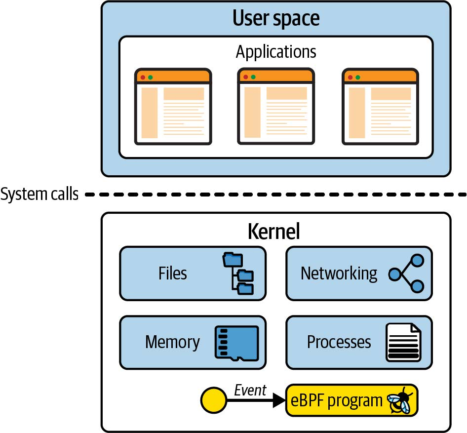
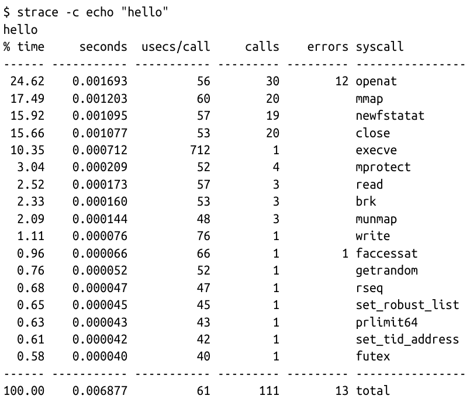
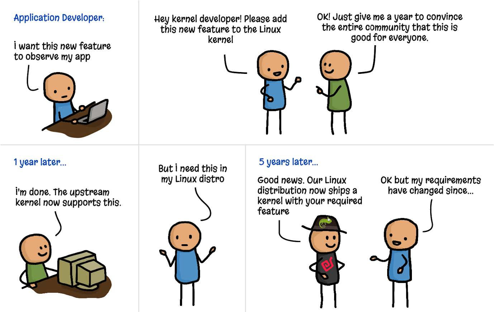
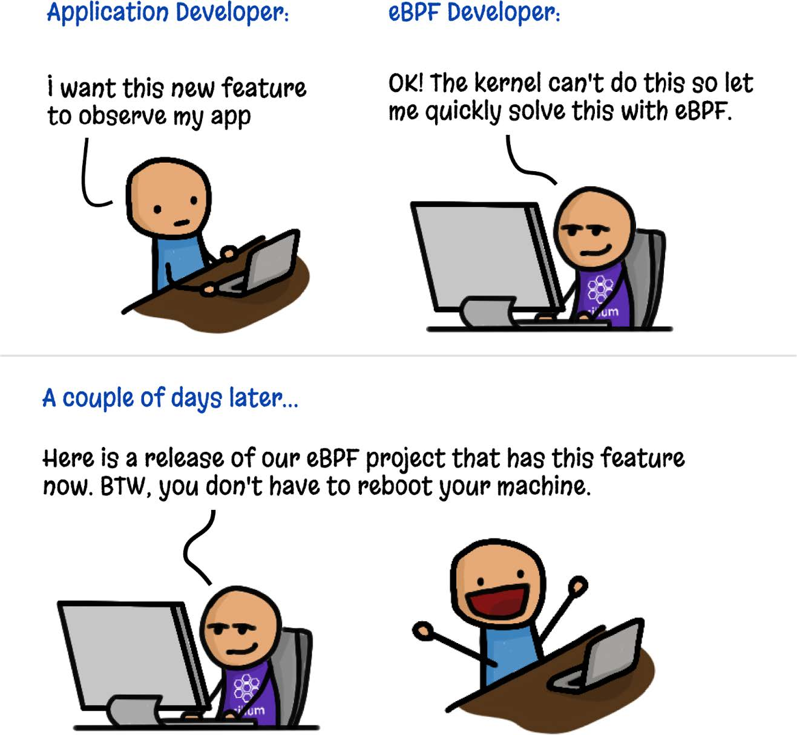
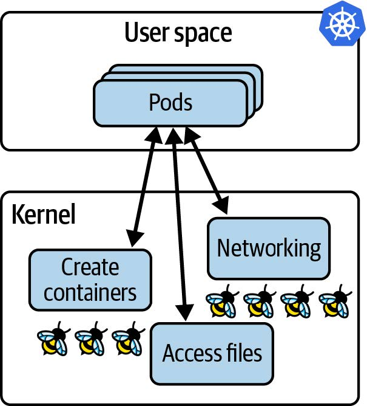
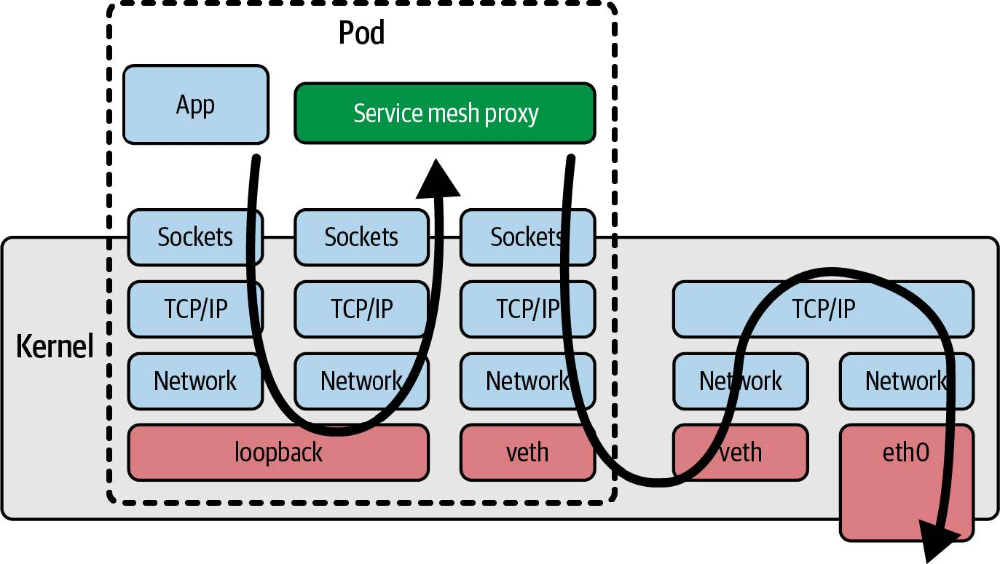

# 第一章 什么是 eBPF，为何它如此重要？

eBPF 是一项革命性的内核技术，它允许开发人员编写可以动态加载到内核中的自定义代码，从而改变内核的行为方式。 （如果您对内核是什么没有信心，请不要担心——我们将在本章中很快讨论这个问题。）

这使得新一代高性能网络、可观察性和安全工具成为可能。正如您将看到的，如果您想使用这些基于 eBPF 的工具来检测应用程序，不需要以任何方式修改或重新配置应用程序，这要归功于 eBPF 在内核中的优势。

您可以使用 eBPF 执行以下操作：

- 对系统的几乎任何方面进行性能追踪
- 高性能网络，具有内置可见性
- 检测并阻止（可选）恶意活动

让我们从伯克利数据包过滤器（Berkeley Packet Filter）开始简要回顾一下 eBPF 的历史。

## eBPF 的起源：伯克利数据包过滤器

我们今天所说的 "eBPF" 起源于 BSD 数据包过滤器，在 1993 年由劳伦斯伯克利国家实验室的 Steven McCanne 和 Van Jacobson 撰写的一篇论文中首次描述。（[“The BSD Packet Filter: A New Architecture for User-level Packet Capture”](https://www.tcpdump.org/papers/bpf-usenix93.pdf)，作者：Steven McCanne 和 Van Jacobson。）这篇论文讨论了一个可以运行过滤器的假机器，过滤器是为确定是否接受或拒绝网络数据包而编写的程序。这些程序是用 BPF 指令集编写的，这是一套通用的 32 位指令，与汇编语言非常相似。下面是一个直接取自该论文的例子：

```
ldh [12]
jeq #ETHERTYPE IP, L1, L2
L1: ret #TRUE
L2: ret #0
```

这一小段代码过滤掉了不是 IP 协议的数据包。这个过滤器的输入是一个以太网数据包，第一条指令（`ldh`）从这个数据包的第 12 字节开始加载一个 2 字节的值。在下一条指令（`jeq`）中，该值与代表 IP 数据包的值进行比较。如果匹配，则执行跳转到标记为 L1 的指令，通过返回一个非零值（这里标识为 `#TRUE`）来接受该数据包。如果不匹配，则该数据包不是一个 IP 数据包，并返回 `0` 来拒绝数据包。

您可以想象（或者说，确实可以参考论文中的例子）更复杂的过滤器程序，根据数据包的其他方面做出决定。重要的是，过滤器的作者可以编写他们自己的自定义程序在内核中执行，这就是 eBPF 的核心。

BPF 是 "Berkeley Packet Filter" 的缩写，它于 1997 年首次被引入 Linux，在内核 2.1.75 版本中（这些和其他细节来自 Alexei Starovoitov 在 2015 NetDev 上的演讲 [“BPF – in-kernel virtual machine”](https://legacy.netdevconf.info/0.1/docs/starovoitov-bpf_netdev01_2015feb13.pdf)），它被用于 tcpdump 工具，作为捕获要追踪的数据包的一种有效方法。

快进到 2012 年，当时 seccomp-bpf 在内核 3.5 版本中引入。这使得 BPF 程序能够决定是否允许或拒绝用户空间应用程序进行系统调用。我们将在第 10 章中更详细地探讨这一问题。这是 BPF 从狭隘的数据包过滤范围发展到今天的通用平台的第一步。从此时起，名字中的“数据包过滤器”一词开始变得不那么有意义！

## 从 BPF 到 eBPF

从 2014 年的内核 3.18 版本开始，BPF 演变为我们所说的 "extended BPF" 或 "eBPF"。这涉及到几个重大变化：

- 为了在 64 位机器上更有效率，BPF 指令集被彻底修改，解释器也被完全重写。
- 引入了 eBPF maps，它是可以被 BPF 程序和用户空间应用程序访问的数据结构，允许它们之间共享信息。您将在第 2 章中了解 maps 。
- 添加了 `bpf()` 系统调用，以便用户空间程序可以与内核中的 eBPF 程序进行交互。您将在第 4 章中了解此系统调用。
- 添加了几个 BPF 辅助函数。您将在第 2 章中看到一些示例，并在第 6 章中看到更多详细信息。
- 添加 eBPF 验证器，以便确保 eBPF 程序可以安全运行。这将在第 6 章中讨论。

这为 eBPF 奠定了基础，但开发并没有放缓！从那时起，eBPF 有了显着的发展。

## eBPF 向生产系统的演变

自 2005 年以来，Linux 内核中就存在一个称为 _kprobes_（内核探针）的功能，允许在内核代码中的几乎任何指令上设置陷阱（traps）。开发人员可以编写内核模块，将功能附加到 kprobes 上，用于调试或性能测量。（[内核文档](https://docs.kernel.org/trace/kprobes.html)中对 kprobes 的工作原理有详细描述。）

2015 年添加了将 eBPF 程序附加到 kprobes 的功能，这是整个 Linux 系统追踪方式革命的起点。与此同时，开始在内核的网络协议栈中添加钩子，允许 eBPF 程序处理网络功能的更多方面。我们将在第 8 章中看到更多内容。

到了 2016 年，基于 eBPF 的工具已经在生产系统中被广泛使用。Netflix 的 Brendan Gregg 在跟踪方面的工作在基础设施和运维领域得到了广泛认可，他也称 eBPF "为 Linux 带来超能力"。同年， Cilium 项目的宣布引起了广泛关注，该项目是第一个在容器环境中使用 eBPF 来替代整个数据路径的网络项目。

接下来的一年，Facebook（现在是 Meta）将 Katran 项目开源。Katran 是一个四层负载均衡器，满足了 Facebook 对高度可扩展和快速的解决方案的需求。自 2017 年以来，所有发送到 Facebook.com 的数据包都通过 eBPF/XDP 进行处理。（这一精彩事实来自 Daniel Borkmann 在 KubeCon 2020 上发表的题为 [“eBPF 和 Kubernetes：用于扩展微服务的小助手”](https://youtu.be/99jUcLt3rSk)。）对我个人而言，这一年点燃了我对这项技术所带来可能性的兴奋，因为我在德克萨斯州奥斯汀的 DockerCon 上看到了 Thomas Graf 关于 eBPF 和 Cilium 项目的演讲。

2018 年，eBPF 成为 Linux 内核中的一个独立子系统，由来自 Isovalent 的 Daniel Borkmann 和来自 Meta 的 Alexei Starovoitov 担任其维护者（后来同样来自 Meta 的 Andrii Nakryiko 加入了他们）。同年引入了 BPF 类型格式 (BTF)，这使得 eBPF 程序更具可移植性。我们将在第 5 章中探讨这一点。

2020 年引入了 LSM BPF，允许 eBPF 程序附加到 Linux 安全模块 (Linux Security Module，LSM) 内核接口。这表明 eBPF 的第三个主要用途已经确定：很明显，除了网络和可观察性之外，eBPF 也是一个出色的安全工具平台。

多年来，由于 300 多名内核开发人员和相关用户空间工具（例如 bpftool，我们将在第 3 章中介绍）、编译器和编程语言库的许多贡献者的工作，eBPF 的功能得到了显着增长。程序曾经被限制为 4,096 条指令，但该限制已增长到 100 万条经过验证的指令，并且通过对尾调用和函数调用的支持（您将在第 2 章和第 3 章中看到），该限制实际上已变得无关紧要。

> 提示
> 为了更深入地了解 eBPF 的历史，有谁比从一开始就从事该工作的维护者更适合参考？
> Alexei Starovoitov 精彩地介绍了 [BPF 的历史](https://youtu.be/DAvZH13725I)，从软件定义网络 (SDN)的起源开始。在本次演讲中，他讨论了早期 eBPF 补丁被内核接受的策略，并透露了 eBPF 的正式诞生日期是 2014 年 9 月 26 日，那天接受了包括验证器、BPF 系统调用和 Maps 的第一批补丁。
> Daniel Borkmann 也讨论了 BPF 的历史以及它在支持网络和跟踪功能方面的演进。我强烈推荐他的演讲[“eBPF 和 Kubernetes：用于扩展微服务的小助手”](https://youtu.be/99jUcLt3rSk)。这个演讲中充满了有趣的信息。

## 艰难的命名

eBPF 的应用范围已经远远超出了数据包过滤的范畴，因此这个缩写现在本质上已经失去了意义，它已经成为一个独立的术语。由于当前广泛使用的 Linux 内核都对 "extended" 部分提供支持，因此 eBPF 和 BPF 这两个术语通常可以互换使用。在内核源代码和 eBPF 编程中，常用的术语是 BPF。例如，在第 4 章中我们会看到，与 eBPF 进行交互的系统调用是`bpf()`，辅助函数以`bpf_`开头，不同类型的(e)BPF 程序以`BPF_PROG_TYPE`开头的名称进行标识。在内核社区之外，"eBPF"这个名称似乎已经被广泛使用，例如在社区网站 [ebpf.io](https://ebpf.io) 上和 [eBPF 基金会](http://ebpf.foundation)的名称中都使用了这个术语。

## Linux 内核

要理解 eBPF，您需要对 Linux 中内核空间和用户空间之间的区别有深入的了解。我在我的报告 "What Is eBPF?" 中谈到了这一点，并将其中的一些内容进行调整，形成接下来的几个段落。

Linux 内核是应用程序和它们运行的硬件之间的软件层。应用程序在一个称为用户空间的非特权层中运行，无法直接访问硬件。相反，应用程序使用系统调用（syscall）接口向内核发出请求，以代表其执行操作。这种硬件访问可以涉及读写文件、发送或接收网络流量，甚至只是访问内存。内核还负责协调并发进程，使许多应用程序可以同时运行。这在图 1-1 中有所说明。

作为应用程序开发者，通常我们不直接使用系统调用接口，因为编程语言提供了高级抽象和标准库，这些更易于编程的接口。因此，很多人对内核在我们的程序运行时所做的工作并不了解。如果您想了解内核被调用的频率，可以使用 strace 工具来显示应用程序所有系统调用。



_图 1-1. 用户空间中的应用程序使用系统调用接口向内核发出请求_

下面是一个例子，使用 cat 命令将单词 "hello" 输出到屏幕上涉及了 100 多个系统调用：



由于应用程序在很大程度上依赖于内核，如果我们能观察应用程序与内核的交互，就可以了解应用程序的行为。通过使用 eBPF，我们可以在内核中添加工具来获得观察能力。

例如，如果您能拦截打开文件的系统调用，您就可以准确地查看应用程序访问的文件。但是，如何进行拦截呢？让我们考虑一下，如果我们想修改内核，添加新代码，在每次调用该系统调用时创建某种输出，会涉及到什么问题。

## 向内核添加新功能

Linux 内核非常复杂，在撰写本文时，其代码行数约为 3000 万行。要对任何代码库进行更改，都需要对现有代码有一定的了解，因此除非您已经是一个内核开发者，否则这可能会带来一些挑战。

此外，如果您希望将您的修改贡献给上游，您将面临一个不纯粹是技术上的挑战。Linux 是一个通用的操作系统，用于各种环境和情况。这意味着，如果您希望您的修改成为官方 Linux 版本的一部分，那就不是简单的编写代码就可以了。代码必须被社区接受（更具体地说是由 Linux 的创造者 Linus Torvalds 和主要开发者接受），认为这个修改对于所有人都有更大的好处。这并不一定成功——提交的内核补丁中只有三分之一被接受。

假设您已经找到了一个良好的技术方法来拦截打开文件的系统调用。经过数月的讨论和您的辛勤开发工作，假设这个修改被内核接受了。太棒了！但是要多久才能让这个修改到达所有人的机器上呢？

Linux 内核每两到三个月就会发布一个新版本，但即使一个修改已经包含在其中一个版本中，它距离大多数人的生产环境还有一段时间。这是因为我们大多数人不直接使用 Linux 内核，而是使用像 Debian、Red Hat、Alpine 和 Ubuntu 这样的 Linux 发行版，它们将 Linux 内核的一个版本与其他各种组件打包在一起。您可能会发现您喜欢的发行版正在使用几年前的内核版本。

例如，很多企业用户使用 Red Hat Enterprise Linux（RHEL）。在撰写本文时，当前的发布版本是 RHEL 8.5，日期为 2021 年 11 月，它使用的是 Linux 内核的 4.18 版本。这个内核发布于 2018 年 8 月。

正如图 1-2 中的漫画所示，从想法阶段到将新功能纳入生产环境的 Linux 内核中，需要几乎数年的时间。



_图 1-2. 向内核添加功能（漫画：Vadim Shchekoldin，Isovalent）_

## Kernel Modules

如果您不想等待数年才能使您的修改进入内核，还有另一种选择。Linux 内核被设计为接受内核模块，可以按需加载和卸载。如果您想改变或扩展内核的行为，编写一个模块无疑是一种方法。内核模块可以被分发供他人使用，而不依赖于官方的 Linux 内核发布，因此它不必被接受到主要的上游代码库中。

在这里最大的挑战仍然是完全进行内核编程。用户对使用内核模块历来非常谨慎，原因很简单：如果内核代码崩溃，它将导致整个机器和运行在上面的所有程序崩溃。用户如何确信一个内核模块是安全可靠的呢？

“安全可靠”不仅仅意味着不会崩溃——用户希望知道内核模块在安全方面是安全的。它是否包含攻击者可以利用的漏洞？我们是否信任模块的作者不会在其中插入恶意代码？因为内核是特权代码，它可以访问机器上的所有内容，包括所有数据，所以内核中的恶意代码将是一个严重的安全问题。这同样适用于内核模块。

内核的安全性是 Linux 发行版需要花费如此长时间才能纳入新版本的一个重要原因。如果其他人在不同的环境中运行一个内核版本数月甚至数年，这应该会发现问题。发行版维护者可以有一些信心，认为他们向用户/客户提供的内核是经过加固的——也就是说，可以安全运行的。

eBPF 提供了一种非常不同的安全方法：eBPF 验证器，它确保只有在安全的情况下才加载 eBPF 程序——它不会导致机器崩溃或陷入死循环，并且不会允许数据被泄露。我们将在第 6 章中详细讨论验证过程。

## eBPF 程序的动态加载

eBPF 程序可以动态地加载到内核中并进行移除。一旦它们附加到一个事件上，无论是什么引发了该事件，它们都会被触发。例如，如果您将一个程序附加到打开文件的系统调用上，那么无论何时任何进程尝试打开文件，它都会被触发。无论在加载程序时该进程是否已经在运行，都不重要。与升级内核然后需要重新启动机器才能使用新功能相比，这是一个巨大的优势。

这是使用 eBPF 的可观测性或安全工具的一大优势——它可以立即获得有关机器上发生的所有事情的可见性。在运行容器的环境中，这包括对容器内部以及主机机器上运行的所有进程的可见性。我将在本章后面深入探讨这对云原生部署的影响。

此外，如图 1-3 所示，通过 eBPF，人们可以非常快速地创建新的内核功能，而无需要求其他 Linux 用户接受相同的更改。



_图 1-3. 用 eBPF 添加内核功能（漫画：Vadim Shchekoldin，Isovalent）_

## eBPF 程序的高性能

eBPF 程序是一种非常高效的添加工具的方式。一旦加载并进行即时编译（JIT-compiled，您将在第 3 章中了解到），程序将作为本机机器指令在 CPU 上运行。此外，处理每个事件不需要在内核和用户空间之间进行转换（这是一项昂贵的操作）。

2018 年描述了 eXpress Data Path（XDP）的论文中包含了一些关于 eBPF 在网络中实现性能改进的示例。例如，在 XDP 中实现路由与常规 Linux 内核实现相比，“性能提高了 2.5 倍”，并且在负载均衡方面，“XDP 相比于 IPVS 提供了 4.3 倍的性能提升”。

对于性能跟踪和安全可观测性来说，eBPF 的另一个优势是在将相关事件发送到用户空间之前，可以在内核中对其进行过滤，从而避免了相关成本。毕竟，仅过滤特定的网络数据包是最初实现 BPF 的目的。如今，eBPF 程序可以收集系统中各种事件的信息，并且它们可以使用复杂的、定制化的可编程过滤器，仅将相关的子集信息发送到用户空间。

## 云原生环境中的 eBPF

现如今，许多组织选择不通过直接在服务器上执行程序来运行应用程序。相反，许多人使用云原生的方法，例如容器、 Kubernetes 或 ECS 等编排工具，或者像 Lambda、云函数、Fargate 等无服务器(serverless)方法。所有这些方法都使用自动化技术来选择每个工作负载将在哪台服务器上运行；在无服务器环境中，我们甚至不知道每个工作负载在哪个服务器上运行。



_图 1-4. 内核中的 eBPF 程序对 Kubernetes 节点上运行的所有应用程序具有可见性_

在云原生计算中，对节点上所有进程的可见性以及动态加载 eBPF 程序的能力为基于 eBPF 的工具提供了真正的超能力，这些超能力包括：

- 我们无需修改应用程序，甚至不需要改变它们的配置，就能够利用 eBPF 工具对应用程序进行检测。
- 一旦 eBPF 程序被加载到内核并附加到一个事件上，它就能够开始观察已经存在的应用程序进程。

与之相比，Sidecar 模型被用于向 Kubernetes 应用程序添加日志记录、追踪、安全和服务网格功能等功能。在 Sidecar 方法中，工具作为一个容器运行，并"注入"到每个应用程序 Pod 中。该过程涉及修改定义应用程序 Pod 的 YAML 文件，添加 Sidecar 容器的定义。这种方法比将工具添加到应用程序的源代码中要方便得多（这是在使用 Sidecar 方法之前我们必须做的事情，例如，在应用程序中包含一个日志记录库，并在代码中的适当位置调用该库）。然而，Sidecar 方法有一些不足之处：

- 为了添加 Sidecar，必须重新启动应用程序 Pod。
- 需要对应用程序的 YAML 进行修改。通常情况下，这是一个自动化的过程，但如果出现问题，Sidecar 就不会被添加，这意味着 Pod 无法被检测。例如，一个部署可能需要标注，以指示准入控制器将 Sidecar 的 YAML 添加到该部署的 Pod 规范中。但如果部署没有正确标注，Sidecar 就不会被添加，因此无法被检测到。
- 当 Pod 内有多个容器时，它们可能在不同的时间点就绪，而这个顺序可能是不可预测的。注入 Sidecar 可能会显著延长 Pod 的启动时间，甚至更糟糕的是，可能会引发竞争条件或其他不稳定性问题。例如，[Open Service Mesh 文档](https://oreil.ly/z80Q5)描述了应用容器必须对所有流量被丢弃的情况具有弹性，直到 Envoy 代理容器准备就绪。
- 当网络功能（如服务网格（service mesh））作为 Sidecar 实现时，这意味着所有与应用程序容器的通信流量都必须经过内核中的网络堆栈，以达到网络代理容器，从而增加了流量的延迟。这在图 1-5 中有所说明。我们将在第 9 章中讨论如何通过 eBPF 来提高网络效率。



_图 1-5. 使用服务网格代理 sidecar 容器的网络数据包的路径_

所有这些问题都是 Sidecar 模型固有的问题。幸运的是，现在有了 eBPF 作为平台，我们有了一种新的模型可以避免这些问题。此外，由于基于 eBPF 的工具可以观察到（虚拟）机器上发生的一切，恶意行为者很难绕过这些工具。例如，如果攻击者成功在您的主机上部署了一个加密货币挖矿应用程序，他们可能不会将其与您在其他应用程序工作负载上使用的 Sidecar 工具一起使用。如果您依赖基于 Sidecar 的安全工具来防止应用程序进行意外的网络连接，那么如果没有注入 Sidecar，该工具将无法发现挖矿应用程序连接到其挖矿池的情况。相比之下，通过 eBPF 实现的网络安全可以监控主机上的所有流量，因此可以轻松阻止此加密货币挖矿操作。我们将在第 8 章中重新讨论出于安全原因丢弃网络数据包的能力。

## 总结

我希望这一章能让您了解为什么 eBPF 作为一个平台是如此强大。它允许我们改变内核的行为，为我们提供了建立定制工具或定制策略的灵活性。基于 eBPF 的工具可以观察整个内核的任何事件，从而观察在（虚拟）机器上运行的所有应用程序，无论它们是否被容器化。

到目前为止，我们在相对概念层面上讨论了 eBPF。在下一章中，我们将更具体地探索基于 eBPF 的应用程序的组成部分。
