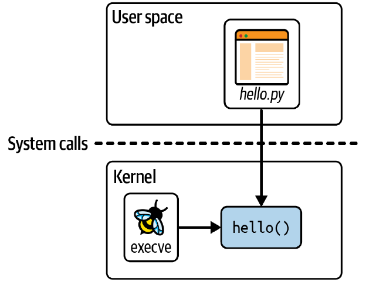
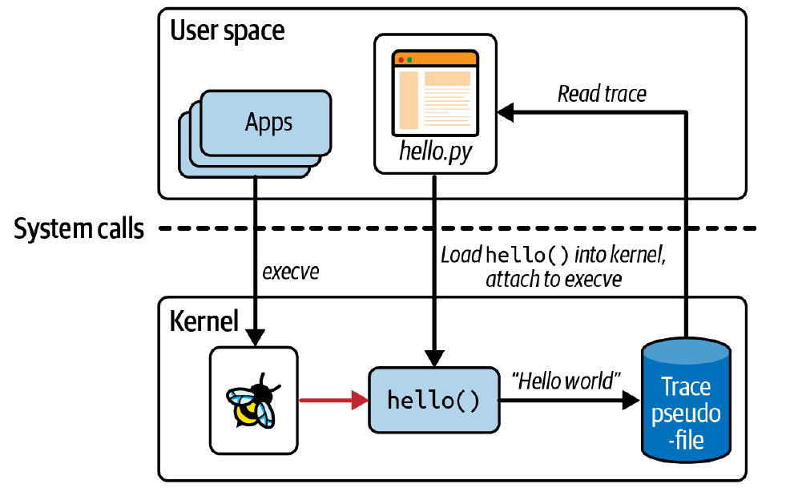
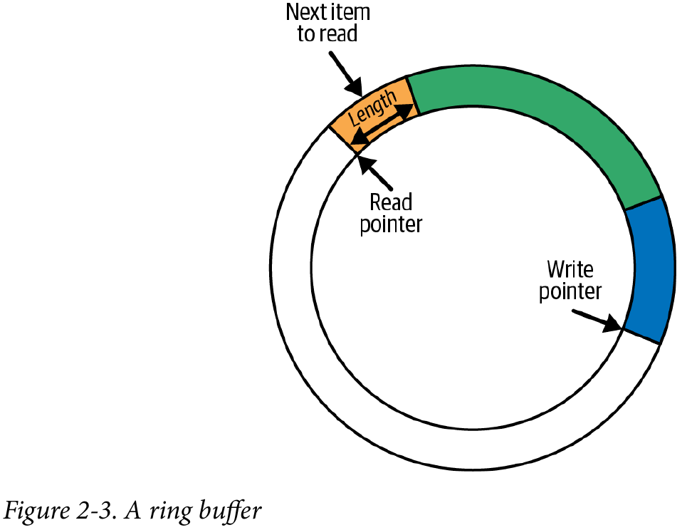
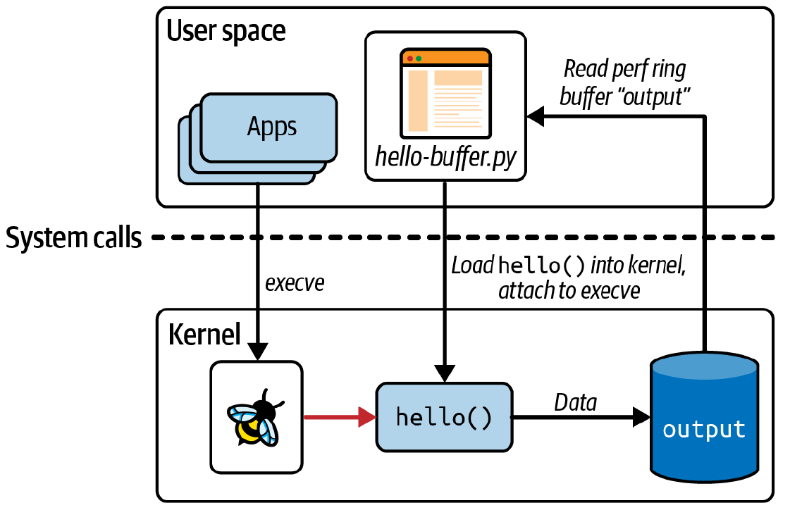
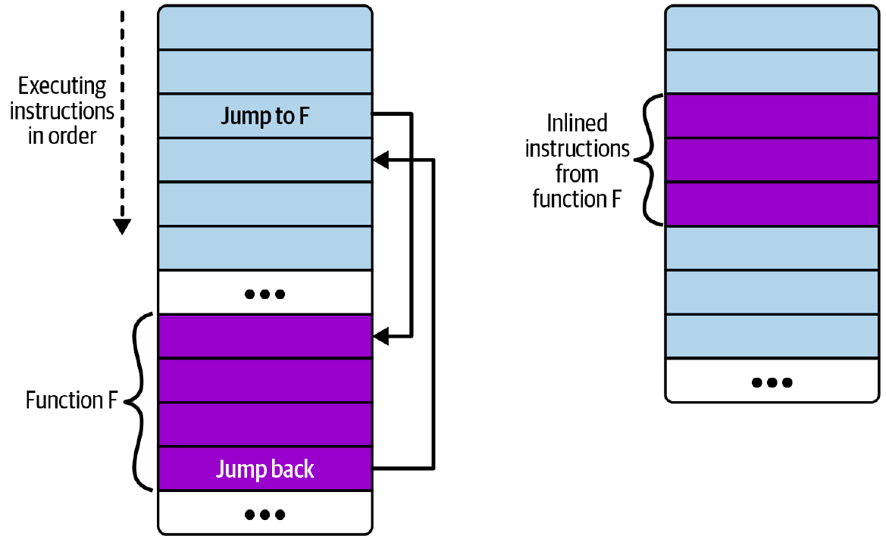

# 第 2 章 eBPF 的 Hello World

在上一章中，我讨论了为什么 eBPF 如此强大，但如果您还没有对运行 eBPF 程序有一个具体的理解，那也没关系。在本章中，我将使用一个简单的“Hello World”示例来帮助您更好地理解它。

正如您在阅读本书时会了解到的，有几种不同的库和框架可用于编写 eBPF 应用程序。作为热身，我将向您展示从编程角度来看可能最易于理解的方法：使用[BCC Python 框架](https://github.com/iovisor/bcc)。这提供了一种非常简单的方式来编写基本的 eBPF 程序。出于我将在第 5 章中介绍的原因，对于分发给其他用户的生产应用程序，这不一定是我推荐的方法，但对于初学者来说非常棒。

> 提示
> 如果您想自己试试这段代码，可以在 [https:// github.com/lizrice/learning-ebpf](https://github.com/lizrice/learning-ebpf) 的 chapter2 目录下找到。
> 您可以在[https://github.com/iovisor/bcc](https://github.com/iovisor/bcc) 找到 BCC 项目，安装 BCC 的说明在 [https://github.com/iovisor/bcc/blob/master/INSTALL.md](https://github.com/iovisor/bcc/blob/master/INSTALL.md) 。

## BCC 的 Hello World

下面是`hello.py`的全部源代码，这是一个使用 BCC 的 Python 库编写的 eBPF "Hello World "应用程序：

```python
#!/usr/bin/python3
from bcc import BPF

program = r"""
int hello(void *ctx) {
    bpf_trace_printk("Hello World!");
    return 0;
}
"""

b = BPF(text=program)
syscall = b.get_syscall_fnname("execve")
b.attach_kprobe(event=syscall, fn_name="hello")

b.trace_print()
```

这段代码包括两部分：在内核中运行的 eBPF 程序和将 eBPF 程序加载到内核并读取其生成的跟踪信息的用户空间代码。正如您在图 2-1 中所看到的那样，`hello.py`是这个应用程序的用户空间部分，而`hello()`是在内核中运行的 eBPF 程序。



图 2-1. "Hello World"的用户空间和内核部分

让我们深入研究源代码的每一行以更好地理解它。

第一行告诉您这是 Python 代码，可以运行它的程序是 Python 解释器（/usr/bin/python）。

eBPF 程序本身是用 C 编写的，就是这部分：

```c
int hello(void *ctx) {
    bpf_trace_printk("Hello World!");
    return 0;
}
```

eBPF 程序所做的只是使用辅助函数 `bpf_trace_printk()` 来写入消息。辅助函数是“extended” BPF 与其 “classic” 前身的另一个区别。它们是 eBPF 程序可以调用来与系统交互的一组函数；我将在第 5 章中进一步讨论它们。现在您可以将其看作打印一行文本。

整个 eBPF 程序在 Python 代码中被定义为一个名为 program 的字符串。该 C 程序需要先进行编译才能执行，但 BCC 会为您处理好。 （您将在下一章中看到如何自己编译 eBPF 程序）您所需要做的就是在创建 BPF 对象时将此字符串作为参数传递，如下行所示：

```python
b = BPF(text=program)
```

eBPF 程序需要附加到一个事件，在这个例子中，我选择附加到系统调用 `execve`，这是用于执行程序的系统调用。无论何时，任何东西或任何人在这台机器上启动一个新的程序执行，这将调用`execve()`，这将触发 eBPF 程序。虽然“execve()”名称是 Linux 中的标准接口，但在内核中实现它的函数名称取决于芯片架构，但 BCC 给了我们一个方便的方法来查询我们运行的机器的函数名称：

```python
syscall = b.get_syscall_fnname("execve")
```

现在，`syscall`代表我要使用`kprobe`附加到的内核函数的名称（在第 1 章中已经介绍了`kprobe`的概念）。您可以像这样将`hello`函数附加到该事件上：

```python
b.attach_kprobe(event=syscall, fn_name="hello")
```

此时，eBPF 程序被加载到内核中并附加到一个事件，因此每当机器上启动新的可执行文件时，该程序就会被触发。 Python 代码中剩下要做的就是读取内核输出的跟踪信息并将其输出到屏幕上：

```python
b.trace_print()
```

这个`trace_print()`函数将无限循环显示所有跟踪信息（直到您停止程序，可以使用`Ctrl+C`）。

图 2-2 说明了这段代码。Python 程序编译 C 代码，将其加载到内核，并将其附加到 execve 系统调用的 kprobe 上。每当这台（虚拟）机器上的任何应用程序调用`execve()`时，它都会触发 eBPF 的`hello()`程序，该程序会将一行跟踪信息写入特定的伪文件中（稍后在本章中会介绍该伪文件的位置）。Python 程序从伪文件中读取跟踪信息并将其显示给用户。



图 2-2. 运行中的 "Hello World"

## 运行 "Hello World"

运行此程序，根据您正在使用的（虚拟）机器上发生的情况，您可能会立即看到跟踪信息的生成，因为其他进程可能正在执行带有 execve 系统调用的程序。如果您没有看到任何内容，请打开第二个终端并执行任何命令，您将看到由“Hello World”生成的相应跟踪信息。

```bash
$ hello.py
b' bash-5412 [001] .... 90432.904952: 0: bpf_trace_printk: Hello World'
```

> 提示
> 由于 eBPF 非常强大，因此需要特殊的权限来使用它。特权会自动分配给 root 用户，因此以 root 身份运行 eBPF 程序可能是最简单的方式，可以使用 sudo 命令来实现。为了清晰起见，在本书的示例命令中，我不会包含 sudo 命令，但是如果您看到“Operation not permitted”错误，首先要检查的是您是否尝试以非特权用户身份运行 eBPF 程序。
> `CAP_BPF` 是在内核版本 5.8 中引入的，它提供了足够的权限来执行一些 eBPF 操作，例如创建某些类型的 map。但是，您可能需要额外的功能：
>
> - `CAP_PERFMON` 和 `CAP_BPF` 都是加载跟踪程序所需要的。
> - `CAP_NET_ADMIN` 和 `CAP_BPF` 都是加载网络程序所必需的。
>
> 在 Milan Landaverde 的博文 ["CAP_BPF 简介"](https://oreil.ly/G2zFO) 中有很多这方面的细节。

一旦 `hello` eBPF 程序被加载并附加到一个事件，它就会被预先存在的进程产生的事件触发。这应该会强化您在第 1 章中学到的几点：

- eBPF 程序可用于动态改变系统的行为。无需重新启动计算机或重新启动现有进程。 eBPF 代码一旦附加到事件就开始生效。
- 无需对其他应用程序进行任何更改，它们就可以被 eBPF 看到。只要您在该机器上具有终端访问权限，如果在其中运行一个可执行文件，它将使用`execve()`系统调用，如果将`hello`程序附加到该系统调用上，它将被触发生成跟踪输出。同样，如果您有一个运行可执行文件的脚本，也会触发`hello` eBPF 程序。您无需更改终端的 shell 、脚本或您正在运行的可执行文件的任何内容。

跟踪输出不仅显示了“Hello World”字符串，还显示了触发`hello` eBPF 程序运行的事件的一些附加上下文信息。在本节开头显示的示例输出中，进行了 execve 系统调用的进程的进程 ID 为 5412，并且它正在运行 bash 命令。对于跟踪消息，此上下文信息作为内核跟踪基本结构的一部分添加进去（这不特定于 eBPF），但正如您在本章后面将看到的，也可以在 eBPF 程序内部检索类似的上下文信息。

您可能想知道 Python 代码如何知道从哪里读取跟踪输出。答案并不复杂——内核中的`bpf_trace_printk()`辅助函数总是将输出发送到同一个预定义的伪文件位置：`/sys/kernel/debug/tracing/trace_pipe`。您可以使用 cat 命令查看它的内容；您需要 root 权限来访问它。

一个跟踪管道的单一位置对于简单的“Hello World”示例或基本的调试来说是可以的，但它非常有限。输出的格式几乎没有灵活性，它只支持字符串的输出，因此在传递结构化信息方面并不是特别有用。也许最重要的是，在（虚拟）机器上只有这一个位置可用。如果同时运行多个 eBPF 程序，它们都会将跟踪输出写入相同的跟踪管道，这对于人类操作员来说可能会非常混乱。

有一种更好的方法可以从 eBPF 程序中获取信息：使用 eBPF Map。

## BPF Maps

Map 是一种数据结构，可以从 eBPF 程序和用户空间访问。Maps 是区分 extended BPF 与其 classic 前身的一项非常重要的功能之一。（您可能认为它们通常被称为“eBPF maps”，实际上您经常会看到“BPF maps”。一般情况下，这两个术语是可以互换使用的。）

Maps 可用于在多个 eBPF 程序之间共享数据，或在用户空间应用程序和运行于内核的 eBPF 代码之间进行通信。典型的用途包括如下：

- 用户空间写入配置信息，由 eBPF 程序进行查询
- 一个 eBPF 程序存储状态，以便稍后由另一个 eBPF 程序（或未来运行的同一程序）检索。
- 一个 eBPF 程序将结果或指标写入 Map 中，以便用户空间应用程序可以检索并呈现结果。

Linux 的`uapi/linux/bpf.h`文件中定义了各种类型的 BPF 映射，并且内核文档中有一些关于它们的信息。总的来说，它们都是键-值存储，本章中您将看到哈希表（hash tables）、perf 和环形缓冲区（ring buffers）以及数组（arrays）的 ebpf Maps 示例。

有些 Map 类型被定义为数组类型，总是以一个 4 字节索引作为键类型；其他映射是哈希表类型，可以使用任意数据类型作为键类型。

有些 Map 类型针对特定类型的操作进行了优化，例如[先进先出队列](https://oreil.ly/VSoEp)、[先进后出堆栈](https://oreil.ly/VSoEp)、[最近最少使用的数据存储](https://oreil.ly/vpsun)、[最长前缀匹配](https://oreil.ly/hZ5aM)和[Bloom 过滤器](https://oreil.ly/DzCTK)（一种概率数据结构，旨在提供有关元素是否存在的快速结果）。

有些 eBPF Map 类型用来保存特定类型对象的信息。例如，[sockmap](https://oreil.ly/UUTHO) 和 [devmap](https://oreil.ly/jzKYh) 保存有关套接字和网络设备的信息，并由网络相关的 eBPF 程序用来重定向流量。程序数组 Map 存储一组索引的 eBPF 程序，并且（正如您将在本章后面看到的）这用于实现尾部调用，其中一个程序可以调用另一个程序。甚至还有一个地图的地图类型来支持存储有关地图的信息。

有些 eBPF 映射类型保存特定类型对象的信息。例如，[sockmap](https://oreil.ly/UUTHO) 和 [devmap](https://oreil.ly/jzKYh) 保存关于套接字和网络设备的信息，并被网络相关的 eBPF 程序用于重定向流量。Program array Map 存储一组索引的 eBPF 程序，（正如您稍后在本章中所看到的）这用于实现尾调(tail calls)，其中一个程序可以调用另一个程序。甚至还有一种 [Map in Map](https://oreil.ly/038tN) 类型，用于支持存储关于 Map 的信息。

有些映射类型具有 per-CPU 的变体类型，也就是说，内核为每个 CPU 核心使用了不同的内存块。这可能让您对不是 per-CPU 的 Map 的并发性产生疑虑，因为多个 CPU 核心可能同时访问同一个映射。自内核版本 5.1 起，为（某些）Map 添加了自旋锁支持，我们将在第 5 章中重新讨论这个话题。

下一个示例（[GitHub 存储库](https://github.com/lizrice/learning-ebpf)中的 `Chapter2/hello-map.py`）显示了使用 Hash Table Map 的一些基本操作。它还演示了 BCC 提供的一些方便的抽象，使 Map 的使用变得非常容易。

### Hash Table Map

和本章前面的示例一样，这个 eBPF 程序将在 execve 系统调用的入口处附加到 kprobe。它将用键值对填充哈希表，其中键是用户 ID，值是在该用户 ID 下运行的进程调用 execve 次数的计数器。实际上，此示例将显示不同用户运行程序的次数。

首先，让我们看一下 eBPF 程序本身的 C 代码：

```c
// BPF_HASH()是一个BCC宏，定义了一个哈希表映射。
BPF_HASH(counter_table);

int hello(void *ctx) {
   u64 uid;
   u64 counter = 0;
   u64 *p;
   // bpf_get_current_uid_gid() 是一个辅助函数，用于获取正在运行触发此 kprobe 事件的进程的用户 ID。
   // 用户 ID 保存在返回的 64 位值的低 32 位中。（高 32 位保存组 ID）
   uid = bpf_get_current_uid_gid() & 0xFFFFFFFF;
   // 在哈希表中查找其键与用户 ID 匹配的条目。它返回一个指向哈希表中相应值的指针。
   p = counter_table.lookup(&uid);
   // 如果有这个用户ID的条目，将计数器变量设置为哈希表中的当前值（由p指向）。
   // 如果在哈希表中没有这个用户ID的条目，指针将为0，计数器的值将保持为0。
   if (p != 0) {
      counter = *p;
   }
   // 无论当前计数器值是多少，它都会加一。
   counter++;
   // 使用该用户 ID 的新计数器值更新哈希表。
   counter_table.update(&uid, &counter);
   return 0;
}
```

仔细看一下访问哈希表的几行代码：

```c
p = counter_table.lookup(&uid);
```

和后面的：

```c
counter_table.update(&uid, &counter);
```

如果您在想“这不是正确的 C 代码！”，那么没错，您绝对是正确的。 C 不支持在这样的结构上定义方法。这是一个很好的例子，其中 BCC 版本的 C 语言是非常松散的类 C 语言类型，BCC 在将代码发送到编译器之前对其进行重写。 BCC 提供了一些方便的快捷方式和宏，并将其转换为“正确的”C 代码。

就像前面的示例一样，C 代码被存储在 program 的字符串中。该程序被编译，加载到内核中，并附加到 execve 的 kprobe，其方式与前面的“Hello World”示例完全相同：

```python
b = BPF(text=program)
syscall = b.get_syscall_fnname("execve")
b.attach_kprobe(event=syscall, fn_name="hello")
```

这次 Python 端需要做更多的工作来从哈希表中读取信息：

```python
// 这部分代码无限循环，每隔两秒就寻找输出显示。
while True:
    sleep(2)
    s = ""
    // BCC 自动创建一个 Python 对象来表示哈希表。这段代码循环遍历所有值并将它们打印到屏幕上。
    for k,v in b["counter_table"].items():
        s += f"ID {k.value}: {v.value}\t"
    print(s)
```

当您运行此示例时，您将需要第二个终端窗口，您可以在其中运行一些命令。这是我获得的一些示例输出，在右侧用我在另一个终端中运行的命令进行了注释：

```bash
Terminal 1 Terminal 2
$ ./hello-map.py
                            [blank line(s) until I run something]
ID 501: 1                   ls
ID 501: 1
ID 501: 2                   ls
ID 501: 3   ID 0: 1         sudo ls
ID 501: 4   ID 0: 1         ls
ID 501: 4   ID 0: 1
ID 501: 5   ID 0: 2         sudo ls
```

这个示例每两秒生成一行输出，无论是否发生任何事情。在此输出的末尾，哈希表包含两个条目：

- key=501, value=5
- key=0, value=2

在第二个终端中，我的用户 ID 为 501。使用此用户 ID 运行 ls 命令会增加 execve 计数器。当我运行 sudo ls 时，这会导致两次调用 execve：一次是在用户 ID 501 下执行 sudo；另一种是在 root 用户 ID 0 下执行 ls。

在这个例子中，我使用了哈希表来将数据从 eBPF 程序传递到用户空间。（我也可以使用数组类型的 Map，因为键是整数；而哈希表允许您使用任意类型作为键）当数据自然地以键值对的形式存在时，哈希表非常方便，但用户空间的代码必须定期轮询表来获取数据。Linux 内核已经支持了 perf 子系统，用于从内核向用户空间发送数据，而且 eBPF 还包括对 perf 缓冲区和其后继者 BPF 环形缓冲区（Ring Buffer Maps）的支持。让我们来看一下。

### Perf 和 环形缓冲区 Map（Ring Buffer Maps）

在本节中，我将描述一个稍微复杂一些的“Hello World”版本，它使用 BCC 的`BPF_PERF_OUTPUT`功能，允许您将数据以您选择的结构写入 perf 环形缓冲区映射中。

> 提示
> 如果您使用的是 5.8 版本或更高版本的内核，现在一般更倾向于使用名为“BPF 环形缓冲区（BPF ring buffers）”的较新构造，而不是 BPF perf 缓冲区（BPF perf buffers）。在安德烈·纳克里科（Andrii Nakryiko）的[BPF 环形缓冲区](https://oreil.ly/ARRyV)博文中，他讨论了这两者之间的区别。在第 4 章中，您将看到 BCC 的`BPF_RINGBUF_OUTPUT`的示例。

> 环形缓冲区
> 环形缓冲区并不仅限于 eBPF，但我还是会解释一下，以防您之前没有遇到过。您可以将环形缓冲区视为逻辑上组织成环形的一块内存，其中有单独的“写入”和“读取”指针。某个任意长度的数据被写入到写入指针所在的位置，该数据的头部包含了长度信息。写入指针移动到该数据的末尾之后，准备进行下一次写入操作。
> 类似地，对于读取操作，数据从读取指针所指向的位置读取，并使用头部信息确定要读取的数据量。读取指针沿着与写入指针相同的方向移动，以指向下一个可用的数据片段。图 2-3 展示了一个环形缓冲区的示例，其中有三个不同长度的数据项可供读取。
> 如果读取指针赶上写入指针，这意味着没有可读取的数据。如果写入操作使得写入指针超过读取指针，数据将不会被写入，并且*丢弃计数器*会增加。读取操作包括丢弃计数器，以指示自上次成功读取以来是否有数据丢失。
> 如果读取和写入操作以完全相同的速率进行，并且它们始终包含相同数量的数据，理论上您可以使用一个恰好能容纳该数据大小的环形缓冲区。但在大多数应用中，读取和写入之间的时间会有一定的变化，因此缓冲区的大小需要根据这种变化进行调整。
> 
> 图 2-3. 一个环形缓冲器

您可以在 Learning eBPF [GitHub 仓库](http://github.com/lizrice/learning-ebpf)的`chapter2/hello-buffer.py`中找到此示例的源代码。与本章早期展示的第一个“Hello World”示例一样，该版本在每次使用`execve()`系统调用时都会将字符串“Hello World”写入屏幕。它还会查找每个调用 execve()的进程 ID 和命令名称，以便您能够获得类似于第一个示例的输出。这为我提供了展示几个 BPF 辅助函数的机会。

这是将加载到内核的 eBPF 程序：

```c
// BCC定义了宏BPF_PERF_OUTPUT，用于创建一个 map，该 map 将用于将消息从内核传递到用户空间。我将这个 map 定义为 output。
BPF_PERF_OUTPUT(output);
// 每次运行hello()函数时，代码将写入一个结构体的数据。这是该结构体的定义，其中包含进程ID、当前运行命令的名称和文本消息的字段。
struct data_t {
   int pid;
   int uid;
   char command[16];
   char message[12];
};

int hello(void *ctx) {
   // data是一个本地变量，用于保存要提交的数据结构，而message则保存了字符串"Hello World"。
   struct data_t data = {};
   char message[12] = "Hello World";
   // bpf_get_current_pid_tgid() 是一个辅助函数，用于获取触发此 eBPF 程序运行的进程的 ID。它返回一个 64 位值，进程 ID 位于前 32 位。
   // （低32位是线程组ID。对于单线程进程，它与进程ID相同，但对于该进程的其他线程，将被分配不同的ID。GNU C库的文档对[进程ID和线程组ID](https://oreil.ly/Wo9k3)之间的区别有很好的描述。）
   data.pid = bpf_get_current_pid_tgid() >> 32;
   // bpf_get_current_uid_gid() 是您在上一个示例中看到的用于获取用户 ID 的辅助函数。
   data.uid = bpf_get_current_uid_gid() & 0xFFFFFFFF;
   // 类似地，bpf_get_current_comm()是一个辅助函数，用于获取正在执行进行execve系统调用的进程中运行的可执行文件（或“命令”）的名称。
   // 这是一个字符串，而不是像进程ID和用户ID那样的数值。
   // 在C语言中，您不能简单地使用=赋值一个字符串。您需要将字符串应该写入的字段的地址&data.command作为参数传递给辅助函数。
   bpf_get_current_comm(&data.command, sizeof(data.command));
   // 对于这个示例，每次消息都是"Hello World"。bpf_probe_read_kernel()函数将它复制到数据结构的适当位置。
   bpf_probe_read_kernel(&data.message, sizeof(data.message), message);
   // 此时，数据结构已经填充了进程ID、命令名称和消息。调用output.perf_submit()函数将该数据放入 map 中。
   output.perf_submit(ctx, &data, sizeof(data));

   return 0;
}
```

就像在第一个“Hello World”示例中一样，这个 C 程序被赋值给 Python 代码中的一个名为 program 的字符串。接下来是 Python 代码的剩余部分：

```python
# 编译C代码、将其加载到内核并将其附加到系统调用事件的代码行与您之前看到的“Hello World”版本没有变化。
b = BPF(text=program)
syscall = b.get_syscall_fnname("execve")
b.attach_kprobe(event=syscall, fn_name="hello")

# print_event是一个回调函数，它将在屏幕上输出一行数据。BCC会处理一些繁重的工作，以便我可以简单地通过b["output"]引用map，并使用b["output"].event()从中获取数据。
def print_event(cpu, data, size):
   data = b["output"].event(data)
   print(f"{data.pid} {data.uid} {data.command.decode()} {data.message.decode()}")

# b["output"].open_perf_buffer()打开 perf 环形缓冲区。该函数以print_event作为参数，定义了每当有数据可从缓冲区读取时要使用的回调函数。
b["output"].open_perf_buffer(print_event)
# 现在，程序将无限循环，轮询 perf 环形缓冲区。如果有任何可用的数据，print_event将被调用。
while True:
   b.perf_buffer_poll()
```

运行这段代码将给我们输出结果，其与原始的“Hello World”相似：

```bash
$ sudo ./hello-buffer.py
11654 node Hello World
11655 sh Hello World
...
```

与以前一样，您可能需要打开第二个终端连接到相同的（虚拟）机器，并运行一些命令来触发输出。

这个示例与原始的“Hello World”示例的主要区别在于，它不再使用单个中央跟踪管道，而是通过一个名为 output 的环形缓冲区 map 传递数据，该 map 是由该程序自己创建并供其使用，如图 2-4 所示。



图 2-4.使用 perf 环形缓冲器从内核向用户空间传递数据

您可以使用 `cat /sys/kernel/debug/tracing/trace_pipe` 来验证信息是否不会进入跟踪管道。

除了演示环形缓冲区 map 的使用外，这个示例还展示了一些 eBPF 辅助函数，用于获取触发 eBPF 程序运行的事件的上下文信息。在这里，您已经看到了获取用户 ID、进程 ID 和当前命令名称的辅助函数。正如您将在第 7 章中看到的那样，可用的上下文信息集合以及可用于检索它的有效辅助函数集合取决于程序的类型和触发它的事件。

上下文信息的可用性是使 eBPF 代码在可观测性方面如此有价值的原因。无论何时发生事件，eBPF 程序都可以报告事件发生的事实，以及触发事件发生的相关信息。它还具有高性能，因为所有这些信息都可以在内核中收集，无需进行任何同步的上下文切换到用户空间。

在本书中，您将看到更多的示例，其中使用 eBPF 辅助函数被用来收集其他上下文数据，以及示例中的 eBPF 程序更改上下文数据甚至完全阻止事件发生。

### 函数调用

您已经看到 eBPF 程序可以调用内核提供的辅助函数，但是如果您想将编写的代码拆分为函数呢？通常，在软件开发中，将常见代码提取到一个函数中，并从多个地方调用该函数，被认为是良好的实践，而不是重复相同的代码行。但在早期，eBPF 程序不被允许调用除辅助函数之外的函数。为了解决这个问题，程序员将编译器指示为“总是内联”它们的函数，例如：

```c
static __always_inline void my_function(void *ctx, int val)
```

通常，源代码中的函数会导致编译器生成一个跳转指令，该指令导致执行跳转到组成被调用函数的一系列指令（然后在该函数完成时再次跳回）。您可以在图 2-5 的左侧看到这种情况的示例。右侧显示了内联函数的情况：没有跳转指令；相反，在调用函数内直接包含函数的指令副本。



图 2-5. 非内联函数和内联函数的指令布局

如果函数从多个地方调用，那么在编译后的可执行文件中将会有多个该函数的指令副本。（有时编译器可能选择内联某个函数以进行优化，这也是为什么您可能无法将 kprobe 附加到某些内核函数的原因之一。我将在第 7 章中再次讨论这个问题。）

从 Linux 内核 4.16 和 LLVM 6.0 开始，解除了需要将函数内联的限制，以便 eBPF 程序员可以更自然地编写函数调用。然而，这个名为“BPF to BPF function calls”或“BPF 子程序”的特性目前不受 BCC 框架支持，所以我们将在下一章中回顾它。（当然，如果函数是内联的，您仍然可以继续在 BCC 中使用函数。）

在 eBPF 中还有一种将复杂功能分解成较小部分的机制：尾部调用（ tail calls）。

### 尾部调用（Tail Calls）

正如在[ebpf.io](https://oreil.ly/Loyuz)上描述的那样，“尾部调用可以调用并执行另一个 eBPF 程序，并替换执行上下文，类似于`execve()`系统调用对常规进程的操作”。换句话说，尾部调用完成后，执行不会返回给调用者。

> 提示
> 尾部调用并不仅仅适用于 eBPF 编程。尾部调用的一般动机是为了避免在函数递归调用时不断向堆栈中添加帧，这最终可能导致堆栈溢出错误。如果您可以安排代码在最后一步调用递归函数，那么与调用函数相关联的堆栈帧实际上并没有发挥实质性的作用。（译者注：在一个函数的最后一条语句调用递归函数，那么当前这个函数的栈帧也就没有什么用了，信息都已经传递给新的函数了）尾部调用允许在不增加堆栈大小的情况下调用一系列函数。在 eBPF 中，这特别有用，因为[堆栈大小限制为 512 字节](https://oreil.ly/SZmkd)。

尾部调用使用`bpf_tail_call()`辅助函数，其具有以下签名：

```c
long bpf_tail_call(void *ctx, struct bpf_map *prog_array_map, u32 index)
```

该函数的三个参数的含义如下：

- `ctx` 允许将上下文从调用 eBPF 程序传递到被调用程序。
- `prog_array_map` 是一种`BPF_MAP_TYPE_PROG_ARRAY`类型的 eBPF Map，用于保存一组标识 eBPF 程序的文件描述符。
- `index` 指示应该调用该组 eBPF 程序中的哪一个。

这个辅助函数有些不同寻常，因为如果它成功执行，它就不会返回。当前运行的 eBPF 程序在堆栈中被被调用的程序所取代。如果辅助函数执行失败，例如，如果指定的程序在 Map 中不存在，那么调用程序将继续执行。

用户空间代码必须将所有的 eBPF 程序加载到内核中（和往常一样），并且还需要设置程序数组 Map（program array map）。

让我们看一个用 Python 编写的使用 BCC 的简单示例，您可以在[GitHub 仓库](http://github.com/lizrice/learning-ebpf)的`chapter2/hello-tail.py`中找到代码。主 eBPF 程序被附加到所有系统调用的通用入口点的跟踪点（tracepoint）上。该程序使用尾部调用来跟踪某些系统调用操作码的特定消息。如果没有给定操作码的尾部调用，程序会跟踪一个通用的消息。

如果您正在使用 BCC 框架，要进行尾部调用，您可以使用形式稍微简化的的代码行：

```c
prog_array_map.call(ctx, index)
```

在将代码传递到编译步骤之前，BCC 会将前一行重写为：

```c
bpf_tail_call(ctx, prog_array_map, index)
```

以下是 eBPF 程序及其尾部调用的源代码：

```c
// BCC提供了一个BPF_PROG_ARRAY宏，方便地定义BPF_MAP_TYPE_PROG_ARRAY类型的 Map 。我将这个 Map 定义为 syscall，并允许数量最大300条，对于这个示例来说应该足够了。
BPF_PROG_ARRAY(syscall, 300);
// 在不久之后您将看到的用户空间代码中，我将把这个eBPF程序附加到sys_enter 原始跟踪点（raw tracepoint）上，每当进行任何系统调用时都会触发。附加到原始跟踪点的eBPF程序接收的上下文以bpf_raw_tracepoint_args结构体的形式传递。
int hello(struct bpf_raw_tracepoint_args *ctx) {
    // 对于sys_enter，在原始跟踪点的参数中包括用于标识正在进行的系统调用的操作码（opcode）。
    int opcode = ctx->args[1];
    // 在这里，我们对程序数组中键与操作码匹配的条目进行尾部调用。在BCC将源代码传给编译器之前，这行代码将被BCC重写为对bpf_tail_call()辅助函数的调用。
    syscall.call(ctx, opcode);
    // 如果尾部调用成功，这行跟踪操作码值的代码将永远不会被触发。我使用这个特性为那些在 Map 中没有对应程序条目的操作码提供了一个默认的跟踪行。
    bpf_trace_printk("Another syscall: %d", opcode);
    return 0;
}
// hello_exec()是一个将加载到syscall程序数组 Map 中的程序，当操作码指示为execve()系统调用时，它将作为尾部调用执行。它只生成一行跟踪信息，告诉用户正在执行一个新的程序。
int hello_exec(void *ctx) {
    bpf_trace_printk("Executing a program");
    return 0;
}
// hello_timer()是另一个将加载到syscall程序数组中的程序。在这种情况下，它将被程序数组中的多个条目引用。
int hello_timer(struct bpf_raw_tracepoint_args *ctx) {
    int opcode = ctx->args[1];
    switch (opcode) {
        case 222:
            bpf_trace_printk("Creating a timer");
            break;
        case 226:
            bpf_trace_printk("Deleting a timer");
            break;
        default:
            bpf_trace_printk("Some other timer operation");
            break;
    }
    return 0;
}
// ignore_opcode()是一个尾调用程序，它不做任何操作。我将在不希望生成任何跟踪信息的系统调用上使用它。
int ignore_opcode(void *ctx) {
    return 0;
}
```

现在让我们来看一下负责加载和管理这组 eBPF 程序的用户空间代码：

```python
b = BPF(text=program)
# 与之前您所见到的附加到kprobe不同，这次用户空间代码将主要的eBPF程序附加到sys_enter跟踪点上。
b.attach_raw_tracepoint(tp="sys_enter", fn_name="hello")
# 这些对b.load_func()的调用为每个尾部调用程序返回一个文件描述符。请注意，尾部调用程序需要与其父程序具有相同的程序类型——在这种情况下为BPF.RAW_TRACEPOINT。此外，值得指出的是，每个尾部调用程序本身都是一个独立的eBPF程序。
ignore_fn = b.load_func("ignore_opcode", BPF.RAW_TRACEPOINT)
exec_fn = b.load_func("hello_exec", BPF.RAW_TRACEPOINT)
timer_fn = b.load_func("hello_timer", BPF.RAW_TRACEPOINT)
# 用户空间代码在 syscall map 中创建条目。map 并不需要为每个可能的操作码都填充条目；如果某个特定操作码没有条目，那么就意味着不会执行任何尾部调用。而且，将多个条目指向同一个eBPF程序也是完全可以的。在这种情况下，我希望hello_timer()尾部调用在一组与定时器相关的系统调用中被执行。
prog_array = b.get_table("syscall")
prog_array[ct.c_int(59)] = ct.c_int(exec_fn.fd)
prog_array[ct.c_int(222)] = ct.c_int(timer_fn.fd)
prog_array[ct.c_int(223)] = ct.c_int(timer_fn.fd)
prog_array[ct.c_int(224)] = ct.c_int(timer_fn.fd)
prog_array[ct.c_int(225)] = ct.c_int(timer_fn.fd)
prog_array[ct.c_int(226)] = ct.c_int(timer_fn.fd)

# 系统中的某些系统调用被系统频繁地运行，如果为每个系统调用都生成一行跟踪信息，会导致跟踪输出混乱到无法阅读的程度。我已经使用了ignore_opcode()尾部调用来处理几个系统调用。
prog_array[ct.c_int(21)] = ct.c_int(ignore_fn.fd)
prog_array[ct.c_int(22)] = ct.c_int(ignore_fn.fd)
prog_array[ct.c_int(25)] = ct.c_int(ignore_fn.fd)
prog_array[ct.c_int(29)] = ct.c_int(ignore_fn.fd)
prog_array[ct.c_int(56)] = ct.c_int(ignore_fn.fd)
prog_array[ct.c_int(57)] = ct.c_int(ignore_fn.fd)
prog_array[ct.c_int(63)] = ct.c_int(ignore_fn.fd)
prog_array[ct.c_int(64)] = ct.c_int(ignore_fn.fd)
prog_array[ct.c_int(66)] = ct.c_int(ignore_fn.fd)
prog_array[ct.c_int(72)] = ct.c_int(ignore_fn.fd)
prog_array[ct.c_int(73)] = ct.c_int(ignore_fn.fd)
prog_array[ct.c_int(79)] = ct.c_int(ignore_fn.fd)
prog_array[ct.c_int(98)] = ct.c_int(ignore_fn.fd)
prog_array[ct.c_int(101)] = ct.c_int(ignore_fn.fd)
prog_array[ct.c_int(115)] = ct.c_int(ignore_fn.fd)
prog_array[ct.c_int(131)] = ct.c_int(ignore_fn.fd)
prog_array[ct.c_int(134)] = ct.c_int(ignore_fn.fd)
prog_array[ct.c_int(135)] = ct.c_int(ignore_fn.fd)
prog_array[ct.c_int(139)] = ct.c_int(ignore_fn.fd)
prog_array[ct.c_int(172)] = ct.c_int(ignore_fn.fd)
prog_array[ct.c_int(233)] = ct.c_int(ignore_fn.fd)
prog_array[ct.c_int(280)] = ct.c_int(ignore_fn.fd)
prog_array[ct.c_int(291)] = ct.c_int(ignore_fn.fd)
# 将跟踪输出打印到屏幕，直到用户终止程序。
b.trace_print()
```

运行这个程序会为在（虚拟）机器上运行的每个系统调用生成跟踪输出，除非操作码有一个条目将其链接到 ignore_opcode()尾部调用。下面是在另一个终端运行 ls 命令时的一些输出示例（为了易读性，省略了一些细节）：

```bash
./hello-tail.py
b' hello-tail.py-2767 ... Another syscall: 62'
b' hello-tail.py-2767 ... Another syscall: 62'
...
b'          bash-2626 ... Executing a program'
b'          bash-2626 ... Another syscall: 220'
...
b'         <...>-2774 ... Creating a timer'
b'         <...>-2774 ... Another syscall: 48'
b'         <...>-2774 ... Deleting a timer'
...
b'            ls-2774 ... Another syscall: 61'
b'            ls-2774 ... Another syscall: 61'
...
```

某些系统调用的执行并不重要，但您可以看到不同的尾部调用被调用并生成了跟踪消息。您还可以看到在尾部调用程序 Map 中没有条目的操作码，默认消息为 Another syscall。

> 提示
> 请查阅 Paul Chaignon 关于不同内核版本下[BPF 尾部调用成本](https://oreil.ly/jTxcb)的博文。

自内核版本 4.2 起，eBPF 开始支持尾调用，但在很长一段时间内，尾部调用与 BPF 到 BPF 函数调用是不兼容的。这个限制在内核版本 5.10 中被解除了。（从 BPF 子程序中进行尾调用需要 JIT 编译器的支持，而这将在下一章中介绍。在我编写本书示例时使用的内核版本中，只有 x86 架构上的 JIT 编译器支持此功能，尽管在[内核 6.0 中已经添加了对 ARM 架构的支持](https://oreil.ly/KYUYS)。）

尾部调用最多可以链式组合达到 33 次，再加上每个 eBPF 程序的指令复杂性限制为 100 万条指令，这意味着如今的 eBPF 程序员有很大的余地来编写完全在内核中运行的非常复杂的代码。

## 总结

我希望通过展示 eBPF 程序的一些具体示例，本章可以帮助您巩固在内核中运行、由事件触发的 eBPF 代码的思维模型。您还看到了使用 BPF Map 将数据从内核传递到用户空间的示例。

使用 BCC 框架隐藏了程序构建、加载到内核并附加到事件的许多细节。在下一章中，我将向您展示一种不同的编写“Hello World”的方法，并且我们将更深入地了解这些隐藏的细节。

## 练习

如果您想进一步探索 "Hello World"，这里有一些可选的活动，您可能想尝试一下（或考虑一下）：

1. 调整 `hello-buffer.py` eBPF 程序以针对奇数和偶数进程 ID 输出不同的跟踪消息。
2. 修改 `hello-map.py`，以便 eBPF 代码由多个系统调用触发。例如，通常调用 `openat()` 来打开文件，调用 `write()` 来将数据写入文件。您可以首先将 hello eBPF 程序附加到多个系统调用 kprobes。然后尝试为不同的系统调用修改 `hello` eBPF 程序的版本，证明您可以从多个不同的程序访问同一个 Map 。
3. `hello-tail.py` eBPF 程序是一个附加到 sys_enter 原始跟踪点的程序的例子，每当任何系统调用被调用时，都会触发该跟踪点。改变`hello-map.py`以显示每个用户 ID 进行的系统调用的总数，方法是将其附加到同一个 sys_enter 原始跟踪点。
   以下是我进行更改后得到的一些示例输出：
   ```bash
   $ ./hello-map.py
   ID 104: 6   ID 0: 225
   ID 104: 6   ID 101: 34  ID 100: 45  ID 0: 332   ID 501: 19
   ID 104: 6   ID 101: 34  ID 100: 45  ID 0: 368   ID 501: 38
   ID 104: 6   ID 101: 34  ID 100: 45  ID 0: 533   ID 501: 57
   ```
4. [使用 BCC 提供的 RAW_TRACEPOINT_PROBE 宏](https://oreil.ly/kh-j4)可以简化对原始跟踪点的附加操作，它会告诉用户空间的 BCC 代码自动将其附加到指定的跟踪点。您可以尝试在`hello-tail.py`中使用它，如下所示：

   - 用`RAW_TRACE_POINT_PROBE(sys_enter)`取代`hello()`函数的定义。
   - 从 Python 代码中删除显式的`b.attach_raw_tracepoint()`附加调用。

   您应该会看到 BCC 自动创建、附加并且程序正常运行。这是 BCC 提供的许多方便的宏的示例之一。

5. 您可以进一步修改`hello_map.py`，使哈希表中的键标识特定的系统调用（而不是特定的用户）。输出将显示整个系统中该系统调用被调用的次数。
