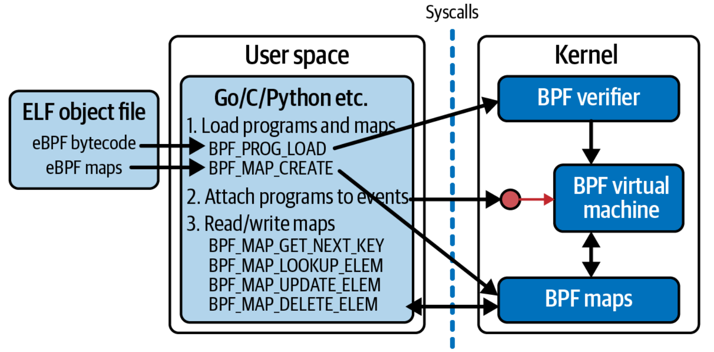

# 第四章 bpf()系统调用

正如您在第 1 章中看到的，当用户空间应用程序希望内核代表它们执行某些操作时，它们会使用系统调用 API 发出请求。因此，如果用户空间应用程序想要将 eBPF 程序加载到内核中，必然涉及一些系统调用。实际上，这个系统调用是 bpf()，在本章中我将向您展示如何使用它来加载和操作 eBPF 程序和 Map。

值得注意的是，运行在内核中的 eBPF 代码并不使用系统调用来访问 Map。系统调用接口仅由用户空间应用程序使用。相反，eBPF 程序使用辅助函数来读取和写入 Map；您在前两章中已经看到了一些例子。

如果您继续编写自己的 eBPF 程序，很可能您不会直接调用这些 bpf()系统调用。在本书的后面部分，我会介绍一些库，它们提供了更高级的抽象，使编程更加容易。也就是说，这些抽象通常与本章中所见的底层系统调用命令非常相似。无论您使用哪个库，您都需要了解底层操作，比如加载程序、创建和访问 Map 等，这些内容都将在本章中介绍。

在展示 bpf()系统调用的示例之前，让我们先看一下[bpf()的手册上的说明](https://man7.org/linux/man-pages/man2/bpf.2.html)。手册中提到，bpf()用于“对扩展 BPF Map 或程序执行命令”。它还告诉我们，bpf()的函数签名如下所示：

```c
int bpf(int cmd, union bpf_attr *attr, unsigned int size);
```

**bpf()** 函数的第一个参数 **cmd** 指定要执行的命令。**bpf()**系统调用不仅仅执行一个操作，它有很多不同的命令可以用来操作 eBPF 程序和 Map。图 4-1 概述了用户空间代码可能使用的一些常见命令，包括加载 eBPF 程序、创建 Map、将程序附加到事件以及访问 Map 中的键值对。



_图 4-1. 用户空间程序使用系统调用与内核中的 eBPF 程序和映射进行交互_

**bpf()** 系统调用的 **attr** 参数保存指定命令参数所需的任何数据，**size** 表明 **attr** 中有多少字节数据。

在第 1 章中，您已经遇到了**strace**，我在那里使用它展示了用户空间代码如何通过系统调用 API 发出许多请求。在本章中，我将使用它来演示如何使用 **bpf()** 系统调用。**strace** 的输出包括每个系统调用的参数，但为了避免本章的示例输出过于混乱，我将省略 **attr** 参数中的大部分细节，除非它们特别有趣。

> 提示
>
> 您可以在 [github.com/lizrice/learning-ebpf](https://github.com/lizrice/learning-ebpf) 上找到该代码以及设置运行该代码的环境的说明。本章的代码位于 chapter4 目录中。

在这个例子中，我将使用一个名为 _hello-buffer-config.py_ 的 BCC 程序，它在第 2 章中的示例基础上进行了扩展。与 _hello-buffer.py_ 示例一样，该程序在每次运行时会向 perf 缓冲区发送一条消息，将内核关于 **execve()** 系统调用事件的信息传递给用户空间。这个新版本的特点是可以为每个用户 ID 配置不同的消息。

下面是 eBPF 源代码：

```c
// 该行表示有一个结构体定义 user_msg_t，用于保存 12 个字符的消息。
struct user_msg_t {
   char message[12];
};
// BCC 宏 BPF_HASH 用于定义一个名为 config 的哈希Map。它将保存 user_msg_t 类型的值，由 u32 类型的键索引，这刚好是用户 ID 的大小。 （如果您不指定键和值的类型，则 BCC 默认为 u64。）
BPF_HASH(config, u32, struct user_msg_t);
// perf 缓冲区输出的定义方式与第 2 章完全相同。您可以向缓冲区提交任意数据，因此无需在此处指定任何数据类型...
BPF_PERF_OUTPUT(output);
// ...尽管实际上，在这个示例中，程序总是提交一个data_t结构。这与第2章的示例相同。
struct data_t {
   int pid;
   int uid;
   char command[16];
   char message[12];
};
// eBPF程序的其余部分与您之前看到的hello()版本没有任何变化。
int hello(void *ctx) {
   struct data_t data = {};
   struct user_msg_t *p;
   char message[12] = "Hello World";

   data.pid = bpf_get_current_pid_tgid() >> 32;
   data.uid = bpf_get_current_uid_gid() & 0xFFFFFFFF;

   bpf_get_current_comm(&data.command, sizeof(data.command));
   // 唯一的区别是，使用辅助函数来获取用户 ID 后，代码会在 config 哈希 Map 中查找以该用户 ID 作为键的条目。如果存在匹配的条目，则该值包含一条将使用的消息，而不是默认的“Hello World”。
   p = config.lookup(&data.uid);
   if (p != 0) {
      bpf_probe_read_kernel(&data.message, sizeof(data.message), p->message);
   } else {
      bpf_probe_read_kernel(&data.message, sizeof(data.message), message);
   }

   output.perf_submit(ctx, &data, sizeof(data));

   return 0;
}
```

Python 代码增加了两行：

```python
b["config"][ct.c_int(0)] = ct.create_string_buffer(b"Hey root!")
b["config"][ct.c_int(501)] = ct.create_string_buffer(b"Hi user 501!")
```

它们在 **config** 哈希表中定义了用户 ID 0 和 501 的消息，它们对应于该虚拟机上的 root 用户和我的用户 ID。此代码使用 Python 的 **ctypes** 包来确保键和值与 C 语言中 **user_msg_t** 的定义相同。

下面是这个示例的一些说明性输出，以及我在第二个终端运行的命令：

```bash
Terminal 1 									Terminal 2
$ ./hello-buffer-config.py
37926 501 bash Hi user 501! 				ls
37927 501 bash Hi user 501! 				sudo ls
37929 0 sudo Hey root!
37931 501 bash Hi user 501! 				sudo -u daemon ls
37933 1 sudo Hello World
```

现在您已经了解了该程序的作用，我想向您展示该程序运行时使用的 **bpf()** 系统调用。我将使用 **strace** 再次运行它，并指定 **-e bpf** 来指示我只对查看 **bpf()** 系统调用感兴趣：

```bash
$ strace -e bpf ./hello-buffer-config.py
```

如果您自己尝试这个过程，您将看到几个对该系统调用的调用。对于每个调用，您将看到命令，指示 **bpf()** 系统调用应该执行的操作。大致内容如下：

```bas
bpf(BPF_BTF_LOAD, ...) = 3
bpf(BPF_MAP_CREATE, {map_type=BPF_MAP_TYPE_PERF_EVENT_ARRAY...) = 4
bpf(BPF_MAP_CREATE, {map_type=BPF_MAP_TYPE_HASH...) = 5
bpf(BPF_PROG_LOAD, {prog_type=BPF_PROG_TYPE_KPROBE,...prog_name="hello",...) = 6
bpf(BPF_MAP_UPDATE_ELEM, ...}
...
```

让我们逐个检查它们。读者和我都没有无限的耐心，所以我不会讨论每一个调用的每一个参数！我将重点关注那些我认为真正有助于讲述用户空间程序与 eBPF 程序交互时发生的情况的部分。

## 加载 BTF 数据

我看到的对 **bpf()** 的第一次调用是这样的：

```bash
bpf(BPF_BTF_LOAD, {btf="\237\353\1\0...}, 128) = 3
```

在这个例子中，您可以看到输出的命令是 **BPF_BTF_LOAD** 。这只是一系列有效命令中的一个，这些命令（至少在写这篇文章的时候）在内核源代码中都有详细的记录。（如果您想查看完整的 BPF 命令集，它们记录在 [linux/bpf.h](https://elixir.bootlin.com/linux/latest/source/include/uapi/linux/bpf.h#L96) 头文件中。）

如果您使用的是相对较旧的 Linux 内核，您可能看不到使用此命令的调用，因为它与 BTF 或 BPF 类型格式相关。（BTF 是在 5.1 内核的上游引入的，但它已在某些 Linux 发行版上向后移植，您可以从这个[讨论](https://lists.iovisor.org/g/iovisor-dev/topic/which_is_oldest_linux_kernel/80980657?p=,,,20,0,0,0::recentpostdate%2Fsticky,,,20,0,0,80980657)中看到。）BTF 允许 eBPF 程序在不同内核版本之间移植，以便您可以在一台机器上编译程序并在另一台可能使用不同的内核版本，具有不同的内核数据结构的机器上使用它。我将在第 5 章中更详细地讨论这一点。

对 **bpf()** 的调用会将 BTF 数据块加载到内核中，并且 **bpf()** 系统调用的返回代码（在我的示例中是 3）是引用该数据的文件描述符。

*文件描述符*是打开文件（或类文件对象）的标识符。如果您打开一个文件（使用 **open()** 或 **openat()** 系统调用），则返回代码是一个文件描述符，然后将其作为参数传递给其他系统调用（例如 **read()** 或 **write()**），以执行对该文件的操作。这里的数据块并不完全是一个文件，但它被赋予一个文件描述符作为标识符，可用于将来对它的引用操作。

## 创建 Map

下一个 **bpf()** 创建 **output** perf 缓冲区 map：

```bash
bpf(BPF_MAP_CREATE, {map_type=BPF_MAP_TYPE_PERF_EVENT_ARRAY, , key_size=4,
value_size=4, max_entries=4, ... map_name="output", ...}, 128) = 4
```

您可能可以从命令名称 **BPF_MAP_CREATE** 猜测该调用创建了一个 eBPF Map。可以看到这个 map 的类型是**PERF_EVENT_ARRAY**，它被定义为 **output** 。此 perf event map 中的键和值的大小为 4 个字节。由字段 **max_entries** 定义，该 map 中可以保存四个键值对；我将在本章后面解释为什么这个 map 中有四个条目。返回值 **4** 是用户空间代码访问 **output** map 的文件描述符。

输出中的下一个 **bpf()** 系统调用将创建 **config** map：

```bash
bpf(BPF_MAP_CREATE, {map_type=BPF_MAP_TYPE_HASH, key_size=4, value_size=12,
max_entries=10240... map_name="config", ...btf_fd=3,...}, 128) = 5
```

该映射被定义为哈希表 map，其键大小为 4 字节（对应于可保存用户 ID 的 32 位整数），值大小为 12 字节（与 **msg_t** 结构体大小匹配）。我没有指定表的大小，因此 BCC 的默认大小为 10,240 个条目。

此 **bpf()** 系统调用还返回一个文件描述符 **5**，它将用于在将来的系统调用中引用 **config** map。

您还可以看到字段 **btf_fd=3**，它告诉内核使用之前获得的 BTF 文件描述符 **3**。正如您将在第 5 章中看到的，BTF 信息描述了数据结构的布局，在 map 的定义中包含这个信息意味着拥有在这个 map 中使用的键和值类型的布局信息。 **bpftool** 等工具使用它来漂亮地打印 map 转储，使它们易于人类阅读——您已经在第 3 章中看到了一个这样的例子。

## 加载程序

到目前为止，您已经看到了使用系统调用将 BTF 数据加载到内核并创建一些 eBPF map 的示例程序。接下来，它会使用以下 **bpf()** 系统调用将 eBPF 程序加载到内核中：

```bash
bpf(BPF_PROG_LOAD, {prog_type=BPF_PROG_TYPE_KPROBE, insn_cnt=44,
insns=0xffffa836abe8, license="GPL", ... prog_name="hello", ...
expected_attach_type=BPF_CGROUP_INET_INGRESS, prog_btf_fd=3,...}, 128) = 6
```

这里有不少有趣的字段：

- **prog_type** 字段描述程序类型，此处表示它要附加到 kprobe。您将在第 7 章中了解有关程序类型的更多信息。
- **insn_cnt** 字段的意思是“指令计数”。这是程序中字节码指令的数量。
- 组成该 eBPF 程序的字节码指令保存在内存中 **insns** 字段指定的地址处。
- 该程序被指定为 **GPL** 许可，以便它可以使用 GPL 许可的 BPF 辅助函数。
- 程序名称是 **hello**。
- **BPF_CGROUP_INET_INGRESS** 的 **expected_attach_type**（预期附加类型）可能看起来令人惊讶，因为这听起来像是与入口网络流量有关，但您知道这个 eBPF 程序将附加到 kprobe。事实上，expected_attach_type 字段仅用于某些程序类型，而 BPF_PROG_TYPE_KPROBE 不是其中之一。 BPF_CGROUP_INET_INGRESS 恰好是 BPF 附件类型列表中的第一个（这些在 [linux/bpf.h](https://elixir.bootlin.com/linux/latest/source/include/uapi/linux/bpf.h#L958) 的 bpf_attach_type 枚举类型中定义），因此它的值为 0。
- **prog_btf_fd** 字段告诉内核先前加载的 BTF 数据中的哪个 blob 与此程序一起使用。这里的值 **3** 对应于您从 **BPF_BTF_LOAD** 系统调用返回的文件描述符（它与用于 **config** map 的 BTF 数据块相同）。

如果程序验证失败（我将在第 6 章中讨论），此系统调用将返回负值，但在这里您可以看到它返回文件描述符 **6**。 回顾一下，此时文件描述符的含义如表 4-1 所示。

_表 4-1. 加载程序后运行 hello-buffer-config.py 时的文件描述符_

| 文件描述符 | 代表含义                   |
| ---------- | -------------------------- |
| 3          | BTF 数据                   |
| 4          | **output** perf buffer map |
| 5          | **config** hash table map  |
| 6          | **hello** eBPF program     |

## 从用户空间修改 Map

您已经在 Python 用户空间源代码中看到了配置特殊消息的代码行，这些消息将为用户 ID 为 0 的 root 用户和 ID 为 501 的用户显示：

```bash
b["config"][ct.c_int(0)] = ct.create_string_buffer(b"Hey root!")
b["config"][ct.c_int(501)] = ct.create_string_buffer(b"Hi user 501!")
```

您可以看到这些条目被通过如下系统调用，定义在 map 中：

```bash
bpf(BPF_MAP_UPDATE_ELEM, {map_fd=5, key=0xffffa7842490, value=0xffffa7a2b410, flags=BPF_ANY}, 128) = 0
```

**BPF_MAP_UPDATE_ELEM** 命令更新 map 中的键值对。 **BPF_ANY** 标志表示如果该 map 中尚不存在该键，则应该创建它。其中有两个调用，对应于为两个不同用户 ID 配置的两个条目。

**map_fd** 字段标识正在操作哪个 map 。您可以看到，在本例中它是 5，这是创建 **config** map 时先前返回的文件描述符值。

文件描述符是由内核为特定进程分配的，因此这个值 5 仅对运行 Python 程序的特定用户空间进程有效。然而，多个用户空间程序（以及内核中的多个 eBPF 程序）都可以访问同一个 map。访问内核中相同 map 的两个用户空间程序很可能被分配不同的文件描述符值；同样，两个用户空间程序可能对于完全不同的 map 具有相同的文件描述符值。

键和值都是指针，因此您无法从该 **strace** 输出中得知键或值的数值。但是，您可以使用 **bpftool** 查看 map 的内容并看到如下内容：

```bash
$ bpftool map dump name config
[{
         "key": 0,
         "value": {
             "message": "Hey root!"
         }
     },{
         "key": 501,
         "value": {
             "message": "Hi user 501!"
         }
     }
]
```

bpftool 是怎么知道如何格式化输出的呢？例如，它如何知道该值是一个结构体，其中包含一个名为 **message** 的字段，其中包含一个字符串？答案是它使用定义此 map 的 **BPF_MAP_CREATE** 系统调用中包含的 BTF 信息中的定义。您将在下一章中看到有关 BTF 如何传达此信息的更多详细信息。

您现在已经了解了用户空间如何与内核交互以加载程序和 map 以及更新 map 中的信息。到目前为止您所看到的系统调用序列中，程序尚未附加到事件。这一步必须执行；否则，程序永远不会被触发。

公平警告：不同类型的 eBPF 程序以各种不同的方式附加到不同的事件！在本章后面，我将向您展示本示例中用于附加到 kprobe 事件的系统调用，在本例中，它不涉及 **bpf()**。相反，在本章末尾的练习中，我将向您展示另一个示例，其中使用 **bpf()** 系统调用将程序附加到原始跟踪点事件。

在我们讨论这些细节之前，我想讨论一下当您退出运行程序时会发生什么。您会发现程序和 map 会自动卸载，发生这种情况是因为内核使用*引用计数*来跟踪它们。

## BPF 程序和 map 引用

您知道使用 **bpf()** 系统调用将 BPF 程序加载到内核中会返回一个文件描述符。在内核中，该文件描述符是对程序的引用。进行系统调用的用户空间进程拥有该文件描述符；当该进程退出时，文件描述符将被释放，并且程序的引用计数将减少。当没有对 BPF 程序的引用时，内核会删除该程序。

当您将程序*固定*到文件系统时，会创建一个额外引用。

### 固定（pin）

在第 3 章中，您已经看到了固定操作，使用以下命令：

```bash
bpftool prog load hello.bpf.o /sys/fs/bpf/hello
```

> 提示
>
> 这些固定对象并不是持久保存到磁盘的真实文件。它们是在伪文件系统上创建的，其行为类似于具有目录和文件的常规基于磁盘的文件系统。但它们保存在内存中，这意味着它们在系统重新启动后不会保留在原处。

如果 **bpftool** 允许您加载程序而不固定它，那将毫无意义，因为文件描述符在 bpftool 退出时被释放，并且如果引用为零，则程序将被删除，因此不会实现任何有用的结果。但是将其固定到文件系统意味着有一个对该程序的额外引用，因此该程序在命令完成后仍保持加载状态。

当 BPF 程序附加到触发它的钩子时，引用计数器也会增加。这些引用计数的行为取决于 BPF 程序类型。您将在第 7 章中了解有关这些程序类型的更多信息，但有些程序类型与跟踪相关（例如 kprobes 和跟踪点）并且始终与用户空间进程相关联；对于这些类型的 eBPF 程序，当该进程退出时，内核的引用计数会减少。附加在网络堆栈或 cgroup（“control group，控制组”的缩写）中的程序不与任何用户空间进程关联，因此即使在加载它们的用户空间程序退出后，它们也会保留在原位。当使用 `ip link` 命令加载 XDP 程序时，您已经看到了这样的示例：

```bash
ip link set dev eth0 xdp obj hello.bpf.o sec xdp
```

**ip** 命令已完成，并且没有固定位置的定义，但是 **bpftool** 将显示 XDP 程序已加载到内核中：

```bash
$ bpftool prog list
…
1255: xdp name hello tag 9d0e949f89f1a82c gpl
        loaded_at 2022-11-01T19:21:14+0000 uid 0
        xlated 48B jited 108B memlock 4096B map_ids 612
```

该程序的引用计数不为零，因为 XDP 钩子的附加在 `ip link` 命令完成后仍然存在。

eBPF map 也有引用计数器，当引用计数降至零时，它们就会被清理。每个使用 map 的 eBPF 程序都会递增计数器，用户空间程序可能持有 map 的每个文件描述符也会递增计数器。

eBPF 程序的源代码可能定义了程序实际上并未引用的 map。假设您想存储有关程序的一些元数据；您可以将其定义为全局变量，正如您在上一章中看到的，该信息存储在 map 中。如果 eBPF 程序不对该映射执行任何操作，则不会自动产生从程序到该映射的引用计数。有一个 **BPF(BPF_PROG_BIND_MAP)** 系统调用将 map 与程序关联起来，这样一旦用户空间加载程序退出并且不再持有对 map 的文件描述符引用，映射也不会被清理。

map 还可以固定到文件系统，用户空间程序可以通过 map 的路径来访问它。

> 提示
>
> Alexei Starovoitov 在他的博客文章[“BPF 对象的生命周期”](https://facebookmicrosites.github.io/bpf/blog/2018/08/31/object-lifetime.html)中对 BPF 引用计数器和文件描述符进行了很好的描述。

创建 BPF 程序引用的另一种方法是使用 BPF 链接(link)。

### BPF 链接（BPF Links）

BPF 链接在 eBPF 程序和它所附加的事件之间提供了一个抽象层。 BPF 链接本身可以固定到文件系统，这会创建对程序的额外引用。这意味着将程序加载到内核中的用户空间进程可以终止，从而使程序保持加载状态。用户空间加载程序的文件描述符被释放，减少了对该程序的引用计数，但由于 BPF 链接，引用计数将不为零。

如果您按照本章末尾的练习进行操作，您将有机会看到实际的 BPF 链接。现在，让我们回到 _hello-buffer-config.py_ 使用的 **bpf()** 系统调用序列。

## eBPF 涉及的其他系统调用

回顾一下，到目前为止，您已经看到了 **bpf()** 系统调用，它将 BTF 数据、程序和 map 以及 map 中的数据添加到内核。 **strace** 输出显示的下一件事与设置 perf 缓冲区有关。

> 提示
>
> 本章的其余部分相对深入地探讨了使用 perf 缓冲区、环形缓冲区、kprobes 和 map 迭代时涉及的系统调用序列。并不是所有的 eBPF 程序都需要做这些事情，所以如果您很着急或者发现它有点太详细了，请跳到本章总结。我不会生气的！

### 初始化 perf 缓冲区

您已经看到了 bpf(BPF_MAP_UPDATE_ELEM) 调用，该调用将条目添加到配置映射中。接下来，输出显示一些如下所示的调用：

```bash
bpf(BPF_MAP_UPDATE_ELEM, {map_fd=4, key=0xffffa7842490, value=0xffffa7a2b410, flags=BPF_ANY}, 128) = 0
```

这些看起来与定义 **config** map 条目的调用非常相似，只是在这里 map 的文件描述符是 4，它表示 **output** perf 缓冲区 map。

和前面一样，键和值是指针，因此您无法从该 strace 输出中得知键或值的数值。我看到这个系统调用重复了四次，所有参数的值都相同，但无法知道指针保存的值在每次调用之间是否发生了变化。通过观察这些 **BPF_MAP_UPDATE_ELEM** **bpf()** 调用，我们对缓冲区是如何设置和使用的有了一些疑问：

- 为什么有四次调用 **BPF_MAP_UPDATE_ELEM**？这是否与 **output** map 是用最多四个条目创建的这一事实有关？
- 在这四个 **BPF_MAP_UPDATE_ELEM** 实例之后，**strace** 输出中不再出现 **bpf()** 系统调用。因为 map 的存在是为了 eBPF 程序可以在每次触发时写入数据，而且您已经看到了用户空间代码显示的数据。该数据显然不是通过 **bpf()** 系统调用从 map 中检索的，那么它是如何获取的呢？

您还没有看到任何证据表明 eBPF 程序如何附加到触发它的 kprobe 事件。为了获得所有这些问题的解释，我需要 strace 在运行此示例时显示更多系统调用，如下所示：

```bash
$ strace -e bpf,perf_event_open,ioctl,ppoll ./hello-buffer-config.py
```

为了简洁起见，我将忽略与本示例的 eBPF 功能没有特别相关的 **ioctl()** 调用。

### 附加到 Kprobe 事件

您已经看到，一旦 eBPF 程序 _hello_ 加载到内核中，文件描述符 **6** 就被分配来表示它。要将 eBPF 程序附加到事件，您还需要一个代表该特定事件的文件描述符。 **strace** 输出中的以下行显示了 **execve()** **kprobe** 的文件描述符的创建：

```bash
perf_event_open({type=0x6 /* PERF_TYPE_??? */, ...},...) = 7
```

根据 [perf_event_open() 系统调用的手册页](https://man7.org/linux/man-pages/man2/perf_event_open.2.html)，它“创建一个允许测量性能信息的文件描述符”。您可以从输出中看到 strace 不知道如何解释值为 6 的类型参数，但如果您进一步检查该联机帮助页，它描述了 Linux 如何支持性能测量单元（Performance Measurement Unit）的动态类型：

> ...在 _/sys/bus/event_source/devices_ 下，每个 PMU 实例都有一个子目录。每个子目录下都有一个 type 文件，其内容为可用于 type 字段的整数。

果然，如果您查看该目录，您会发现一个 _kprobe/type_ 文件：

```bash
$ cat /sys/bus/event_source/devices/kprobe/type
6
```

从这里可以看到，调用 **perf_event_open()** 的 type 设置为 6，表示这是一个 kprobe 类型的 perf 事件。

不幸的是，strace 不会输出最终表明 kprobe 附加到 **execve()** 系统调用的详细信息，但我希望这里有足够的证据让您相信这就是这里返回的文件描述符所代表的内容。

**perf_event_open()** 的返回码是 7，这代表 kprobe 的 perf 事件的文件描述符，并且您知道文件描述符 6 代表 _hello_ eBPF 程序。 **perf_event_open()** 的联机帮助页还解释了如何使用 **ioctl()** 在两者之间创建连接：

> **PERF_EVENT_IOC_SET_BPF** [...] 允许将 Berkeley Packet Filter (BPF) 程序附加到现有的 kprobe 跟踪点事件。参数是由先前的 **bpf(2)** 系统调用创建的 BPF 程序文件描述符。

这解释了您将在 **strace** 输出中看到的以下 **ioctl()** 系统调用，其中参数引用两个文件描述符：

```bash
ioctl(7, PERF_EVENT_IOC_SET_BPF, 6) = 0
```

还有另一个 **ioctl()** 调用可以打开 kprobe 事件：

```bash
ioctl(7, PERF_EVENT_IOC_ENABLE, 0) = 0
```

完成此操作后，每当 **execve()** 在此计算机上运行时，就会触发 eBPF 程序。

### 设置和读取 Perf 事件

我已经提到过，我看到四个与 **output** perf 缓冲区相关的 **bpf(BPF_MAP_UPDATE_ELEM)** 调用。通过跟踪其他系统调用，**strace** 输出显示四个序列，如下所示：（译者注：下面的输出持续了四次，为了节省篇幅，使用 X 代表 0、1、2、3）

```bash
perf_event_open({type=PERF_TYPE_SOFTWARE, size=0 /* PERF_ATTR_SIZE_??? */,
config=PERF_COUNT_SW_BPF_OUTPUT, ...}, -1, X, -1, PERF_FLAG_FD_CLOEXEC) = Y
ioctl(Y, PERF_EVENT_IOC_ENABLE, 0) = 0
bpf(BPF_MAP_UPDATE_ELEM, {map_fd=4, key=0xffffa7842490, value=0xffffa7a2b410, flags=BPF_ANY}, 128) = 0
```

在上面的输出中，我使用 **X** 的位置表示值 0、1、2 和 3 。参考 **perf_event_open()** 系统调用的联机帮助页，您会看到这是 cpu，而它前面的字段是 pid 或进程 ID。从联机帮助页：

> pid == -1 并且 cpu >= 0
>
> 这测量指定 CPU 上的所有进程/线程。

该序列发生四次的原因对应于我的笔记本电脑中有四个 CPU 核心。最后，这解释了为什么“**output**” perf 缓冲区 map 中有四个条目：每个 CPU 核心都有一个条目。它还解释了映射类型名称 **BPF_MAP_TYPE_PERF_EVENT_ARRAY** 的“array”部分，因为 map 不只代表一个 perf 环形缓冲区，而是代表一组缓冲区，每个核心一个。

如果您编写 eBPF 程序，则无需担心诸如处理核心数量之类的细节，因为第 10 章中讨论的任何 eBPF 库都会为您处理这些问题，但是我认为当您在这个程序中使用 strace 时，您会看到系统调用的一个有趣的方面。

**perf_event_open()** 调用每个都返回一个文件描述符，我将其表示为 **Y**；它们的值为 8、9、10 和 11。**ioctl()** 系统调用为每个文件描述符启用 perf 输出。 **BPF_MAP_UPDATE_ELEM** **bpf()** 系统调用将 map 条目设置为指向每个 CPU 核心的 perf 环形缓冲区，以指示它可以在哪里提交数据。

然后，用户空间代码可以在所有四个输出流文件描述符上使用 **ppoll()**，以便无论哪个 CPU 核心恰好运行 eBPF 程序 **hello** ，以处理任何给定的 **execve()** kprobe 事件，它都可以获得数据输出。这是 **ppoll()** 的系统调用：

```bash
ppoll([{fd=8, events=POLLIN}, {fd=9, events=POLLIN}, {fd=10, events=POLLIN},
{fd=11, events=POLLIN}], 4, NULL, NULL, 0) = 1 ([{fd=8, revents=POLLIN}])
```

如果您尝试自己运行示例程序，您将会看到，这些 **ppoll()** 调用会阻塞，直到从文件描述符之一读取数据为止。直到有东西触发 execve()，导致 eBPF 程序写入用户空间通过 ppoll()调用获取的数据，您才会看到返回代码写入屏幕。

在第 2 章中我提到，如果您的内核版本为 5.8 或更高版本，则 BPF 环形缓冲区（ring buffers）现在优于 perf 缓冲区。（提醒一下，有关差异的更多信息，请阅读 Andrii Nakryiko 的[“BPF 环形缓冲区”](https://nakryiko.com/posts/bpf-ringbuf/)博客文章。）让我们看一下使用环形缓冲区的同一示例代码的修改版本。

## 环形缓冲区

正如[内核文档](https://www.kernel.org/doc/html/latest/bpf/ringbuf.html)中所讨论的，环形缓冲区优于 perf 缓冲区，部分原因是出于性能原因，但也是为了确保保留数据的顺序，即使数据是由不同的 CPU 核心提交的。只有一个缓冲区，由所有内核共享。

将 _hello-buffer-config.py_ 转换为使用环形缓冲区不需要太多更改。在随附的 GitHub 存储库中，您会发现此示例为 _chapter4/hello-ring-buffer-config.py_。表 4-2 显示了差异。

_表 4-2. 使用 perf 缓冲区和环形缓冲区的示例 BCC 代码之间的差异_

| hello-buffer-config.py                        | hello-ring-buffer-config.py                    |
| --------------------------------------------- | ---------------------------------------------- |
| BPF_PERF_OUTPUT(output);                      | BPF_RINGBUF_OUTPUT(output, 1);                 |
| output.perf_submit(ctx, &data, sizeof(data)); | output.ringbuf_output(&data, sizeof(data), 0); |
| b["output"].open_perf_buffer(print_event)     | b["output"].open_ring_buffer(print_event)      |
| b.perf_buffer_poll()                          | b.ring_buffer_poll()                           |

正如您所期望的，由于这些更改仅与输出缓冲区相关，因此与加载程序和配置 map 以及将程序附加到 kprobe 事件相关的系统调用都保持不变。

创建 **output** 环形缓冲区 map 的 **bpf()** 系统调用如下所示：

```bash
bpf(BPF_MAP_CREATE, {map_type=BPF_MAP_TYPE_RINGBUF, key_size=0, value_size=0,
max_entries=4096, ... map_name="output", ...}, 128) = 4
```

strace 输出的主要区别在于，没有您在设置 perf 缓冲区时观察到一系列四个不同的 **perf_event_open()**、**ioctl()** 和 **bpf(BPF_MAP_UPDATE_ELEM)** 系统调用。对于环形缓冲区，只有一个文件描述符在所有 CPU 内核之间共享。

在撰写本文时，BCC 使用我之前为 perf 缓冲区展示的 **ppoll** 机制来展示 perf 缓冲区的数据，现在它使用较新的 **epoll** 机制来等待来自环形缓冲区的数据。让我们以此为契机来了解 **ppoll** 和 **epoll** 之间的区别。

在 perf buffer 示例中，我展示了 _hello-buffer-config.py_ 生成 **ppoll()** 系统调用，如下所示：

```bash
ppoll([{fd=8, events=POLLIN}, {fd=9, events=POLLIN}, {fd=10, events=POLLIN},
{fd=11, events=POLLIN}], 4, NULL, NULL, 0) = 1 ([{fd=8, revents=POLLIN}])
```

请注意，这传递了用户空间进程想要从中检索数据的文件描述符集 8、9、10 和 11。每次此 poll 事件返回数据时，都必须再次调用 ppoll() 来重新设置同一组文件描述符。使用 epoll 时，文件描述符集在内核对象中进行管理。

当 _hello-ring-buffer-config.py_ 设置对 **output** 环形缓冲区的访问时，您可以从下面一系列与 **epoll** 相关的系统调用中看到这一点。

首先，用户空间程序请求在内核中创建一个新的 **epoll** 实例：

```bash
epoll_create1(EPOLL_CLOEXEC) = 8
```

这将返回文件描述符 8。然后调用 **epoll_ctl()**，它告诉内核将文件描述符 4（ output 缓冲区）添加到该 **epoll** 实例中的文件描述符集中：

```bash
epoll_ctl(8, EPOLL_CTL_ADD, 4, {events=EPOLLIN, data={u32=0, u64=0}}) = 0
```

用户空间程序使用 **epoll_pwait()** 等待，直到环形缓冲区中有数据可用。此调用仅在数据可用时返回：

```bash
epoll_pwait(8, [{events=EPOLLIN, data={u32=0, u64=0}}], 1, -1, NULL, 8) = 1
```

当然，如果您使用 BCC（或 libbpf 或我将在本书后面描述的任何其他库）之类的框架编写代码，您真的不需要知道这些关于您的用户空间应用程序如何通过 perf 或环形缓冲区从内核获取信息的底层细节。我希望您能从中发现一些有趣的东西，看看这些东西是如何工作的。

然而，您可能会发现自己编写的代码会从用户空间访问 map，看看如何实现这一点的示例可能会对您有所帮助。在本章前面，我使用 bpftool 检查了 **config** map 的内容。由于这是一个运行在用户空间的工具，让我们使用 strace 来查看它调用了哪些系统调用来获取这些信息。

## 从 map 中读取信息

以下命令显示了 bpftool 在读取 **config** map 内容时进行的 **bpf()** 系统调用的摘录：

```bash
$ strace -e bpf bpftool map dump name config
```

正如您所看到的，该序列包括两个主要步骤：

- 遍历所有 map，查找名称为 config 的 map。
- 如果找到匹配的 map，则遍历 map 中的所有元素。

### 找到 map

输出以重复且相似的调用序列开始，因为 bpftool 会遍历所有 map 找到 config：

```bash
# BPF_MAP_GET_NEXT_ID 获取 start_id 中指定值之后的下一个 map 的 ID。
bpf(BPF_MAP_GET_NEXT_ID, {start_id=0,...}, 12) = 0
# BPF_MAP_GET_FD_BY_ID 返回指定 map ID 的文件描述符。
bpf(BPF_MAP_GET_FD_BY_ID, {map_id=48...}, 12) = 3
# BPF_OBJ_GET_INFO_BY_FD 检索文件描述符所引用对象（在本例中为 map）的信息。此信息包括名称，以便 bpftool 可以检查这是否是它正在查找的 map。
bpf(BPF_OBJ_GET_INFO_BY_FD, {info={bpf_fd=3, ...}}, 16) = 0

# 重复该序列，获取步骤 1 中 map 之后下一张 map ID。
bpf(BPF_MAP_GET_NEXT_ID, {start_id=48, ...}, 12) = 0
bpf(BPF_MAP_GET_FD_BY_ID, {map_id=116, ...}, 12) = 3
bpf(BPF_OBJ_GET_INFO_BY_FD, {info={bpf_fd=3...}}, 16) = 0
```

加载到内核中的每个 map 都有一组这三个系统调用，您还会看到用于 start_id 和 map_id 的值与这些 map 的 ID 匹配。当没有更多 map 可供查看时，重复模式结束，这会导致 **BPF_MAP_GET_NEXT_ID** 返回 **ENOENT** 值，如下所示：

```bash
bpf(BPF_MAP_GET_NEXT_ID, {start_id=133,...}, 12) = -1 ENOENT (No such file or directory)
```

如果找到匹配的 map，bpftool 会保存其文件描述符，以便可以从该 map 中读取元素。

### 读取 Map 中的元素

此时 bpftool 对要读取的 map 有一个文件描述符引用。让我们看一下读取该信息的系统调用序列：

```bash
# 首先，应用程序需要在 map 中找到一个有效的键。它通过bpf()系统调用的 BPF_MAP_GET_NEXT_KEY 来实现。key 参数是一个指向 key 的指针，系统调用将返回这个 key 之后的下一个有效 key。通过传递一个NULL指针，应用程序请求映射中的第一个有效键。内核将把键写入next_key指针指定的位置。
bpf(BPF_MAP_GET_NEXT_KEY, {map_fd=3, key=NULL,
next_key=0xaaaaf7a63960}, 24) = 0
# 给定一个键，应用程序请求相关的值，该值被写入由值(value)指定的内存位置。
bpf(BPF_MAP_LOOKUP_ELEM, {map_fd=3, key=0xaaaaf7a63960,
value=0xaaaaf7a63980, flags=BPF_ANY}, 32) = 0
# 此时，bpftool获得了第一个键值对的内容，并将该信息写入屏幕。
[{
    "key": 0,
    "value": {
        "message": "Hey root!"
    }
# 在这里，bpftool移动到 map 中的下一个键，获取它的值，并将这个键值对写到屏幕上。
bpf(BPF_MAP_GET_NEXT_KEY, {map_fd=3, key=0xaaaaf7a63960,
next_key=0xaaaaf7a63960}, 24) = 0
bpf(BPF_MAP_LOOKUP_ELEM, {map_fd=3, key=0xaaaaf7a63960,
value=0xaaaaf7a63980, flags=BPF_ANY}, 32) = 0
    },{
        "key": 501,
        "value": {
            "message": "Hi user 501!"
        }
# 下一次调用 BPF_MAP_GET_NEXT_KEY 返回 ENOENT，表示 map 中没有更多的条目。
bpf(BPF_MAP_GET_NEXT_KEY, {map_fd=3, key=0xaaaaf7a63960,
next_key=0xaaaaf7a63960}, 24) = -1 ENOENT (No such file or directory)
# 此处，bpftool 完成写入屏幕的输出并退出。
    }
]
+++ exited with 0 +++
```

请注意，此处 **bpftool** 已被分配文件描述符 **3** 对应于 **config** map。这与 _hello-buffer-config.py_ 使用文件描述符 **4** 引用的 map 相同。正如我已经提到的，文件描述符是特定于进程的。

对 bpftool 行为方式的分析显示了用户空间程序如何迭代可用的 map 和存储在 map 中的键值对。

## 总结

在本章中，您了解了用户空间代码如何使用 **bpf()** 系统调用来加载 eBPF 程序和 map。您看到了使用 **BPF_PROG_LOAD** 和 **BPF_MAP_CREATE** 命令创建程序和 map。

您了解到，内核会跟踪对 eBPF 程序和 map 的引用数量，并在引用计数降至零时释放它们。除此之外，还向您介绍了将 BPF 对象固定到文件系统以及使用 BPF 链接创建额外引用的概念。

您看到了 **BPF_MAP_UPDATE_ELEM** 用于从用户空间在 map 中创建条目的示例。类似的命令，**BPF_MAP_LOOKUP_ELEM** 和 **BPF_MAP_DELETE_ELEM** ，用于从 map 中检索和删除值。还有命令 **BPF_MAP_GET_NEXT_KEY** 用于查找映射中存在的下一个键。您可以使用它来迭代所有有效条目。

您看到了用户空间程序使用 **perf_event_open()** 和 **ioctl()** 将 eBPF 程序附加到 kprobe 事件的示例。对于其他类型的 eBPF 程序，附加方法可能非常不同，其中一些甚至使用 bpf() 系统调用。例如，有一个 **bpf(BPF_PROG_ATTACH)** 系统调用可用于附加 cgroup 程序，还有 **bpf(BPF_RAW_TRACEPOINT_OPEN)** 用于原始跟踪点（请参阅本章末尾的练习 5）。

我还展示了如何使用 **BPF_MAP_GET_NEXT_ID**、**BPF_MAP_GET_FD_BY_ID** 和 **BPF_OBJ_GET_INFO_BY_FD** 来定位内核持有的 map（和其他）对象。

还有一些其他 **bpf()** 命令我在本章中没有介绍，但是您在这里看到的内容足以获得一个很好的全局视图了。

您还看到一些 BTF 数据被加载到内核中，我提到 **bpftool** 使用这些信息来理解数据结构的格式，以便它可以很好地打印出来。我还没有解释 BTF 数据是什么样的，或者如何使用它来使 eBPF 程序可以跨内核版本移植。这将在下一章中介绍。

## 联系

如果您想进一步探索 bpf() 系统调用，可以尝试以下一些操作：

1. 确认 **BPF_PROG_LOAD** 系统调用中的 **insn_cnt** 字段对应于使用 **bpftool** 转储该程序的已翻译的 eBPF 字节码时输出的指令数量。 （这在 [bpf() 系统调用的手册页](https://man7.org/linux/man-pages/man2/bpf.2.html)上有记录）

2. 运行示例程序的两个实例，以便有两个名为 **config** 的 map。如果运行 **bpftool map dump name config**，输出将包括有关两个不同 map 及其内容的信息。在 strace 下运行它，并通过系统调用输出跟踪不同文件描述符的使用。您能看到它在哪里检索有关 map 的信息以及在哪里检索存储在其中的键值对吗？

3. 在示例程序之一运行时，使用 **bpftool map update** 修改 **config** map。使用 **sudo -u username** 检查 eBPF 程序是否采取了这些配置更改。

4. 当 _hello-buffer-config.py_ 运行时，使用 **bpftool** 将程序固定到 BPF 文件系统，如下所示：

   ```bash
   bpftool prog pin name hello /sys/fs/bpf/hi
   ```

   退出正在运行的程序，并使用 **bpftool prog list** 检查 **hello** 程序是否仍然加载在内核中。您可以通过使用 **rm /sys/fs/bpf/hi** 删除引用来清理链接。

5. 在系统调用级别附加到原始跟踪点比附加到 kprobe 更简单，因为它只涉及 **bpf()** 系统调用。尝试使用 BCC 的 **RAW_TRACEPOINT_PROBE** 宏将 **hello-buffer-config.py** 转换为附加到 **sys_enter** 的原始跟踪点（如果您完成了第 2 章中的练习，您已经有了一个可以使用的合适程序）。您无需在 Python 代码中显式附加该程序，因为 BCC 会为您处理好。在 **strace** 下运行它，您应该看到类似于以下的系统调用：

   ```bash
   bpf(BPF_RAW_TRACEPOINT_OPEN, {raw_tracepoint={name="sys_enter", prog_fd=6}}, 128) = 7
   ```

   内核中的跟踪点名为 sys_enter，文件描述符为 6 的 eBPF 程序正附加到该跟踪点。从现在开始，每当内核中的执行到达该跟踪点时，它将触发 eBPF 程序。

6. 从 [BCC 的 libbpf 工具集](https://github.com/iovisor/bcc/tree/master/libbpf-tools)运行 opensnoop 应用程序。该工具设置了一些 BPF 链接，您可以使用 **bpftool** 查看这些链接，如下所示：

   ```bash
   $ bpftool link list
   116: perf_event prog 1849
           bpf_cookie 0
           pids opensnoop(17711)
   117: perf_event prog 1851
           bpf_cookie 0
           pids opensnoop(17711)
   ```

   确认程序 ID（在我这里的输出示例中为 1849 和 1851）与加载的 eBPF 程序列表输出一致：

   ```bash
   $ bpftool prog list
   ...
   1849: tracepoint name tracepoint__syscalls__sys_enter_openat
           tag 8ee3432dcd98ffc3 gpl run_time_ns 95875 run_cnt 121
           loaded_at 2023-01-08T15:49:54+0000 uid 0
           xlated 240B jited 264B memlock 4096B map_ids 571,568
           btf_id 710
           pids opensnoop(17711)
   1851: tracepoint name tracepoint__syscalls__sys_exit_openat
           tag 387291c2fb839ac6 gpl run_time_ns 8515669 run_cnt 120
           loaded_at 2023-01-08T15:49:54+0000 uid 0
           xlated 696B jited 744B memlock 4096B map_ids 568,571,569
           btf_id 710
           pids opensnoop(17711)
   ```

7. 当 opensnoop 运行时，尝试使用 **bpftool link pin id 116 /sys/fs/bpf/mylink** 固定这些链接之一（使用您在 **bpftool link list** 中看到的输出的链接 ID 之一）。您会发现，即使在终止 opensnoop 之后，链接和相应的程序仍然加载在内核中。
8. 如果您跳到第 5 章的示例代码，您会发现使用 _libbpf_ 库编写的 _hello-buffer-config.py_ 版本。这个库会自动为加载到内核中的程序设置一个 BPF 链接。使用 strace 检查它发出的 bpf() 系统调用，并查看 **bpf(BPF_LINK_CREATE)** 系统调用。
