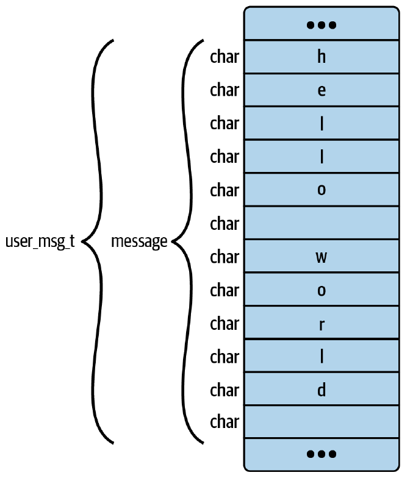

# 第五章 CO-RE、BTF 和 Libbpf

在上一章中，您第一次遇到了 BTF（BPF Type Format，BPF 类型格式）。本章讨论它存在的原因以及如何使用它来使 eBPF 程序在不同版本的内核之间可移植。它是 BPF 一次编译、到处运行 (compile once-run everywhere，CO-RE) 方法的关键部分，该方法解决了 eBPF 程序在不同内核版本之间可移植的问题。

许多 eBPF 程序访问内核数据结构体，eBPF 程序员需要包含相关的 Linux 头文件，以便他们的 eBPF 代码可以正确定位这些数据结构体中的字段。然而，Linux 内核正在不断开发，这意味着不同内核版本之间的内部数据结构体可能会发生变化。如果您要将在一台机器上编译的 eBPF 目标文件加载到具有不同内核版本的机器上，则无法保证数据结构体相同。（严格来说，数据结构体定义来自内核头文件，您可以选择基于一组头文件进行编译，其中这组头文件可以与用于构建当前机器上运行的内核的头文件不同。为了正确工作（没有本章中描述的 CO-RE 机制），内核头必须与运行 eBPF 程序的目标机器上的内核兼容。）

CO-RE 方法在高效解决可移植性问题方面迈出了一大步。它允许 eBPF 程序包含编译时的数据结构体布局信息，并提供了一种机制，用于在目标机器上运行时，如果数据结构体布局不同，就调整字段的访问方式。只要程序不访问目标机器内核中根本不存在的字段或数据结构体，程序就可以在不同内核版本之间移植。

在我们深入探讨 CO-RE 如何工作的细节之前，让我们先看看 BCC 项目最初实现内核可移植性的方法，讨论一下为什么它如此受欢迎。

## BCC 的可移植性方法

在第 2 章中，我使用 [BCC](https://github.com/iovisor/bcc) 展示了 eBPF 程序的基本“Hello World”示例。 BCC 项目是第一个用于实现 eBPF 程序的流行项目，为用户空间和内核方面提供了一个框架，对于没有太多内核经验的程序员来说相对容易访问。为了解决跨内核的可移植性，BCC 采用了在运行时、在目标计算机上就地编译 eBPF 代码的方法。这种方法存在许多问题：

- 编译工具链需要安装在您希望运行代码的每台目标计算机上，内核头文件也需要安装（默认情况下并不总是存在）。
- 您必须等待编译完成才能启动该工具，这可能意味着每次启动该工具时都会延迟几秒钟。
- 如果您在大量相同的机器上运行该工具，则在每台机器上重复编译会浪费计算资源。
- 一些基于 BCC 的项目将其 eBPF 源代码和工具链打包到容器镜像中，这使得分发到每台机器变得更容易。但这并不能解决确保内核头文件存在的问题，如果在每台机器上安装多个这样的 BCC 容器，甚至可能意味着更多的重复。
- 嵌入式设备可能没有足够的内存资源来运行编译步骤。

由于这些问题，如果您计划开始开发一个重要的新 eBPF 项目，我不建议使用这种遗留的 BCC 方法，特别是如果您计划将其分发给其他人使用。在本书中，我给出了一些基于 BCC 的示例，因为这是学习 eBPF 基本概念的好方法，特别是因为 Python 用户空间代码非常紧凑且易于阅读。如果您对它比较熟悉，并且想快速完成一些事情，它也是一个很好的选择。但它并不是现代 eBPF 开发的最佳方法。

CO-RE 方法为 eBPF 程序的跨内核可移植性问题提供了更好的解决方案。

> 提示
>
> [github.com/iovisor/bcc](https://github.com/iovisor/bcc) 上的 BCC 项目包含各种命令行工具，用于观察 Linux 机器行为的各种信息。位于 [tools](https://github.com/iovisor/bcc/tree/master/tools) 目录中的原始版本主要是使用我在本节中描述的这种传统的可移植性方法在 Python 中实现的。
>
> 在 BCC 的 [libbpf-tools](https://github.com/iovisor/bcc/tree/master/libbpf-tools) 目录中，您会发现这些用 C 语言编写的工具的更新版本，它们利用了 _libbpf_ 和 CO-RE，并且不会遇到我刚刚列出的问题。它们是一组非常有用的实用程序！

## CO-RE 概述

CO-RE 方法由几个要素组成（本节部分内容改编自“What Is eBPF?”，作者：Liz Rice。一项小型且不科学的调查表明，大多数人将其发音与 core 一词相同，而不是两个音节）：

- _BTF_
  - [BTF](https://docs.kernel.org/bpf/btf.html) 是一种表达数据结构体和函数签名布局的格式。在 CO-RE 中，它用于确定编译时和运行时使用的结构体之间的任何差异。 BTF 还被 bpftool 等工具用来以人类可读的格式转储数据结构体。 Linux 内核从 5.4 开始支持 BTF。
- 内核头
  - Linux 内核源代码包含描述其使用的数据结构体的头文件，并且这些头文件在 Linux 版本之间可能发生变化。 eBPF 程序员可以选择包含单独的头文件，或者，正如您将在本章中看到的，您可以使用 bpftool 从正在运行的系统生成一个名为 _vmlinux.h_ 的头文件，它包含了 BPF 程序可能需要的关于内核的所有数据结构体信息。
- 编译器支持
  - [Clang 编译器得到了增强](https://lists.llvm.org/pipermail/cfe-dev/2021-December/069635.html)，因此当它使用 **-g** 标志编译 eBPF 程序时，它包括所谓的 _CO-RE 重定位_（CO-RE relocations），该重定位源自描述内核数据结构体的 BTF 信息。 GCC 编译器还在[版本 12](https://gcc.gnu.org/gcc-12/changes.html) 中添加了对 BPF 目标的 CO-RE 支持。
- 支持数据结构体重定位的库
  - 当用户空间程序将 eBPF 程序加载到内核中时，CO-RE 方法要求根据编译时的数据结构体与即将运行的目标机器上的数据结构体之间的差异，调整字节码以进行补偿。这基于编译到对象中的 CO-RE 重定位信息。有几个库可以处理这个问题：[libbpf](https://github.com/libbpf/libbpf) 是包含此重定位功能的原始 C 库，Cilium eBPF 库为 Go 程序员提供了相同的功能，Aya 为 Rust 提供了同样的功能。
- 可选地，BPF 框架（skeleton）
  - 可以从编译的 BPF 对象文件自动生成一个框架，其中包含用户空间代码可以调用的便捷函数，用于管理 BPF 程序的生命周期，如将它们加载到内核中、将它们附加到事件等。如果您使用 C 编写用户空间代码，可以使用 **bpftool gen skeleton** 命令生成该框架。这些函数是更高级的抽象，对开发人员来说比直接使用底层库（如 _libbpf_、_cilium/ebpf_ 等）更方便。

> 提示
>
> Andrii Nakryiko 撰写了一篇[出色的博客文章](https://nakryiko.com/posts/bpf-portability-and-co-re/)，描述了 CO-RE 的背景，并阐述了它的工作原理和使用方法。他还编写了规范的 [BPF CO-RE 参考指南](https://nakryiko.com/posts/bpf-core-reference-guide/#bpf-core-read)，因此如果您要自己编写代码，请务必阅读该指南。他的 [libbpf-bootstrap 指南](https://nakryiko.com/posts/libbpf-bootstrap/)使用 CO-RE + libbpf + sketchs 从头开始构建 eBPF 应用程序是另一个必读的内容。

现在，您已经对 CO-RE 的要素有了一个大致的了解，让我们从探讨 BTF 开始，深入了解它们是如何工作的。

## BPF 类型格式（BPF Type Format）

BTF 信息描述了数据结构体和代码在内存中的布局方式。这些信息可以有多种不同的用途。

### BTF 用例

在 CO-RE 章节中讨论 BTF 的主要原因是，了解编译 eBPF 程序的结构体布局与将要运行的结构体布局之间的差异，可以在程序加载到内核时进行适当的调整。我将在本章后面讨论重定位过程，但是现在，让我们考虑一下 BTF 信息的其他用途。

了解结构体的布局方式以及该结构体中每个字段的类型，可以以人类可读的形式漂亮地打印结构体的内容。例如，从计算机的角度来看，字符串只是一系列字节，但是将这些字节转换为字符使字符串更容易被人类理解。您已经在前一章中看到了这样的示例，其中 **bpftool** 使用 BTF 信息来格式化映射转储的输出。

BTF 信息还包括行和函数信息，这些信息使 **bpftool** 能够在翻译或即时编译后的程序转储的输出中交错输出源代码，如您在第 3 章中看到的那样。当您阅读第 6 章时，您还将看到源代码信息与验证器日志输出交错在一起，这也来自 BTF 信息。

BPF 自旋锁也需要 BTF 信息。*自旋锁*用于阻止两个 CPU 核心同时访问相同的 map 值。锁必须作为 map 值结构体的一部分，如下所示：

```c
struct my_value {
    ... <other fields>
    struct bpf_spin_lock lock;
... <other fields>
};
```

在内核中，eBPF 程序使用 **bpf_spin_lock()** 和 **bpf_spin_unlock()** 辅助函数来获取和释放锁。只有当 BTF 信息可以描述锁字段在结构体中的位置时，才能使用这些辅助程序。

> 提示
>
> 内核版本 5.1 中添加了自旋锁支持。自旋锁的使用有很多限制：它们只能用于哈希或数组 map 类型，并且不能用于跟踪或套接字过滤器类型的 eBPF 程序。请阅读 [lwn.net 有关 BPF 并发管理](https://lwn.net/Articles/779120/)文章，了解有关自旋锁的更多信息。

现在您已经知道为什么 BTF 信息有用，让我们通过一些示例来更具体地了解。

### 使用 bpftool 列出 BTF 信息

与程序和 map 一样，您可以使用 **bpftool** 实用程序来显示 BTF 信息。以下命令列出了加载到内核中的所有 BTF 数据：

```bash
bpftool btf list
1: name [vmlinux] size 5843164B
2: name [aes_ce_cipher] size 407B
3: name [cryptd] size 3372B
...
149: name <anon> size 4372B prog_ids 319 map_ids 103
        pids hello-buffer-co(7660)
155: name <anon> size 37100B
        pids bpftool(7784)
```

（为了简洁起见，我省略了结果中的许多条目。）

列表中的第一个条目是 **vmlinux**，它对应于我之前提到的 _vmlinux_ 文件，该文件保存有关当前运行的内核的 BTF 信息。

> 提示
>
> 本章前面的一些示例重用了第 4 章中的程序，然后在本章后面您将找到新示例，其源代码位于 [github.com/lizrice/learning-ebpf](https://github.com/lizrice/learning-ebpf) 的 Chapter5 目录中。

为了获得这个示例输出，我在运行第 4 章中的 **hello-buffer-config** 示例时运行了此命令。您可以在以 **149:** 开头的行上看到描述此进程正在使用的 BTF 信息的条目：

```bash
149: name <anon> size 4372B prog_ids 319 map_ids 103
        pids hello-buffer-co(7660)
```

这行带给我们的信息有：

- 这块 BTF 信息的 ID 为 149。
- 这是一个大约 4 KB BTF 信息的匿名 blob。
- 它由 **prog_id 319** 的 BPF 程序和 **map_id 103** 的 BPF 映射使用。
- 它还被 ID 为 7660（显示在括号内）的进程使用，该进程运行 **hello-buffer-config** 可执行文件（其名称已被截断为 15 个字符）。

这些程序、map 和 BTF 标识符与 **bpftool** 显示的有关 **hello-buffer-config** 名为 **hello** 的程序的以下输出相匹配：

```bash
bpftool prog show name hello
319: kprobe name hello tag a94092da317ac9ba gpl
        loaded_at 2022-08-28T14:13:35+0000 uid 0
        xlated 400B jited 428B memlock 4096B map_ids 103,104
        btf_id 149
        pids hello-buffer-co(7660)
```

这两组信息之间唯一看起来不完全匹配的是程序引用了一个额外的 **map_id, 104**。这是 perf 事件缓冲区 map，它不使用 BTF 信息；因此，它不会出现在 BTF 相关输出中。

就像 bpftool 可以转储程序和 map 的内容一样，它也可以用于查看数据块中包含的 BTF 类型信息。

### BTF 类型

知道 BTF 信息的 ID 后，您可以使用命令 **bpftool btf dump id \<id\>** 检查其内容。当我使用之前获得的 ID 149 运行此程序时，我得到了 69 行输出，每行都是一个类型定义。我将只描述前几行，这应该可以让您很好地了解如何解释其余的内容。前几行的 BTF 信息与配置哈希 map 相关，它在源代码中定义如下：

```c
struct user_msg_t {
    char message[12];
};
BPF_HASH(config, u32, struct user_msg_t);
```

该哈希表的键类型为 **u32**，值类型为结构体 **user_msg_t**。该结构体包含一个 12 字节的 **message** 字段。让我们看看在相应的 BTF 信息中是如何定义这些类型的。

BTF 输出的前三行如下：

```bash
[1] TYPEDEF 'u32' type_id=2
[2] TYPEDEF '__u32' type_id=3
[3] INT 'unsigned int' size=4 bits_offset=0 nr_bits=32 encoding=(none)
```

每行开头方括号中的数字是类型 ID（因此，以 **[1]** 开头的第一行定义了 **type_id 1**，等等）。让我们更详细地探讨这三种类型：

- 类型 1 定义了一个名为 u32 的类型，其类型由 **type_id 2** 定义，即以 [2] 开头的行中定义的类型。如您所知，哈希表中的键的类型为 u32。
- 类型 2 的名称为 **\_\_u32**，类型由 **type_id 3** 定义。
- 类型 3 是一个整数类型，名称为 **unsigned int**，长度为 4 个字节。

上面这三种类型都是 32 位无符号整数类型的同义词。在 C 语言中，整数的长度与平台相关，因此 Linux 定义了像 **u32** 这样的类型来显式定义特定长度的整数。在本机上，**u32** 对应于无符号整数。引用这些的用户空间代码应该使用带下划线前缀的同义词，如 **\_\_u32**。

BTF 输出中的接下来的几种类型如下所示：

```bash
[4] STRUCT 'user_msg_t' size=12 vlen=1
        'message' type_id=6 bits_offset=0
[5] INT 'char' size=1 bits_offset=0 nr_bits=8 encoding=(none)
[6] ARRAY '(anon)' type_id=5 index_type_id=7 nr_elems=12
[7] INT '__ARRAY_SIZE_TYPE__' size=4 bits_offset=0 nr_bits=32 encoding=(none)
```

这些与用于 **config** map 中的值的 **user_msg_t** 结构体相关：

- 类型 4 是 **user_msg_t** 结构本身，总共 12 个字节长。它包含一个名为 **message** 的字段，该字段由类型 6 定义。 **vlen** 字段指示此定义中有多少个字段。
- 类型 5 被命名为 **char**，是一个 1 字节整数——这正是 C 程序员对 "char "类型的期望定义。
- 类型 6 将该 **message** 字段的类型定义为包含 12 个元素的数组。每个元素的类型为 5（它是一个字符），数组的索引为类型 7。
- 类型 7 是一个 4 字节整数。

通过这些定义，您可以完整了解 **user_msg_t** 结构体在内存中的布局，如图 5-1 所示。



_图 5-1. **user_msg_t** 结构体占用 12 字节内存_

到目前为止，所有条目的 **bits_offset** 都设置为 0，但下一行输出的结构体包含多个字段：

```bash
[8] STRUCT '____btf_map_config' size=16 vlen=2
        'key' type_id=1 bits_offset=0
        'value' type_id=4 bits_offset=32
```

这是存储在名为 **config** 的 map 中的键值对的结构定义。我没有在源代码中定义这个**btf_map_config** 类型，但它是由 BCC 生成的。键的类型为 **u32**，值是 **user_msg_t** 结构体。这些对应于您之前看到的类型 1 和 4。

关于该结构体的 BTF 信息的另一个重要部分是值字段在该结构开始后的 32 位开始。这完全有道理，因为需要前 32 位来保存键字段。

> 提示
>
> 在 C 中，结构体字段会自动与边界对齐，因此您不能简单地假设一个字段始终紧跟在内存中的前一个字段之后。例如，考虑这样的结构：
>
> ```c
> struct something {
>     char letter;
>     u64 number;
> }
> ```
>
> 在 **letter** 的字段之后、 **number** 字段之前将有 7 个字节的未使用内存，以便将 64 位 **number** 对齐到可被 8 整除的内存位置。
>
> 在某些情况下，可以打开编译器打包来避免这种未使用的空间，但它通常会降低性能，而且（至少根据我的经验）这样做是不寻常的。更多时候，C 程序员会手工设计结构体以有效利用空间。

### 带有 BTF 信息的 map

您刚刚看到了与 map 相关的 BTF 信息。现在让我们看看在创建 map 时，如何将这些 BTF 数据传递给内核。

您在第 4 章中看到，map 是使用 **bpf(BPF_MAP_CREATE)** 系统调用创建的。这需要一个 **bpf_attr** 结构体作为参数，[在内核中定义](https://elixir.bootlin.com/linux/v5.19.17/source/include/uapi/linux/bpf.h#L1273)如下（省略一些细节）：

```c
struct { /* anonymous struct used by BPF_MAP_CREATE command */
    __u32    map_type;    /* one of enum bpf_map_type */
    __u32    key_size;    /* size of key in bytes */
    __u32    value_size;    /* size of value in bytes */
    __u32    max_entries;    /* max number of entries in a map */
    ...
    char    map_name[BPF_OBJ_NAME_LEN];
    ...
    __u32    btf_fd;        /* fd pointing to a BTF type data */
    __u32    btf_key_type_id;    /* BTF type_id of the key */
    __u32    btf_value_type_id;    /* BTF type_id of the value */
    ...
};
```

在引入 BTF 之前，**bpf_attr** 结构中不存在 **btf\_\*** 字段，并且内核不知道键或值的结构。 key_size 和 value_size 字段定义了它们需要多少内存，但它们只是被视为这么多字节。通过额外传入定义键和值类型的 BTF 信息，内核可以深入理解他们，并且像 bpftool 这样的实用程序可以检索类型信息以进行漂亮打印，如前所述。然而，值得注意的是，键和值分别传入了单独的 BTF **type_id**。您刚刚看到定义的 **btf_map_config** 结构并未被内核用于 map 定义；它仅由 BCC 在用户空间使用。

### 函数和函数原型的 BTF 数据

到目前为止，本示例输出中的 BTF 数据与数据类型相关，但 BTF 数据还包含有关函数和函数原型的信息。下面是同一个 BTF 数据 blob 中描述 **hello** 函数的信息：

```bash
[31] FUNC_PROTO '(anon)' ret_type_id=23 vlen=1
        'ctx' type_id=10
[32] FUNC 'hello' type_id=31 linkage=static
```

在类型 32 中，您可以看到名为 hello 的函数被定义为具有上一行中定义的类型。这是一个函数原型，它返回类型 ID 23 的值，并采用一个(**vlen=1**)名为 **ctx** 的参数 ，类型 ID 为 10。为了完整起见，以下是前面输出中这些类型的定义：

```bash
[10] PTR '(anon)' type_id=0

[23] INT 'int' size=4 bits_offset=0 nr_bits=32 encoding=SIGNED
```

类型 10 是一个匿名指针，默认类型为 0，它没有显式地包含在 BTF 输出中，但被定义为 void 指针。（请参阅 [https://docs.kernel.org/bpf/btf.html#type-encoding](https://docs.kernel.org/bpf/btf.html#type-encoding) 上的内核文档。）

类型 23 的返回值为 4 字节整数，**encoding=SIGNED** 表示为有符号整数；也就是说，它可以具有正值或负值。这对应于 _hello-buffer-config.py_ 源代码中的函数定义，如下所示：

```c
int hello(void *ctx)
```

到目前为止，我展示的示例 BTF 信息来自列出 BTF 数据 blob 的内容。让我们看看如何获取与特定 map 或程序相关的 BTF 信息。

### 检查 map 和程序的 BTF 数据

如果您想检查与特定 map 关联的 BTF 类型，bpftool 可以帮助您轻松实现。例如，这是 **config** map 的输出：

```bash
bpftool btf dump map name config
[1] TYPEDEF 'u32' type_id=2
[4] STRUCT 'user_msg_t' size=12 vlen=1
    'message' type_id=6 bits_offset=0
```

同样，您可以使用 **bpftool btf dump prog \<prog Identity\>** 检查与特定程序相关的 BTF 信息。更多详情请查看[手册](https://manpages.ubuntu.com/manpages/jammy/man8/bpftool-btf.8.html)。

> 提示
>
> 如果您想更好地了解 BTF 类型数据是如何生成和去重的，Andrii Nakryiko 就该主题撰写了另一篇精彩的[博客文章](https://nakryiko.com/posts/btf-dedup/)。

到此阶段，您应该了解 BTF 如何描述数据结构和函数的格式。用 C 编写的 eBPF 程序需要定义类型和结构体的头文件。让我们看看为 eBPF 程序可能需要的任何内核数据类型生成头文件是多么容易。

## 生成内核头文件

如果您在支持 BTF 的内核上运行 **bpftool btf list**，您将看到许多预先存在的 BTF 数据块，如下所示：

```bash
$ bpftool btf list
1: name [vmlinux] size 5842973B
2: name [aes_ce_cipher] size 407B
3: name [cryptd] size 3372B
...
```

此列表中的第一项 ID 为 1，名为 **vmlinux**，是有关在此（虚拟）计算机上运行的内核使用的所有数据类型、结构体和函数定义的 BTF 信息。（内核需要在启用 **CONFIG_DEBUG_INFO_BTF** 选项的情况下构建。）

eBPF 程序需要它所引用的任何内核数据结构体和类型的定义。在 CO-RE 出现之前，您通常必须弄清楚 Linux 内核源代码中的许多单独头文件中的哪些包含您感兴趣的结构的定义，但现在有一种更简单的方法，因为支持 BTF 的工具可以从内核包含的 BTF 信息中生成一个合适的头文件。

该头文件通常称为 _vmlinux.h_，您可以使用 **bpftool** 生成它，如下所示：

```bash
bpftool btf dump file /sys/kernel/btf/vmlinux format c > vmlinux.h
```

该文件定义了所有内核的数据类型，因此在您的 eBPF 程序源代码中包含此生成的 _vmlinux.h_ 文件可提供您可能需要的任何 Linux 数据结构体的定义。当您将源代码编译为 eBPF 目标文件时，该目标文件将包含与头文件中定义相匹配的 BTF 信息。稍后，当程序在目标计算机上运行时，将其加载到内核的用户空间程序将根据编译时的 BTF 信息和目标机器上运行的内核的 BTF 信息之间的差异进行调整。

自版本 5.4 以来（哪个是支持 BTF 的最旧的 Linux 内核版本？请参阅[这个](https://lists.iovisor.org/g/iovisor-dev/message/1966)），_/sys/kernel/btf/vmlinux_ 文件形式的 BTF 信息已包含在 Linux 内核中，但也可以为较旧的内核生成 libbpf 可以使用的原始 BTF 数据。换句话说，如果您想在还没有 BTF 信息的目标机器上运行支持 CO-RE 的 eBPF 程序，您可以自己为目标机提供 BTF 数据。 [BTFHub](https://github.com/aquasecurity/btfhub) 上提供了有关如何生成 BTF 文件的信息，以及各种 Linux 发行版的文件存档。

> 提示
>
> 如果您想更深入地了解这个主题，BTFHub 存储库还包括有关 [BTF internals](https://github.com/aquasecurity/btfhub/blob/main/docs/btfgen-internals.md) 的进一步阅读。

接下来，让我们看看如何使用 CO-RE 来编写跨内核可移植的 eBPF 程序。

## CO-RE eBPF 程序

您应该记得 eBPF 程序在内核中运行。在本章后面，我将展示一些将与内核中运行的代码交互的用户空间代码，但在本节中我将重点关注内核端。

正如您已经看到的，eBPF 程序被编译为 eBPF 字节码，并且（至少在撰写本文时）支持此功能的编译器是用于编译 C 代码的 Clang 或 gcc 以及 Rust 编译器。我将在第 10 章中讨论使用 Rust 的一些选项，但就本章而言，我假设您使用 C 语言编写并使用 Clang 以及 _libbpf_ 库。

在本章的剩余部分，我们将考虑一个名为 _hello-buffer-config_ 的示例应用程序。它与上一章中使用 BCC 框架的 _hello-buffer-config.py_ 示例非常相似，但该版本是用 C 编写的，以使用 _libbpf_ 和 CO-RE。

如果您有基于 BCC 的 eBPF 代码想要迁移到 libbpf，请在 Andrii Nakryiko 的网站上查看出色且全面的[指南](https://nakryiko.com/posts/bcc-to-libbpf-howto-guide/#bpf-code-conversion)。 BCC 提供了一些方便的快捷方式，这些快捷方式与使用 _libbpf_ 的处理方式不同；相反，_libbpf_ 提供了自己的一组宏和库函数，以使 eBPF 程序员更轻松。在演示该示例时，我将指出 BCC 和 _libbpf_ 方法之间的一些差异。

> 提示
>
> 您可以在 [github.com/lizrice/learning-ebpf](https://github.com/lizrice/learning-ebpf) 存储库的 _chapter5_ 目录中找到本节附带的示例 C eBPF 程序。

首先我们看一下 _hello-buffer-config.bpf.c_，它实现了在内核中运行的 eBPF 程序。在本章后面，我将向您展示 _hello-buffer-config.c_ 中的用户空间代码，该代码加载程序并显示输出，就像第 4 章中此示例的 BCC 实现中的 Python 代码所做的那样。

与任何 C 程序一样，eBPF 程序需要包含一些头文件。

### 头文件

_hello-buffer-config.bpf.c_ 的前几行指定了它需要的头文件：

```c
#include "vmlinux.h"
#include <bpf/bpf_helpers.h>
#include <bpf/bpf_tracing.h>
#include <bpf/bpf_core_read.h>
#include "hello-buffer-config.h"
```

这五个文件是 _vmlinux.h_ 文件、_libbpf_ 中的一些头文件以及我自己编写的用于应用程序的头文件。让我们看看为什么这是 _libbpf_ 程序所需的头文件的典型模式。

#### 内核头信息

如果您正在编写引用任何内核数据结构体或类型的 eBPF 程序，最简单的选择是包含本章前面描述的 _vmlinux.h_ 文件。或者，如果您确实想解决这个问题，也可以包含来自 Linux 源代码的单独头文件，或者在您自己的代码中手动定义类型。如果您要使用 _libbpf_ 中的任何 BPF 辅助函数，则需要包含 _vmlinux.h_ 或 _linux/types.h_ 来获取 BPF 辅助函数源代码所引用的 **u32**、**u64** 等类型的定义。

_vmlinux.h_ 文件源自内核源代码头文件，但它不包含其中的 **#define** 定义的值。例如，如果您的 eBPF 程序解析以太网数据包，您可能需要常量定义来告诉您数据包包含什么协议（例如 **0x0800** 表示它是 IP 数据包，或 **0x0806** 表示 ARP 数据包）。如果您不包含为内核定义这些值的 [_if_ether.h_ 文件](https://elixir.bootlin.com/linux/v5.19.4/source/include/uapi/linux/if_ether.h#L52)，则需要在自己的代码中复制一系列常量值。我不需要在 _hello-buffer-config_ 中定义这些值，但您会在第 8 章中看到另一个与之相关的示例。

#### 来自 libbpf 的头文件

要在 eBPF 代码中使用任何 BPF 辅助函数，您需要包含 libbpf 中提供其定义的头文件。

> 提示
>
> 关于 _libbpf_ 可能有点令人困惑的一件事是它不仅仅是一个用户空间库。您会发现自己在用户空间和 eBPF C 代码中都包含了 _libbpf_ 的头文件。

在写这篇文章的时候，我们经常看到 eBPF 项目将 _libbpf_ 作为一个子模块，并从源代码开始构建/安装——我在本书的示例资源库中就是这样做的。如果您把它作为一个子模块，您只需要在 _libbpf/src_ 目录下运行 **make install**。我认为不久的将来，_libbpf_ 就会作为一个软件包广泛地出现在常见的 Linux 发行版上，尤其是*libbpf* 现在已经通过了[1.0 版本](https://nakryiko.com/posts/libbpf-v1/)的里程碑。

#### 用于应用程序的头文件

拥有一个用于应用程序的头文件是很常见的，它定义了应用程序的用户空间和 eBPF 部分使用的任何结构体。在我的示例中，_hello-buffer-config.h_ 头文件定义了 **data_t** 结构体，我使用该结构将事件数据从 eBPF 程序传递到用户空间。它与您在该代码的 BCC 版本中看到的结构体几乎相同，如下所示：

```c
struct data_t {
   int pid;
   int uid;
   char command[16];
   char message[12];
   char path[16];
};
```

与您之前看到的版本的唯一区别是我添加了一个名为 **path** 的字段。

将此结构体定义放入单独的头文件中的原因是我还将从 _hello-buffer-config.c_ 中的用户空间代码中引用它。在 BCC 版本中，内核和用户空间代码都定义在单个文件中，并且 BCC 在幕后做了一些工作，以使该结构可供 Python 用户空间代码使用。

### 定义 map

包含头文件后，_hello-buffer-config.bpf.c_ 中源代码的接下来几行定义了用于 map 的结构体，如下所示：

```c
struct {
    __uint(type, BPF_MAP_TYPE_PERF_EVENT_ARRAY);
    __uint(key_size, sizeof(u32));
    __uint(value_size, sizeof(u32));
} output SEC(".maps");

struct user_msg_t {
   char message[12];
};

struct {
    __uint(type, BPF_MAP_TYPE_HASH);
    __uint(max_entries, 10240);
    __type(key, u32);
    __type(value, struct user_msg_t);
} my_config SEC(".maps");
```

这需要的代码行数比我在等效 BCC 示例中所需的代码行数要多！使用 BCC 的话，使用以下宏创建名为 config 的映射：

```c
BPF_HASH(config, u64, struct user_msg_t);
```

当您不使用 BCC 时，该宏不可用，因此在 C 中您必须手写它。您会看到我使用了 **\_\_uint** 和 **\_\_type**。它们与 **\_\_array** 一起在 [bpf/bpf_helpers_def.h](https://elixir.bootlin.com/linux/v5.19.17/source/tools/lib/bpf/bpf_helpers.h) 中定义，如下所示：

```c
#define __uint(name, val) int (*name)[val]
#define __type(name, val) typeof(val) *name
#define __array(name, val) typeof(val) *name[]
```

在基于 _libbpf_ 的程序中，这些宏似乎是约定俗成的，我认为它们使 map 定义更容易阅读。

> 提示
>
> 名称 “config” 与 _vmlinux.h_ 中的定义冲突，因此我在本示例中将 map 重命名为 “my_config”。

### eBPF 程序节

使用 libbpf 要求每个 eBPF 程序都用 **SEC()** 宏标记定义程序类型，如下所示：

```c
SEC("kprobe")
```

这会在编译的 ELF 对象中产生一个名为 **kprobe** 的部分，因此 _libbpf_ 知道将其加载为 **BPF_PROG_TYPE_KPROBE**。我们将在第 7 章中进一步讨论不同的程序类型。

根据程序类型，您还可以使用节名称来指定程序将附加到哪个事件。 _libbpf_ 库将使用此信息自动设置附加，而不是让您在用户空间代码中显式执行此操作。因此，例如，要在基于 ARM 架构的计算机上自动附加到 **execve** 系统调用的 kprobe，您可以指定如下部分：

```c
SEC("kprobe/__arm64_sys_execve")
```

这需要您知道该架构上系统调用的函数名称（或者通过查看目标计算机上的 _/proc/kallsyms_ 文件来找出它，该文件列出了所有内核符号，包括函数名称）。但是 **libbpf** 可以通过 **k(ret)syscall** 节名称让开发变得更加轻松，它告诉加载程序自动附加到特定架构函数的 kprobe：

```c
SEC("ksyscall/execve")
```

> 提示
>
> [_libbpf_ 文档](https://libbpf.readthedocs.io/en/latest/program_types.html)中列出了有效的节名称和格式。在过去，对节名称的要求要宽松得多，因此您可能会遇到在 _libbpf 1.0_ 之前编写的 eBPF 程序，其节名称与有效集不匹配。不要让它们迷惑您！

节定义声明了 eBPF 程序应附加到的位置，然后是程序本身。和以前一样，eBPF 程序本身被编写为 C 函数。在示例代码中，它被称为 **hello()**，它与您在第 4 章中看到的 **hello()** 函数非常相似。让我们考虑一下先前版本和此处版本之间的差异：

```c
SEC("ksyscall/execve")
// 我利用了 libbpf 中定义的 BPF_KPROBE_SYSCALL 宏，它可以方便地通过名称访问系统调用的参数。对于 execve()，第一个参数是要执行的程序的路径名。 eBPF 程序名称是 hello。
int BPF_KPROBE_SYSCALL(hello, const char *pathname)
{
   struct data_t data = {};
   struct user_msg_t *p;

   data.pid = bpf_get_current_pid_tgid() >> 32;
   data.uid = bpf_get_current_uid_gid() & 0xFFFFFFFF;

   bpf_get_current_comm(&data.command, sizeof(data.command));
   // 由于宏使访问 execve() 的路径名参数变得如此容易，因此我将其包含在发送到 perf 缓冲区输出的数据中。请注意，复制内存需要使用 BPF 辅助函数。
   bpf_probe_read_user_str(&data.path, sizeof(data.path), pathname);

   // 这里，bpf_map_lookup_elem() 是 BPF 辅助函数，用于在给定键的情况下查找 map 中的值。 BCC 的等效项是 p = my_config.lookup(&data.uid)。 在将C代码传递给编译器之前，BCC 使用底层的 bpf_map_lookup_elem() 函数重写了这个函数。当您使用 libbpf 时，在编译之前不会重写代码，因此您必须直接使用辅助函数。（正常的C语言预处理可以让您做 #define 这样的事情。但是没有像使用 BCC 那样的特殊重写。）
   p = bpf_map_lookup_elem(&my_config, &data.uid);
   if (p != 0) {
      bpf_probe_read_kernel_str(&data.message, sizeof(data.message), p->message);
   } else {
      bpf_probe_read_kernel_str(&data.message, sizeof(data.message), message);
   }

   // 这是另一个类似的示例，我直接使用辅助函数 bpf_perf_event_output()，其中 BCC 为我提供了方便的等效函数：output.perf_submit(ctx, &data, sizeof(data))。
   bpf_perf_event_output(ctx, &output, BPF_F_CURRENT_CPU, &data, sizeof(data));
   return 0;
}
```

唯一的区别是，在 BCC 版本中，我将消息字符串定义为 **hello()** 函数中的局部变量。 BCC 不支持全局变量（至少在撰写本文时）。在此版本中，我将其定义为全局变量，如下所示：

```c
char message[12] = "Hello World";
```

在 _chapter4/hello-buffer-config.py_ 中，**hello** 函数的定义相当不同，如下所示：

```c
int hello(void *ctx)
```

**BPF_KPROBE_SYSCALL** 宏是我提到的 _libbpf_ 中方便添加的宏之一。您不一定要使用宏，但它使开发更轻松。它完成了所有繁重的工作，为传递给系统调用的所有参数提供命名参数。在本例中，它提供一个 **pathname** 参数，该参数指向一个字符串，该字符串保存将要运行的可执行文件的路径，这是 **execve()** 系统调用的第一个参数。

如果您仔细观察，您可能会注意到 **ctx** 变量在我的 _hello-buffer-config.bpf.c_ 源代码中没有显式定义，但尽管如此，我还是能够在向 **output** perf 缓冲区提交数据时使用它，就像这样：

```c
bpf_perf_event_output(ctx, &output, BPF_F_CURRENT_CPU, &data, sizeof(data));
```

**ctx** 变量确实存在，隐藏在 _libbpf_ 中 [bpf/bpf_tracing.h](https://elixir.bootlin.com/linux/v5.19.17/source/tools/lib/bpf/bpf_tracing.h#L516) 内的 **BPF_KPROBE_SYSCALL** 宏定义中，您还可以在其中找到一些相关的注释。使用未明确定义的变量可能会有点混乱，但可以访问它是非常有用的。

### 使用 CO-RE 进行内存访问

用于跟踪的 eBPF 程序通过 **bpf*probe_read*\*()** 系列（处理网络数据包的 eBPF 程序无法使用此辅助函数，只能访问网络数据包内存）的 BPF 辅助函数有限制地对内存进行访问。（还有一个 bpf_probe_write_user() 辅助函数，但它仅[“用于实验”](https://man7.org/linux/man-pages/man7/bpf-helpers.7.html)）。问题在于，正如您将在下一章中看到的，eBPF 验证器通常不会让您像在 C 中那样通过指针简单地读取内存（例如，**x = p->y**）。（它在某些启用 BTF 的程序类型中是允许的，例如 **tp_btf**、**fentry** 和 **fexit**）

_libbpf_ 库围绕 **bpf*probe_read*\*()** 辅助函数提供了 CO-RE 封装器，以利用 BTF 信息并使内存访问调用可以跨不同内核版本移植。下面是 [bpf_core_read.h 头文件](https://github.com/libbpf/libbpf/blob/master/src/bpf_core_read.h#L245)中定义的一个封装器的示例：

```c
#define bpf_core_read(dst, sz, src)                        \
    bpf_probe_read_kernel(dst, sz, (const void *)__builtin_preserve_access_index(src))
```

如您所见，**bpf_core_read()** 直接调用 **bpf_probe_read_kernel()**，唯一的区别是它用 **\_\_builtin_preserve_access_index()** 封装了 src 字段。这告诉 Clang 发出 CO-RE 重定位项以及访问内存中该地址的 eBPF 指令。

> 提示
>
> 此 **\_\_builtin_preserve_access_index()** 指令是“常规”C 代码的扩展，将其添加到 eBPF 还需要更改 Clang 编译器以支持它并发出这些 CO-RE 重定位项。像这样的扩展是一些 C 编译器不能（至少现在不能）生成 eBPF 字节码的原因。在 [LLVM 邮件列表](https://lists.llvm.org/pipermail/cfe-dev/2021-December/069635.html)中阅读更多关于支持 eBPF CO-RE 所需的 Clang 修改。

正如您将在本章后面看到的那样，CO-RE 重定位项告诉 _libbpf_ 在将 eBPF 程序加载到内核时重新写入地址，以考虑任何 BTF 差异。如果源代码在其包含结构体中的偏移在目标内核上是不同的，重新写入的指令将考虑到这一点。

_libbpf_ 库提供了一个 **BPF_CORE_READ()** 宏，这样您就可以在一行中编写多个 **bpf_core_read()** 调用，而不需要为每个指针解引用编写单独的辅助函数调用。例如，如果您想要执行类似 **d = a->b->c->d** 的操作，您可以编写以下代码：

```c
struct b_t *b;
struct c_t *c;

bpf_core_read(&b, 8, &a->b);
bpf_core_read(&c, 8, &b->c);
bpf_core_read(&d, 8, &c->d);
```

但可以使用更加紧凑的写法：

```c
d = BPF_CORE_READ(a, b, c, d);
```

然后，您可以使用 **bpf_probe_read_kernel()** 辅助函数从指针 d 读取。 Andrii 的[指南](https://nakryiko.com/posts/bcc-to-libbpf-howto-guide/#field-accesses)对此有很好的描述。

### 许可证定义

正如您从第 3 章中已经了解的那样，eBPF 程序必须声明其许可证。示例代码是这样实现的：

```c
char LICENSE[] SEC("license") = "Dual BSD/GPL";
```

您现在已经看到了 _hello-buffer-config.bpf.c_ 示例中的所有代码。现在让我们将其编译成目标文件。

## 编译 eBPF 程序为 CO-RE

在第 3 章中，您看到了将 C 编译为 eBPF 字节码的 Makefile 的摘录。让我们深入研究所使用的选项，看看为什么它们对于 CO-RE/_libbpf_ 程序是必需的。

### 调试信息

您必须将 **-g** 标志传递给 Clang，以便它包含 BTF 所必需的调试信息。但是，-g 标志还会将 DWARF 调试信息添加到输出的目标文件中，但 eBPF 程序不需要这样做，因此您可以通过运行以下命令将其删除来减小目标文件的大小：

```bash
llvm-strip -g <object file>
```

### 优化

Clang 需要 **-O2** 优化标志（2 级或更高级别）来生成将通过验证器的 BPF 字节码。一个例子是，默认情况下，Clang 将输出 **callx \<register\>** 来调用辅助函数，但 eBPF 不支持来自寄存器调用地址。

### 目标架构

如果您使用 _libbpf_ 定义的某些宏，则需要在编译时指定目标架构。 _libbpf_ 头文件 _bpf/bpf_tracing.h_ 定义了几个特定于平台的宏，例如我在本示例中使用的 **BPF_KPROBE** 和 **BPF_KPROBE_SYSCALL**。 **BPF_KPROBE** 宏可用于附加到 kprobes 的 eBPF 程序，**BPF_KPROBE_SYSCALL** 是专门用于系统调用 kprobes 的变体。

kprobe 的参数是一个 **pt_regs** 结构体，它保存 CPU 寄存器内容的副本。由于寄存器是特定于架构的，因此 **pt_regs** 结构体定义取决于您正在运行的架构。这意味着如果您想使用这些宏，您还需要告诉编译器目标架构是什么。您可以通过设置 **-D \_\_TARGET_ARCH\_(\$ARCH)** 来完成此操作，其中 **\$ARCH** 是架构名称，如 arm64、amd64 等。

另请注意，如果您不使用宏，则无论如何都需要特定于架构的代码来访问 kprobe 的寄存器信息。

也许“*每个架构*编译一次，到处运行（compile once _per architecture_, run everywhere）”有点拗口！

### Makefile

以下是用于编译 CO-RE 目标的示例 Makefile 指令（取自本书 GitHub 存储库的 _chapter5_ 目录中的 Makefile）：

```makefile
hello-buffer-config.bpf.o: %.o: %.c
    clang \
        -target bpf \
        -D __TARGET_ARCH_$(ARCH) \
        -I/usr/include/$(shell uname -m)-linux-gnu \
        -Wall \
        -O2 -g \
        -c $< -o $@
    llvm-strip -g $@
```

如果您使用示例代码，您应该能够通过在 _chapter5_ 目录中运行 **make** 来构建 eBPF 目标文件 _hello-buffer-config.bpf.o_ （及其配套的用户空间可执行文件，我将很快介绍）。让我们检查该目标文件以查看它是否包含 BTF 信息。

### 目标文件中的 BTF 信息

[BTF 的内核文档](https://www.kernel.org/doc/html/latest/bpf/btf.html#elf-file-format-interface)描述了 BTF 数据如何在 ELF 目标文件中编码为两部分：_.BTF_（包含数据和字符串信息）和 _.BTF.ext_（涵盖函数和行信息）。您可以使用 **readelf** 来查看这些部分是否已添加到目标文件中，如下所示：

```bash
$ readelf -S hello-buffer-config.bpf.o | grep BTF
 [10] .BTF 				PROGBITS 		0000000000000000 	000002c0
 [11] .rel.BTF 			REL 			0000000000000000 	00000e50
 [12] .BTF.ext 			PROGBITS 		0000000000000000 	00000b18
 [13] .rel.BTF.ext 		REL 			0000000000000000 	00000ea0
```

bpftool 实用工具让我们可以检查目标文件中的 BTF 数据，如下所示：

```bash
bpftool btf dump file hello-buffer-config.bpf.o
```

输出结果与您从已加载的程序和 map 中转储 BTF 信息得到的输出结果一样，正如您在本章前面所看到的那样。

让我们看看如何使用此 BTF 信息来允许程序在具有不同内核版本和不同数据结构体的另一台机器上运行。

## BPF 重定位（BPF Relocations）

_libbpf_ 库使 eBPF 程序适应其运行的目标内核上的数据结构体布局，即使该布局与编译代码的内核不同。为此，_libbpf_ 需要 Clang 在编译过程中生成的 BPF CO-RE 重定位信息。

您可以通过 [_linux/bpf.h_](https://elixir.bootlin.com/linux/v5.19.17/source/include/uapi/linux/bpf.h#L6711) 头文件中 **struct bpf_core_relo** 的定义了解有关重定位如何工作的更多信息：

```c
struct bpf_core_relo {
    __u32 insn_off;
    __u32 type_id;
    __u32 access_str_off;
    enum bpf_core_relo_kind kind;
};
```

eBPF 程序的 CO-RE 重定位数据由每个需要重定位的指令的一个结构组成。假设该指令将寄存器设置为结构体内字段的值。该指令的 **bpf_core_relo** 结构体（由 **insn_off** 字段标识）对该结构的 BTF 类型（**type_id** 字段）进行编码，并且还指出了相对于该结构体，字段是如何被访问的（**access_str_off**）。

正如您刚刚看到的，内核数据结构体的重定位数据是由 Clang 自动生成的，并编码在 ELF 目标文件中。您可以在 _vmlinux.h_ 文件开头附近找到以下行，它会导致 Clang 执行此操作：

```c
#pragma clang attribute push (__attribute__((preserve_access_index)), apply_to = record)
```

**preserve_access_index** 属性告诉 Clang 为类型定义生成 BPF CO-RE 重定位。 **clang attribute push** 部分表示该属性应该应用于所有定义，直到出现在文件末尾的 **clang attribute pop** 为止。这意味着 Clang 为 _vmlinux.h_ 中定义的所有类有类有类有类型生成重定位信息。

当您加载 BPF 程序时，您可以通过使用 **bpftool** 并用 **-d** 标志打开调试信息来查看发生的重定位，就像这样：

```bash
bpftool -d prog load hello.bpf.o /sys/fs/bpf/hello
```

这会产生大量输出，但与重定位相关的部分如下所示：

```bash
libbpf: CO-RE relocating [24] struct user_pt_regs: found target candidate [205] struct user_pt_regs in [vmlinux]
libbpf: prog 'hello': relo #0: <byte_off> [24] struct user_pt_regs.regs[0] (0:0:0 @ offset 0)
libbpf: prog 'hello': relo #0: matching candidate #0 <byte_off> [205] struct user_pt_regs.regs[0] (0:0:0 @ offset 0)
libbpf: prog 'hello': relo #0: patched insn #1 (LDX/ST/STX) off 0 -> 0
```

在此示例中，您可以看到 **hello** 程序的 BTF 信息中的类型 ID 24 引用了名为 **user_pt_regs** 的结构体。 _libbpf_ 库已将其与内核结构体（也称为 **user_pt_regs**）进行匹配，该结构体在 _vmlinux_ BTF 数据集中的类型 ID 为 205。实际上，因为我在同一台机器上编译和加载该程序，所以类型定义是相同的，因此在本例中，距结构开头的偏移量 0 保持不变，并且对指令 #1 的“修补”也不会改变它。

在许多应用程序中，您不会希望要求用户运行 **bpftool** 来加载 eBPF 程序。相反，您需要将该功能构建到一个专用的用户空间程序中，并将其作为一个可执行文件提供给用户。让我们考虑一下如何编写这个用户空间代码。

## CO-RE 用户空间代码

不同编程语言中有几种不同的框架，它们通过在将 eBPF 程序加载到内核时实现重定位来支持 CO-RE。在本章中，我将展示使用 _libbpf_ 的 C 代码；其他选项包括 Go 软件包 _cilium/ebpf_ 和 _libbpfgo_，以及 Rust 的 Aya。我将在第 10 章中进一步讨论这些选项。

## 用户空间的 Libbpf 库

_libbpf_ 库是一个用户空间库，如果您用 C 语言编写应用程序的用户空间部分，则可以直接使用。如果您愿意，可以使用此库而无需使用 CO-RE。 [Andrii Nakryiko 关于 libbpf-bootstrap 的优秀博客文章](https://nakryiko.com/posts/libbpf-bootstrap/#minimal-app)中有一个这样的例子。

该库提供了封装 **bpf()** 和您在第 4 章中遇到的相关系统调用的函数，以执行诸如将程序加载到内核中并将其附加到事件或从用户空间访问 map 信息等操作。使用这些抽象的常规和最简单的方法是通过自动生成的 BPF 框架代码。

### BPF 框架（skeletons）

您可以使用 **bpftool** 从现有的 ELF 文件格式的 eBPF 对象中自动生成框架代码，就像这样：

```bash
bpftool gen skeleton hello-buffer-config.bpf.o > hello-buffer-config.skel.h
```

查看这个框架头文件，您会发现它包含 eBPF 程序和 map 的结构定义，以及几个以名称 **hello_buffer_config_bpf\_\_** 开头的函数（基于目标文件的名称）。这些函数管理 eBPF 程序和 map 的生命周期。您不必使用框架代码——如果您愿意，您可以直接调用 libbpf——但自动生成的代码通常会节省您的编写时间。

在生成的框架文件的末尾，您将看到一个名为 **hello_buffer_config_bpf\_\_elf_bytes** 的函数，它返回 ELF 目标文件 **hello-buffer-config.bpf.o** 的字节内容。一旦生成了骨架，我们就不再需要该目标文件了。您可以通过运行 **make** 生成 hello-buffer-config 可执行文件然后删除 .o 文件来测试这一点；可执行文件中包含 eBPF 字节码。

> 提示
>
> 如果您愿意，可以使用 _libbpf_ 函数 **bpf_object\_\_open_file** 从 ELF 文件加载 eBPF 程序和 map ，而不是使用框架文件中的字节。

以下是使用生成的骨架代码管理本示例中的 eBPF 程序和 map 的生命周期的用户空间代码的概述。为了清楚起见，我省略了一些细节和错误处理，但您可以在 _chapter5/hello-buffer-config.c_ 中找到完整的源代码。

```c
... [other #includes]
// 该文件引用了自动生成的框架头文件，以及我为用户空间和内核代码之间共享的数据结构手动编写的头文件。
#include "hello-buffer-config.h"
#include "hello-buffer-config.skel.h"
... [some callback functions]
int main()
{
    struct hello_buffer_config_bpf *skel;
    struct perf_buffer *pb = NULL;
    int err;

    // 此代码设置一个回调函数，该函数将打印 libbpf 生成的任何日志消息。
    libbpf_set_print(libbpf_print_fn);
    // 这里创建了一个 skel 结构体，它表示 ELF 字节码中定义的所有 map 和程序，并将它们加载到内核中。
    skel = hello_buffer_config_bpf__open_and_load();
...
    // 程序自动连接到相应的事件。
    err = hello_buffer_config_bpf__attach(skel);
...
    // 该函数创建一个结构体，用于处理 perf buffer 的输出。
    pb = perf_buffer__new(bpf_map__fd(skel->maps.output), 8, handle_event, lost_event, NULL, NULL);

...
    // 在这里，perf缓冲区被持续轮询。
    while (true) {
    	err = perf_buffer__poll(pb, 100);
... }
    // 这里是清理代码。
    perf_buffer__free(pb);
    hello_buffer_config_bpf__destroy(skel);
    return -err;
}
```

让我们来详细了解其中的一些步骤。

#### 将程序和 map 加载到内核中

对自动生成函数的第一次调用是：

```c
skel = hello_buffer_config_bpf__open_and_load();
```

顾名思义，该函数涵盖了两个阶段：打开和加载。"打开"阶段涉及读取 ELF 数据，并将其部分转换为表示 eBPF 程序和 map 的结构体。"加载"阶段将这些 map 和程序加载到内核中，必要时执行 CO-RE 修复。

这两个阶段可以很容易地单独处理，因为骨架代码提供了单独的 **name\_\_open()** 和 **name\_\_load()** 函数。这使您可以选择在加载 eBPF 信息之前对其进行操作。这通常是为了在加载程序之前对其进行配置。例如，我可以将计数器全局变量 c 初始化为某个值，如下所示：

```c
skel = hello_buffer_config_bpf__open();
if (!skel) {
    // Error ...
}
skel->data->c = 10;
err = hello_buffer_config_bpf__load(skel);
```

被函数 **hello_buffer_config_bpf\_\_open()** 返回和被传入到函数 **hello_buffer_config_bpf\_\_load()** 的数据类型是一个名为 **hello_buffer_config_bpf** 的结构体，在框架头文件中定义，包含目标文件中定义的所有 map、程序和数据的信息。

> 提示
>
> 框架对象（本例中为 **hello_buffer_config_bpf**）只是 ELF 字节信息的用户空间表示。一旦它被加载到内核中，如果您再更改对象中的值，它不会对内核端数据产生任何影响。因此，例如，加载后更改 skel->data->c 不会产生任何效果。

#### 访问存在的 map

默认情况下，_libbpf_ 还将创建在 ELF 字节中定义的所有 map，但有时您可能想要编写一个重用现有 map 的 eBPF 程序。您已经在上一章中看到了这样的示例，其中您看到 **bpftool** 遍历所有 map，查找与给定名称匹配的 map。使用 map 的另一个常见原因是在两个不同的 eBPF 程序之间共享信息，因此只需一个程序创建映射。 **bpf_map\_\_set_autocreate()** 函数允许您覆盖 _libbpf_ 的自动创建。

那么如何访问现有的 map 呢？map 可以被固定，如果您知道固定的路径，您可以用 **bpf_obj_get()** 获得一个现有 map 的文件描述符。下面是一个非常简单的示例（在 GitHub 仓库中为 _chapter5/find-map.c_ ）：

```c
struct bpf_map_info info = {};
unsigned int len = sizeof(info);

int findme = bpf_obj_get("/sys/fs/bpf/findme");
if (findme <= 0) {
    printf("No FD\n");
} else {
    bpf_obj_get_info_by_fd(findme, &info, &len);
    printf("Name: %s\n", info.name);
}
```

要尝试此操作，您可以使用 **bpftool** 创建一个 map，如下所示：

```bash
$ bpftool map create /sys/fs/bpf/findme type array key 4 value 32 entries 4 name findme
```

运行 find-map 可执行文件将打印输出：

```bash
Name: findme
```

让我们回到 _hello-buffer-config_ 示例和框架代码。

#### 附加到事件

示例中的下一个框架函数将程序附加到 **execve** 系统调用函数：

```c
err = hello_buffer_config_bpf__attach(skel);
```

_libbpf_ 库自动从该程序的 **SEC()** 定义中获取附加点。如果您没有完全定义附加点，则有一整套 _libbpf_ 函数，例如 **bpf_program\_\_attach_kprobe**、**bpf_program\_\_attach_xdp** 等，用于附加不同的程序类型。

#### 管理事件缓冲区

设置 perf 缓冲区使用的是 libbpf 本身定义的函数，而不是框架中的函数：

```c
pb = perf_buffer__new(bpf_map__fd(skel->maps.output), 8, handle_event, lost_event, NULL, NULL);
```

您可以看到 **perf_buffer\_\_new()** 函数将“output” map 的文件描述符作为第一个参数。 **handle_event** 参数是一个回调函数，当新数据到达 perf 缓冲区时，该函数将被调用；如果 perf 缓冲区中没有足够的空间供内核写入数据条目，则 **lost_event** 将被调用。在我的示例中，这些函数只是将消息写入屏幕。

最后，程序必须反复轮询 perf 缓冲区：

```c
while (true) {
    err = perf_buffer__poll(pb, 100);
    ...
}
```

100 是超时时间，单位为毫秒。当数据到达或缓冲区满时，先前设置的回调函数将被调用。

最后，为了清理资源，我释放了 perf 缓冲区并销毁了内核中的 eBPF 程序和 map，如下所示：

```c
perf_buffer__free(pb);
hello_buffer_config_bpf__destroy(skel);
```

libbpf 中有一整套与 **perf_buffer\_\*** 和 **ring_buffer\_\*** 相关的函数来帮助您管理事件缓冲区。

如果您编译并运行这个示例 **hello-buffer-config** 程序，您将看到以下输出（这与您在第 4 章中看到的非常相似）：

```bash
23664 501 bash Hello World
23665 501 bash Hello World
23667 0 cron Hello World
23668 0 sh Hello World
```

### Libbpf 代码示例

有很多基于 _libbpf_ 的 eBPF 程序的优秀示例，您可以将它们用作编写自己的 eBPF 程序的灵感和指导：

- [_libbpf-bootstrap_](https://github.com/libbpf/libbpf-bootstrap) 项目旨在通过一组示例程序帮助您起步。
- BCC 项目将许多原始的基于 BCC 的工具迁移到了 _libbpf_ 版本。您可以在 [_libbpf-tools_ 目录](https://github.com/iovisor/bcc/tree/master/libbpf-tools)中找到它们。

## 总结

CO-RE 使 eBPF 程序可以在与其构建版本不同的内核版本上运行。这极大地提高了 eBPF 的可移植性，并使想要向用户和客户提供可立即投入生产的工具的开发人员的工作变得更加轻松。

在本章中，您了解了 CO-RE 如何通过将类型信息编码到编译的目标文件中，并在指令加载到内核中时使用重定位来重写指令来实现此目的。您还了解了如何用 C 语言编写使用 _libbpf_ 的代码：在内核中运行的 eBPF 程序和基于自动生成的 BPF 框架代码管理这些程序生命周期的用户空间程序。在下一章中，您将了解内核如何验证 eBPF 程序是否可以安全运行。

## 练习

以下是您可以进一步探索 BTF、CO-RE 和 _libbpf_ 的一些方法：

1. 使用 **bpftool btf dump map** 和 **bpftool btf dump prog** 分别查看与 map 和程序相关的 BTF 信息。请记住，您可以用多种方式指定单个映射和程序。
2. 比较 **bpftool btf dump file** 和 **bpftool btf dump prog** 中同一程序的 ELF 对象文件形式以及加载到内核后的输出。它们应该是相同的。
3. 检查 _bpftool -d prog load hello-buffer-config.bpf.o /sys/fs/bpf/hello_ 的调试输出。您将看到正在加载的每个部分、检查许可证、发生重定位，以及描述每个 BPF 程序指令的输出。
4. 试着根据 BTFHub 上不同的 _vmlinux_ 头文件编译一个 BPF 程序，在 **bpftool** 的调试输出中查找改变偏移量的重定位。
5. 修改 _hello-buffer-config.c_ 程序，以便可以使用 map 为不同的用户 ID 配置不同的消息（类似于第 4 章中的 _hello-buffer-config.py_ 示例）。
6. 尝试更改 **SEC();** 中的节名称，也许可以更改为您自己的名称。当您将程序加载到内核中时，您应该会看到一个错误，因为 _libbpf_ 无法识别节名称。这说明了 _libbpf_ 如何使用节名称来确定这是什么类型的 BPF 程序。您可以尝试编写自己的附加代码来显式附加到您选择的事件，而不是依赖 _libbpf_ 的自动附加。
