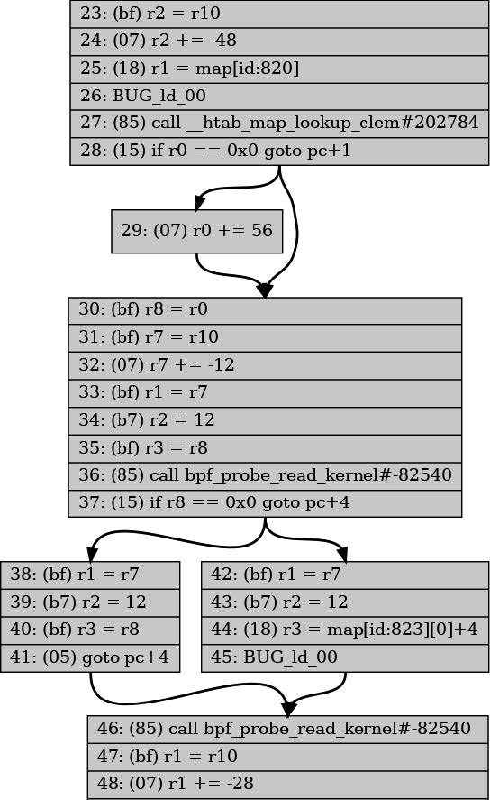

# 第六章 eBPF 验证器

我已经多次提到验证步骤，所以您已经知道，当您将 eBPF 程序加载到内核中时，此验证过程会确保程序是安全的。在本章中，我们将深入探讨验证器如何实现这一目标。

验证会检查程序中每个可能的执行路径并确保每条指令都是安全的。验证器还对字节码进行一些更新以准备执行。在本章中，我将展示一些验证失败的示例，从一个正常工作的示例开始，通过修改使代码对验证器无效。

> 提示
>
> 本章的示例代码位于存储库的 chapter6 目录中，网址为 [github.com/lizrice/learning-ebpf](https://github.com/lizrice/learning-ebpf)。

本章并不试图涵盖验证器可能进行的所有检查。它只是一个概述，并附有示例，帮助您处理在编写自己的 eBPF 代码时可能遇到的验证错误。

需要注意的一点是，验证器工作在 eBPF 字节码上，而不是直接工作在源代码上。字节码依赖于编译器的输出。由于编译器优化等原因，源代码中的变化可能并不总能在字节码中得到您所期望的结果，因此相应地，在验证器的判定中也可能不会得到您所期望的结果。例如，验证器会拒绝无法到达的指令，但编译器可能会在验证器看到这些指令之前将其优化掉。

## 验证过程

验证器分析程序以评估所有可能的执行路径。它按顺序逐步检查指令，而不是实际执行它们。在进行过程中，它使用一个名为 **bpf_reg_state** 的结构来跟踪每个寄存器的状态（我在这里指的是在第 3 章中介绍的 eBPF 虚拟机的寄存器）。这个结构体包括一个名为 bpf_reg_type 的字段，用于描述该寄存器中保存的值的类型。有以下几种可能的类型：

- **NOT_INIT**，表示寄存器尚未设置值。
- **SCALAR_VALUE**，表示寄存器被设置为一个不代表指针的值。
- 几种 **PTR*TO*\*** 类型，表示寄存器持有指向某物的指针。例如：
  - **PTR_TO_CTX**：该寄存器保存一个指向作为参数传递给 BPF 程序的上下文的指针。
  - **PTR_TO_PACKET**：该寄存器指向一个网络数据包（在内核中保存为 skb->data ）。
  - **PTR_TO_MAP_KEY** 或 **PTR_TO_MAP_VALUE**：我相信您能猜到它们的含义。

还有其他几种 **PTR*TO*\*** 类型，您可以在 [_linux/bpf.h_ 头文件](https://elixir.bootlin.com/linux/latest/source/include/linux/bpf.h)中找到枚举的完整集。

**bpf_reg_state** 结构体还跟踪寄存器可能持有的值的范围。验证器使用这些信息来确定是否尝试了无效的操作。

每当验证器遇到一个分支时，必须决定是否按顺序继续执行或跳转到不同的指令，验证器将当前所有寄存器的状态拷贝并压入堆栈，并探索其中一条可能的路径。它继续评估指令，直到到达程序末尾的返回指令（或达到当前指令处理数量的限制，目前为一百万条指令（在很长一段时间内，这个限制是 4,096 条指令，这对 eBPF 程序的复杂性造成了很大的限制。这个限制仍然适用于运行 BPF 程序的非特权用户。）），此时它从堆栈中弹出一个分支以进行下一步评估。如果它发现一个可能导致无效操作的指令，则验证失败。

验证每种可能性的计算成本可能会很高，因此在实践中有一种称为*状态剪枝（state pruning）*的优化方法，可以避免重新评估本质上等效的程序路径。当验证器在程序中工作时，它会记录程序中某些指令处所有寄存器的状态。如果它稍后以寄存器处于匹配的状态到达的相同指令，则无需继续验证该路径的其余部分，因为它已经知道是有效的。

[大量的工作投入到优化验证器](https://lwn.net/Articles/794934/)和修剪过程。验证器过去常常在每个跳转指令之前和之后存储修剪状态，但分析表明，这会导致平均每四个指令左右存储一次状态，并且这些修剪状态中的绝大多数永远不会匹配。事实证明，无论分支如何，每 10 条指令存储一次修剪状态会更有效。

> 提示
>
> 您可以在[内核文档](https://docs.kernel.org/bpf/verifier.html)中阅读有关验证器如何工作的更多详细信息。

## 验证器日志

当程序验证失败时，验证器会生成一条日志，显示其如何得出该程序无效的结论。如果您使用 **bpftool prog load**，验证器日志将输出到 stderr。当您使用 _libbpf_ 编写程序时，可以使用函数 **libbpf_set_print()** 来设置一个处理程序，该处理程序将显示（或执行其他有用的操作）任何错误。 （您将在本章的 _hello-verifier.c_ 源代码中看到这样的示例。）

> 提示
>
> 如果您确实想深入了解验证器正在做什么，您可以让它生成成功和失败的日志。 _hello-verifier.c_ 文件中也有一个基本示例。它涉及到将保存验证器日志内容的缓冲区传递到 libbpf 调用中，该调用将程序加载到内核中，然后将该日志的内容写入屏幕。

验证器日志包含验证器所做工作的摘要，如下所示：

```bash
processed 61 insns (limit 1000000) max_states_per_insn 0 total_states 4 peak_states 4 mark_read 3
```

在此示例中，验证器处理了 61 条指令，包括可能通过不同路径到达同一指令而多次处理该指令。请注意，一百万的复杂性限制是程序中指令数量的上限；实际上，如果代码中存在分支，验证器将多次处理某些指令。

存储的状态总数（total_states）为 4，对于这个简单的程序来说，这与存储状态的峰值数量（peak_states）相匹配。如果某些状态被修剪，峰值数量可能会低于总数。

日志输出包括验证器分析的 BPF 指令，以及相应的 C 源代码行（如果目标文件是用 **-g** 标志构建的，则包括调试信息）以及验证器状态信息摘要。以下是与 _hello-verifier.bpf.c_ 中程序的前几行相关的验证器日志的示例摘录：

```bash
0: (bf) r6 = r1
# 日志包括源代码行，以便于理解输出结果与源代码的关系。由于在编译步骤中使用了 -g 标志来建立调试信息，因此这些源代码是可用的。
; data.counter = c;
1: (18) r1 = 0xffff800008178000
3: (61) r2 = *(u32 *)(r1 +0)
 # 这是在日志中输出一些寄存器状态信息的示例。它告诉我们，在这个阶段，寄存器 1 包含映射值，寄存器 6 保存上下文，寄存器 10 是帧（或栈）指针，用于保存局部变量。
 R1_w=map_value(id=0,off=0,ks=4,vs=16,imm=0) R6_w=ctx(id=0,off=0,imm=0) R10=fp0
; c++;
4: (bf) r3 = r2
5: (07) r3 += 1
6: (63) *(u32 *)(r1 +0) = r3
 # 这是寄存器状态信息的另一个示例。在这里，您不仅可以看到每个（初始化）寄存器中保存的值的类型，还可以看到寄存器 2 和寄存器 3 的可能值的范围。
 R1_w=map_value(id=0,off=0,ks=4,vs=16,imm=0) R2_w=inv(id=1,umax_value=4294967295,
 var_off=(0x0; 0xffffffff)) R3_w=inv(id=0,umin_value=1,umax_value=4294967296,
 var_off=(0x0; 0x1ffffffff)) R6_w=ctx(id=0,off=0,imm=0) R10=fp0
```

让我们深入探讨一下这个问题。我刚刚说寄存器 6 保存上下文，验证器日志通过 **R6_w=ctx(id=0,off=0,imm=0)** 表示了这一点。这是在字节码的第一行中设置的，其中将寄存器 1 复制到寄存器 6。当调用一个 eBPF 程序时，寄存器 1 始终保存传递给程序的上下文参数。为什么要将它复制到寄存器 6 呢？好吧，当调用 BPF 辅助函数时，被调用的参数通过寄存器 1 到 5 传递。辅助函数不会修改寄存器 6 到 9 的内容，因此将上下文保存到寄存器 6 意味着代码可以调用辅助函数而不会丢失上下文信息。

寄存器 0 用于辅助函数的返回值，也用于 eBPF 程序的返回值。寄存器 10 始终保存指向 eBPF 栈帧的指针（并且 eBPF 程序无法修改它）。

我们看一下指令 6 之后寄存器 2 和 3 的寄存器状态信息：

```bash
R2_w=inv(id=1,umax_value=4294967295,var_off=(0x0; 0xffffffff))
R3_w=inv(id=0,umin_value=1,umax_value=4294967296,var_off=(0x0; 0x1ffffffff))
```

寄存器 2 没有最小值，此处以十进制显示的 **umax_value** 对应于 0xFFFFFFFF，这是在这个 8 字节寄存器中可以保存的最大值（译者注：不是寄存器能保存的最大值，而是寄存器所保存类型的最大值）。换句话说，此时寄存器可以保存任何可能的值。

在指令 4 中，寄存器 2 的内容被复制到寄存器 3 中，然后指令 5 在该值上加 1。因此，寄存器 3 的值可以是 1 或更大。在寄存器 3 的状态信息中可以看到，寄存器 3 的 **umin_value** 设置为 1，**umax_value** 为 0xFFFFFFFF。

验证器不仅使用每个寄存器的状态信息，还使用每个寄存器可以包含的值范围的信息来确定程序的可能路径。这也用于我之前提到的状态修剪：如果验证器在代码中处于相同位置，每个寄存器具有相同的类型和可能的值范围，则无需进一步评估此路径。更重要的是，如果当前状态是之前所见状态的子集，它也可以被修剪。

## 可视化控制流

验证器会探索 eBPF 程序中所有可能的路径，如果您试图调试一个问题，查看这些路径可能会对您有帮助。**bpftool** 工具可以通过生成 [DOT 格式](https://graphviz.org/doc/info/lang.html)的程序控制流图来帮助实现这一点，然后您可以将其转换为图像格式，像这样：

```bash
$ bpftool prog dump xlated name kprobe_exec visual > out.dot
$ dot -Tpng out.dot > out.png
```

这将产生如图 6-1 所示的可视化控制流表示。


_图 6-1. 控制流图中部分内容（全图可以在本书的 [GitHub repo](http://github.com/lizrice/learning-ebpf) 中 chapter6/ kprobe_exec.png 找到）_

## 验证辅助函数

不允许从 eBPF 程序直接调用任何内核函数（除非它已注册为 kfunc，您将在下一章中遇到），但 eBPF 提供了许多辅助函数，使程序能够访问内核信息。有一个 [bpf-helpers 联机帮助页](https://man7.org/linux/man-pages/man7/bpf-helpers.7.html) 试图记录所有这些函数。

不同的辅助函数适用于不同的 BPF 程序类型。例如，辅助函数 **bpf_get_current_pid_tgid()** 检索当前用户空间进程 ID 和线程 ID，但是从 XDP 程序中调用这个函数是没有意义的，因为 XDP 程序是由网络接口接收到的数据包触发的，不涉及用户空间进程。您可以通过将 _hello-verifier.bpf.c_ 中 _hello_ eBPF 程序的 **SEC()** 定义从 **kprobe** 更改为 **xdp** 来查看此示例。在尝试加载该程序时，验证器输出会给出以下消息：

```bash
...
16: (85) call bpf_get_current_pid_tgid#14
unknown func bpf_get_current_pid_tgid#14
```

**unknow func** 并不意味着该函数完全未知，只是对于该 BPF 程序类型来说是未知。 （BPF 程序类型是下一章的主题；现在您可以将它们视为适合附加到不同类型事件的程序。）

## 辅助函数参数

例如，如果您查看 [_kernel/bpf/helpers.c_](https://elixir.bootlin.com/linux/latest/source/kernel/bpf/helpers.c)（源代码中的其他一些地方也定义了辅助函数，例如 [*kernel/trace/ bpf_trace.c*](kernel/trace/ bpf_trace.c) 和 [_net/core/filter.c_](https://elixir.bootlin.com/linux/v5.19.17/source/net/core/filter.c)），您会发现每个辅助函数都有一个 **bpf_func_proto** 结构体，类似于这个辅助函数 **bpf_map_lookup_elem()** 的例子：

```c
const struct bpf_func_proto bpf_map_lookup_elem_proto = {
    .func = bpf_map_lookup_elem,
    .gpl_only = false,
    .pkt_access = true,
    .ret_type = RET_PTR_TO_MAP_VALUE_OR_NULL,
    .arg1_type = ARG_CONST_MAP_PTR,
    .arg2_type = ARG_PTR_TO_MAP_KEY,
};
```

该结构体定义了辅助函数的参数和返回值的约束。因为验证器会跟踪每个寄存器中保存的值的类型，所以如果您试图向辅助函数传递错误类型的参数，验证器就会发现。例如，尝试改变 _hello_ 程序中对 **bpf_map_lookup_elem()** 的调用的参数，如下所示：

```c
p = bpf_map_lookup_elem(&data, &uid);
```

现在不再传递 **&my_config**（指向 map 的指针），而是传递 **&data**（指向局部变量结构体的指针）。从编译器的角度来看这是有效的，因此您可以构建 BPF 目标文件 _hello-verifier.bpf.o_，但是当您尝试将程序加载到内核中时，您将在验证器日志中看到类似这样的错误:

```bash
27: (85) call bpf_map_lookup_elem#1
R1 type=fp expected=map_ptr
```

这里，**fp** 代表*帧指针*，它是栈上存储局部变量的内存区域。寄存器 1 加载了名为 data 的局部变量的地址，但该函数需要一个指向 map 的指针（如前面所示的 **bpf_func_proto** 结构中的 **arg1_type** 字段所示）。通过跟踪每个寄存器中存储的值的类型，验证器能够发现这种差异。

## 检查许可证

如果您使用的 BPF 辅助函数采用了 GPL 许可证，那么验证器还会检查您的程序是否也有与 GPL 兼容的许可。第 6 章示例代码 _hello-verifier.bpf.c_ 中的最后一行定义了“许可证”部分，其中包含 **Dual BSD/GPL** 字符串。如果删除这一行，验证程序的输出结果将如下所示：

```bash
...
37: (85) call bpf_probe_read_kernel#113
cannot call GPL-restricted function from non-GPL compatible program
```

这是因为 **bpf_probe_read_kernel()** 辅助函数的 **gpl_only** 字段设置为 **true**。该 eBPF 程序之前还调用了其他辅助函数，但它们没有采用 GPL 许可证，因此验证器并不反对使用它们。

BCC 项目维护了[一个辅助函数列表](https://github.com/iovisor/bcc/blob/master/docs/kernel-versions.md#helpers)，表明它们是否采用了 GPL 许可证。如果您对如何实现辅助函数的更多详细信息感兴趣，请参阅 BPF 和 XDP 参考指南中的相关部分。

## 检查内存访问

验证器执行大量检查以确保 BPF 程序仅访问它们应该访问的内存。

例如，在处理网络数据包时，仅允许 XDP 程序访问构成该网络数据包的内存位置。大多数 XDP 程序的开头与下面的内容非常相似：

```c
SEC("xdp")
int xdp_load_balancer(struct xdp_md *ctx)
{
    void *data = (void *)(long)ctx->data;
    void *data_end = (void *)(long)ctx->data_end;
...
```

作为上下文信息传递给程序的 **xdp_md** 结构体描述了接收到的网络数据包。该结构体中的 **ctx->data** 字段是数据包在内存中的起始位置，而 **ctx->data_end** 是数据包在内存中的结束位置。验证器将确保程序不会超出这些边界。

例如，_hello_verifier.bpf.c_ 中的以下程序是有效的：

```c
SEC("xdp")
int xdp_hello(struct xdp_md *ctx) {
    void *data = (void *)(long)ctx->data;
    void *data_end = (void *)(long)ctx->data_end;
    bpf_printk("%x", data_end);
    return XDP_PASS;
}
```

变量 **data** 和 **data_end** 非常相似，但验证器足够聪明，可以识别 **data_end** 与数据包的结束位置相关。您的程序必须检查从数据包中读取的任何值是否超出该位置，并且它不会让您通过修改 **data_end** 值来“作弊”。尝试在 **bpf_printk()** 调用之前添加以下行：

```c
data_end++;
```

验证器会像这样抱怨：

```bash
; data_end++;
1: (07) r3 += 1
R3 pointer arithmetic on pkt_end prohibited
```

在另一个示例中，当访问数组时，您需要确保不可能访问超出该数组范围的索引。在示例代码中，有一个部分从消息数组中读取一个字符，如下所示：

```c
if (c < sizeof(message)) {
    char a = message[c];
    bpf_printk("%c", a);
}
```

这是没问题的，因为有明确的检查确保计数变量 **c** 不会超过消息数组的大小。但是，如果出现如下简单的“偏一”的错误，将会导致程序无法通过验证：

```c
if (c <= sizeof(message)) {
    char a = message[c];
    bpf_printk("%c", a);
}
```

验证器将失败并显示类似下面的错误消息：

```bash
invalid access to map value, value_size=16 off=16 size=1
R2 max value is outside of the allowed memory range
```

从这条消息可以很清楚地看出，存在对 map 值的无效访问，因为寄存器 2 可能保存的值对于索引 map 而言太大。如果您正在调试此错误，您需要深入查看日志，以查明源代码中哪一行出现了问题。在发出错误消息之前，日志以如下方式结束（为了清晰起见，我已删除了一些状态信息）：

```bash
; if (c <= sizeof(message)) {
# 进一步查找寄存器 1 的值，日志显示它的最大值为 12（十六进制 0x0c）。但是，message 被定义为 12 字节字符数组，因此只有索引 0 到 11 在其范围内。由此，您可以看到错误源于 c <= sizeof(message) 的源代码测试。
30: (25) if r1 > 0xc goto pc+10
 R0_w=map_value_or_null(id=2,off=0,ks=4,vs=12,imm=0) R1_w=inv(id=0,
 umax_value=12,var_off=(0x0; 0xf)) R6=ctx(id=0,off=0,imm=0) ...
; char a = message[c];
# 在指令 31 处，寄存器 2 被设置为内存中的一个地址，然后递增寄存器 1 的值。输出显示这对应于访问 message[c] 的代码行，因此寄存器 2 是理所当然的设置为指向消息数组，然后递增 c 的值，该值保存在寄存器 1 寄存器中。
31: (18) r2 = 0xffff800008e00004
33: (0f) r2 += r1
last_idx 33 first_idx 19
regs=2 stack=0 before 31: (18) r2 = 0xffff800008e00004
regs=2 stack=0 before 30: (25) if r1 > 0xc goto pc+10
regs=2 stack=0 before 29: (61) r1 = *(u32 *)(r8 +0)
# 从错误开始回溯，最后的寄存器状态信息显示寄存器 2 的最大值可为 12。
34: (71) r3 = *(u8 *)(r2 +0)
 R0_w=map_value_or_null(id=2,off=0,ks=4,vs=12,imm=0) R1_w=invP(id=0,
 umax_value=12,var_off=(0x0; 0xf)) R2_w=map_value(id=0,off=4,ks=4,vs=16,
 umax_value=12,var_off=(0x0; 0xf),s32_max_value=15,u32_max_value=15)
 R6=ctx(id=0,off=0,imm=0) ...
```

在步骤 2 中，我根据验证程序在日志中提供的源代码行，推断出一些寄存器与它们所代表的源代码变量之间的关系。您可以通过验证程序日志来检查这是否属实，并且如果代码是在没有调试信息的情况下编译的，您实际上可能必须这样做。鉴于存在调试信息，使用它是有意义的。

**message** 数组被声明为全局变量，您可能还记得第 3 章中全局变量是使用 map 实现的。这解释了为什么错误消息提到 “对 map 值的访问无效”。

## 在解引用指针之前检查他们

造成 C 程序崩溃的一种简单方法是当指针具有零值（也称为 _null_）时解引用该指针。指针指示内存中某个值的存放位置，零不是有效的内存位置。 eBPF 验证器要求在解引用之前检查所有指针，以便不会发生此类崩溃。

_hello-verifier.bpf.c_ 中的示例代码使用以下行查找对于某个用户在 **my_config** 哈希表 map 中可能存在的自定义消息：

```c
p = bpf_map_lookup_elem(&my_config, &uid);
```

如果该映射中没有对应于 **uid** 的条目，则会将 p（指向消息结构 **msg_t** 的指针）设置为零。下面是一些尝试解引用这个潜在空指针的其他代码：

```c
char a = p->message[0];
bpf_printk("%c", a);
```

编译正常，但验证器拒绝了它，如下所示：

```bash
; p = bpf_map_lookup_elem(&my_config, &uid);
25: (18) r1 = 0xffff263ec2fe5000
27: (85) call bpf_map_lookup_elem#1
# 辅助函数调用的返回值存储在寄存器 0 中。这里，将该值存储在寄存器 7 中。这意味着寄存器 7 现在保存局部变量 p 的值。
28: (bf) r7 = r0
; char a = p->message[0];
# 该指令尝试解引用指针值 p。验证器一直在跟踪寄存器 7 的状态，并且知道它可能保存指向 map 值的指针，或者可能为空。
29: (71) r3 = *(u8 *)(r7 +0)
R7 invalid mem access 'map_value_or_null'
```

验证器拒绝解引用空指针的尝试，但如果有显式检查，程序将通过，如下所示：

```c
if (p != 0) {
    char a = p->message[0];
    bpf_printk("%d", cc);
}
```

一些辅助函数包含了指针检查。例如，如果您查看 bpf-helpers 的联机帮助页，您会发现 **bpf_probe_read_kernel()** 的函数签名如下：

```c
long bpf_probe_read_kernel(void *dst, u32 size, const void *unsafe_ptr)
```

该函数的第三个参数为 **unsafe_ptr**。这是一个 BPF 辅助函数的示例，它通过为您处理检查来辅助编写安全代码。您可以传递一个潜在的空指针，但是只能作为名为 **unsafe_ptr** 的第三个参数传递，辅助函数在尝试解引用之前将检查它是否为空。

## 访问上下文

每个 eBPF 程序都会传递一些上下文信息作为参数，但根据程序和附加类型，可能只允许它访问部分上下文信息。例如，[跟踪点（tracepoint）程序](https://lwn.net/Articles/683504/) 接收指向某些跟踪点数据的指针。该数据的格式取决于特定的跟踪点，但它们都以一些公共字段开头，但 eBPF 程序无法访问这些公共字段。只能访问后面的特定于跟踪点的字段。尝试读取或写入错误的字段会导致 **invalid bpf_context access** 错误。本章末尾的练习中有一个这样的例子。

## 可运行结束

验证器确保 eBPF 程序可以运行结束；否则，存在无限消耗资源的风险。为此，它对处理的指令总数设置了限制，正如我前面提到的，在本文撰写时，该限制被设定为一百万条指令。该限制被硬编码到内核中；这不是一个可配置的选项。如果验证器在处理这么多指令之前尚未到达 BPF 程序的末尾，则会拒绝该程序。

要创建一个永不结束的程序，一个简单的方法就是编写一个永不结束的循环。让我们看看如何在 eBPF 程序中创建循环。

## 循环

为了确保运行结束，直到内核版本 5.3 为止（该版本带来了许多针对 BPF 验证器的重要优化和改进，在 LWN 的文章 [Bounded loops in BPF for the 5.3 kernel](https://lwn.net/Articles/794934/) 中有很好的总结。），存在对循环的限制。循环执行相同的指令需要向后跳转到较早的指令，过去验证器不允许这样做。eBPF 程序员通过使用 **#pragma unroll** 编译器指令来解决这个问题，告诉编译器为每次循环生成一组相同（或非常相似）的字节码指令。这样可以节省程序员输入重复代码的时间，但是在生成的字节码中会看到重复的指令。

从版本 5.3 开始，验证器在其检查所有可能的执行路径的过程中，不仅向前跟踪分支，还会向后跟踪分支。这意味着它可以接受一些循环，只要执行路径保持在一百万条指令的限制范围内。

您可以在示例 _xdp_hello_ 程序中看到循环的示例。通过验证的循环版本如下所示：

```c
for (int i=0; i < 10; i++) {
    bpf_printk("Looping %d", i);
}
```

（成功的）验证器日志将显示它已经沿着该循环的执行路径执行了 10 次。这样做并没有达到一百万条指令的复杂性限制。在本章的练习中，该循环的另一个版本将达到该限制并且验证失败。

在 5.17 版本中，引入了一个新的辅助函数 **bpf_loop()**，它使验证者不仅可以更轻松地接受循环，而且可以更有效地执行循环。该辅助函数将最大迭代次数作为其第一个参数，并且还传递一个为每次迭代调用的函数。无论该函数被调用多少次，验证器都只需验证一次该函数中的 BPF 指令。该函数可以返回一个非零值来指示不需要再次调用它，这用于在达到所需结果后提前终止循环。

还有一个辅助函数 [**bpf_for_each_map_elem()**](https://github.com/torvalds/linux/commit/69c087ba6225b574afb6e505b72cb75242a3d844) ，它为 map 中的每个项目提供了回调函数。

## 检查返回值

eBPF 程序的返回值存储在寄存器 0 (R0) 中。如果程序使 R0 未初始化，验证器将失败，如下所示：

```bash
R0 !read_ok
```

您可以通过注释掉函数中的所有代码来尝试此操作；例如，将 **xdp_hello** 示例改成这样：

```c
SEC("xdp")
int xdp_hello(struct xdp_md *ctx) {
    void *data = (void *)(long)ctx->data;
    void *data_end = (void *)(long)ctx->data_end;
    // bpf_printk("%x", data_end);
    // return XDP_PASS;
}
```

这将使验证器失败。但是，如果您将辅助函数 **bpf_printf()** 的代码行取消注释，即使源代码没有设置明确的返回值，验证器也不会报错！

这是因为寄存器 0 也用于保存辅助函数的返回值。从 eBPF 程序中的辅助函数返回后，寄存器 0 不再未初始化。

## 无效指令

正如您从第 3 章中对 eBPF（虚拟）机器的讨论中了解的，eBPF 程序由一组字节码指令组成。验证器检查程序中的指令是否是有效的字节码指令——例如，仅使用已知的操作码。

如果编译器生成了无效的字节码，那将被视为编译器的错误，所以除非您选择（出于某种您自己最了解的原因）手动编写 eBPF 字节码，否则不太可能出现这种类型的验证器错误。然而，近期已经添加了一些新的指令，比如原子操作。如果您编译的字节码使用了这些指令，它们将在旧版本的内核上无法通过验证。

## 不可到达的指令

校验器还会拒绝接受含有不可达指令的程序。通常情况下，这些指令会被编译器优化掉。

## 总结

当我最初对 eBPF 产生兴趣时，让代码通过验证器似乎是一种神秘的艺术，看似有效的代码会被拒绝，并出现似乎是随机的错误。随着时间的推移，验证器已经进行了许多改进，在本章中，您已经看到了几个示例，其中验证器日志给出了提示，帮助您找出问题所在。

当您对 eBPF（虚拟）机器如何工作有一个心理模型时，这些提示会更加有帮助。eBPF 在执行 eBPF 程序时，使用一组寄存器来进行临时值存储。验证器跟踪每个寄存器的类型和可能的值范围，以确保 eBPF 程序在运行时是安全的。

如果您尝试编写自己的 eBPF 代码，可能会遇到需要帮助解决验证器错误的情况。[eBPF 社区的 Slack 频道](http://ebpf.io/slack)是寻求帮助的好地方，许多人也在 StackOverflow 上找到了建议。

## 练习

以下是导致验证器错误的更多方法。看看是否可以将验证器日志输出与遇到的错误关联起来：

1. 在“检查内存访问”一节中，您看到验证器拒绝超出全局变量 **message** 数组末尾的访问。在示例代码中，有一个部分以类似的方式访问局部变量 **data.message**：

   ```c
   if (c < sizeof(data.message)) {
       char a = data.message[c];
       bpf_printk("%c", a);
   }
   ```

   尝试调整代码，通过将 < 替换为 <= 来犯同样的偏一（out-by-one）错误，您将看到一条有关 **invalid variable-offset read**
   **from stack R2** 的错误信息。

2. 在示例代码中找到 xdp_hello 中注释掉的循环。尝试添加第一个循环（即取消注释），如下所示：

   ```c
   for (int i=0; i < 10; i++) {
       bpf_printk("Looping %d", i);
   }
   ```

   您应该在验证程序日志中看到一系列重复的行，如下所示：

   ```c
   42: (18) r1 = 0xffff800008e10009
   44: (b7) r2 = 11
   45: (b7) r3 = 8
   46: (85) call bpf_trace_printk#6
    R0=inv(id=0) R1_w=map_value(id=0,off=9,ks=4,vs=26,imm=0) R2_w=inv11
    R3_w=inv8 R6=pkt_end(id=0,off=0,imm=0) R7=pkt(id=0,off=0,r=0,imm=0)
    R10=fp0
   last_idx 46 first_idx 42
   regs=4 stack=0 before 45: (b7) r3 = 8
   regs=4 stack=0 before 44: (b7) r2 = 11
   ```

   从日志中找出跟踪循环变量 i 的寄存器。

3. 现在尝试添加一个会失败的循环，如下所示：

   ```c
   for (int i=0; i < c; i++) {
       bpf_printk("Looping %d", i);
   }
   ```

   您应该看到验证器尝试探索此循环以得出结论，但它在完成之前就达到了指令复杂性限制（因为全局变量 c 没有上限）。

4. 编写一个附加到跟踪点的程序。 （您可能已经在第 4 章的练习中完成了此操作）提前查看下一章“跟踪点”一节，您可以看到以这些字段开头的上下文参数的结构体定义：

   ```c
   unsigned short common_type;
   unsigned char common_flags;
   unsigned char common_preempt_count;
   int common_pid;
   ```

   创建您自己的结构体版本，该结构体像这样开始，并使程序中的上下文参数成为指向该结构体的指针。在程序中，尝试访问这些字段中的任何一个，并看到验证程序因 **invalid bpf_context access** 而失败。
