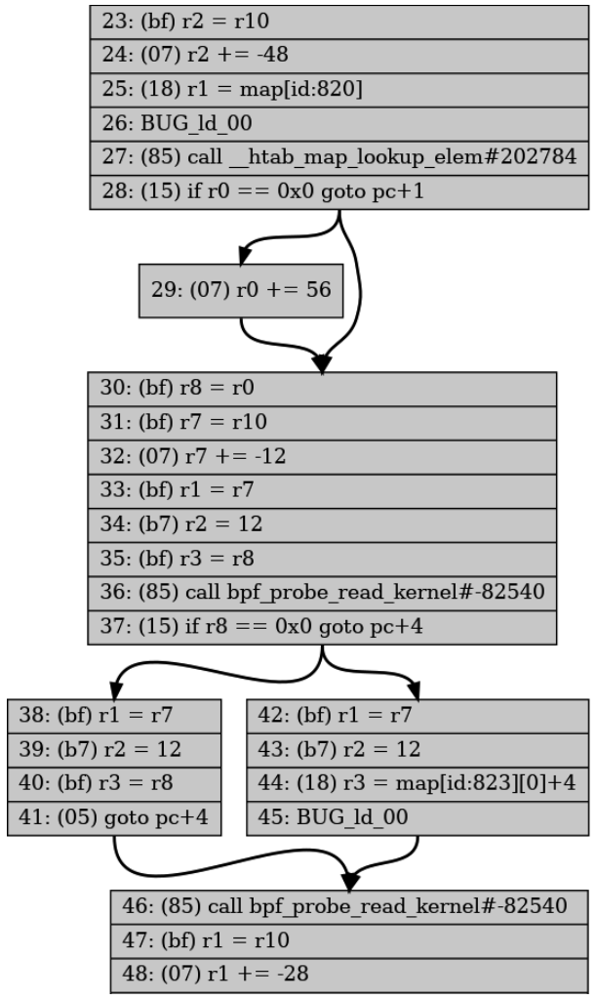

# 第6章 eBPF 验证器

我已经多次提到验证步骤，所以您已经知道，当您将 eBPF 程序加载到内核中时，此验证过程会确保程序是安全的。在本章中，我们将深入探讨验证器如何实现这一目标。

验证会检查程序中每个可能的执行路径并确保每条指令都是安全的。验证器还对字节码进行一些更新以准备执行。在本章中，我将展示一些验证失败的示例，从一个正常工作的示例开始，通过修改使代码对验证器无效。

> 提示
>
> 本章的示例代码位于存储库的 chapter6 目录中，网址为 [github.com/lizrice/learning-ebpf](https://github.com/lizrice/learning-ebpf)。

本章并不试图涵盖验证器可能进行的所有检查。它只是一个概述，并附有示例，帮助您处理在编写自己的 eBPF 代码时可能遇到的验证错误。

需要注意的一点是，验证器工作在 eBPF 字节码上，而不是直接工作在源代码上。字节码依赖于编译器的输出。由于编译器优化等原因，源代码中的变化可能并不总能在字节码中得到您所期望的结果，因此相应地，在验证器的判定中也可能不会得到您所期望的结果。例如，验证器会拒绝无法到达的指令，但编译器可能会在验证器看到这些指令之前将其优化掉。

## 验证过程

验证器分析程序以评估所有可能的执行路径。它按顺序逐步检查指令，而不是实际执行它们。在进行过程中，它使用一个名为 **bpf_reg_state** 的结构来跟踪每个寄存器的状态（我在这里指的是在第 3 章中介绍的 eBPF 虚拟机的寄存器）。这个结构体包括一个名为 bpf_reg_type 的字段，用于描述该寄存器中保存的值的类型。有以下几种可能的类型：

- **NOT_INIT**，表示寄存器尚未设置值。
- **SCALAR_VALUE**，表示寄存器被设置为一个不代表指针的值。
- 几种 **PTR_TO_*** 类型，表示寄存器持有指向某物的指针。例如：
  - **PTR_TO_CTX**：该寄存器保存一个指向作为参数传递给 BPF 程序的上下文的指针。
  - **PTR_TO_PACKET**：该寄存器指向一个网络数据包（在内核中保存为 skb->data ）。
  - **PTR_TO_MAP_KEY** 或 **PTR_TO_MAP_VALUE**：我相信您能猜到它们的含义。

还有其他几种 **PTR_TO_*** 类型，您可以在 [*linux/bpf.h* 头文件](https://elixir.bootlin.com/linux/latest/source/include/linux/bpf.h)中找到枚举的完整集。

**bpf_reg_state** 结构体还跟踪寄存器可能持有的值的范围。验证器使用这些信息来确定是否尝试了无效的操作。

每当验证器遇到一个分支时，必须决定是否按顺序继续执行或跳转到不同的指令，验证器将当前所有寄存器的状态拷贝并压入堆栈，并探索其中一条可能的路径。它继续评估指令，直到到达程序末尾的返回指令（或达到当前指令处理数量的限制，目前为一百万条指令（在很长一段时间内，这个限制是4,096条指令，这对eBPF程序的复杂性造成了很大的限制。这个限制仍然适用于运行BPF程序的非特权用户。）），此时它从堆栈中弹出一个分支以进行下一步评估。如果它发现一个可能导致无效操作的指令，则验证失败。

验证每种可能性的计算成本可能会很高，因此在实践中有一种称为*状态剪枝（state pruning）*的优化方法，可以避免重新评估本质上等效的程序路径。当验证器在程序中工作时，它会记录程序中某些指令处所有寄存器的状态。如果它稍后以寄存器处于匹配的状态到达的相同指令，则无需继续验证该路径的其余部分，因为它已经知道是有效的。

[大量的工作投入到优化验证器](https://lwn.net/Articles/794934/)和修剪过程。验证器过去常常在每个跳转指令之前和之后存储修剪状态，但分析表明，这会导致平均每四个指令左右存储一次状态，并且这些修剪状态中的绝大多数永远不会匹配。事实证明，无论分支如何，每 10 条指令存储一次修剪状态会更有效。

> 提示
>
> 您可以在[内核文档](https://docs.kernel.org/bpf/verifier.html)中阅读有关验证器如何工作的更多详细信息。

## 验证器日志

当程序验证失败时，验证器会生成一条日志，显示其如何得出该程序无效的结论。如果您使用 **bpftool prog load**，验证器日志将输出到 stderr。当您使用 *libbpf* 编写程序时，可以使用函数 **libbpf_set_print()** 来设置一个处理程序，该处理程序将显示（或执行其他有用的操作）任何错误。 （您将在本章的 *hello-verifier.c* 源代码中看到这样的示例。）

> 提示
>
> 如果您确实想深入了解验证器正在做什么，您可以让它生成成功和失败的日志。 *hello-verifier.c* 文件中也有一个基本示例。它涉及到将保存验证器日志内容的缓冲区传递到 libbpf 调用中，该调用将程序加载到内核中，然后将该日志的内容写入屏幕。

验证器日志包含验证器所做工作的摘要，如下所示：

```bash
processed 61 insns (limit 1000000) max_states_per_insn 0 total_states 4 peak_states 4 mark_read 3
```

在此示例中，验证器处理了 61 条指令，包括可能通过不同路径到达同一指令而多次处理该指令。请注意，一百万的复杂性限制是程序中指令数量的上限；实际上，如果代码中存在分支，验证器将多次处理某些指令。

存储的状态总数（total_states）为 4，对于这个简单的程序来说，这与存储状态的峰值数量（peak_states）相匹配。如果某些状态被修剪，峰值数量可能会低于总数。

日志输出包括验证器分析的 BPF 指令，以及相应的 C 源代码行（如果目标文件是用 **-g** 标志构建的，则包括调试信息）以及验证器状态信息摘要。以下是与 *hello-verifier.bpf.c* 中程序的前几行相关的验证器日志的示例摘录：

```bash
0: (bf) r6 = r1
# 日志包括源代码行，以便于理解输出结果与源代码的关系。由于在编译步骤中使用了 -g 标志来建立调试信息，因此这些源代码是可用的。
; data.counter = c;
1: (18) r1 = 0xffff800008178000
3: (61) r2 = *(u32 *)(r1 +0)
 # 这是在日志中输出一些寄存器状态信息的示例。它告诉我们，在这个阶段，寄存器 1 包含映射值，寄存器 6 保存上下文，寄存器 10 是帧（或栈）指针，用于保存局部变量。
 R1_w=map_value(id=0,off=0,ks=4,vs=16,imm=0) R6_w=ctx(id=0,off=0,imm=0) R10=fp0
; c++;
4: (bf) r3 = r2
5: (07) r3 += 1
6: (63) *(u32 *)(r1 +0) = r3
 # 这是寄存器状态信息的另一个示例。在这里，您不仅可以看到每个（初始化）寄存器中保存的值的类型，还可以看到寄存器 2 和寄存器 3 的可能值的范围。
 R1_w=map_value(id=0,off=0,ks=4,vs=16,imm=0) R2_w=inv(id=1,umax_value=4294967295,
 var_off=(0x0; 0xffffffff)) R3_w=inv(id=0,umin_value=1,umax_value=4294967296,
 var_off=(0x0; 0x1ffffffff)) R6_w=ctx(id=0,off=0,imm=0) R10=fp0
```

让我们深入探讨一下这个问题。我刚刚说寄存器 6 保存上下文，验证器日志通过 **R6_w=ctx(id=0,off=0,imm=0)** 表示了这一点。这是在字节码的第一行中设置的，其中将寄存器 1 复制到寄存器 6。当调用一个eBPF程序时，寄存器 1 始终保存传递给程序的上下文参数。为什么要将它复制到寄存器 6 呢？好吧，当调用 BPF 辅助函数时，被调用的参数通过寄存器 1 到 5 传递。辅助函数不会修改寄存器6到9的内容，因此将上下文保存到寄存器6意味着代码可以调用辅助函数而不会丢失上下文信息。

寄存器 0 用于辅助函数的返回值，也用于 eBPF 程序的返回值。寄存器10始终保存指向 eBPF 栈帧的指针（并且eBPF程序无法修改它）。

我们看一下指令 6 之后寄存器 2 和 3 的寄存器状态信息：

```bash
R2_w=inv(id=1,umax_value=4294967295,var_off=(0x0; 0xffffffff))
R3_w=inv(id=0,umin_value=1,umax_value=4294967296,var_off=(0x0; 0x1ffffffff))
```

寄存器 2 没有最小值，此处以十进制显示的 **umax_value** 对应于 0xFFFFFFFF，这是在这个 8 字节寄存器中可以保存的最大值（译者注：不是寄存器能保存的最大值，而是寄存器所保存类型的最大值）。换句话说，此时寄存器可以保存任何可能的值。

在指令 4 中，寄存器 2 的内容被复制到寄存器 3 中，然后指令 5 在该值上加 1。因此，寄存器 3 的值可以是 1 或更大。在寄存器 3 的状态信息中可以看到，寄存器3的 **umin_value** 设置为 1，**umax_value** 为 0xFFFFFFFF。

验证器不仅使用每个寄存器的状态信息，还使用每个寄存器可以包含的值范围的信息来确定程序的可能路径。这也用于我之前提到的状态修剪：如果验证器在代码中处于相同位置，每个寄存器具有相同的类型和可能的值范围，则无需进一步评估此路径。更重要的是，如果当前状态是之前所见状态的子集，它也可以被修剪。

## 可视化控制流

验证器会探索eBPF程序中所有可能的路径，如果您试图调试一个问题，查看这些路径可能会对您有帮助。**bpftool** 工具可以通过生成 [DOT 格式](https://graphviz.org/doc/info/lang.html)的程序控制流图来帮助实现这一点，然后您可以将其转换为图像格式，像这样：

```bash
$ bpftool prog dump xlated name kprobe_exec visual > out.dot
$ dot -Tpng out.dot > out.png
```

这将产生如图 6-1 所示的可视化控制流表示。



*图 6-1. 控制流图中部分内容（全图可以在本书的 [GitHub repo](http://github.com/lizrice/learning-ebpf) 中 chapter6/ kprobe_exec.png 找到）*

## 验证辅助函数

