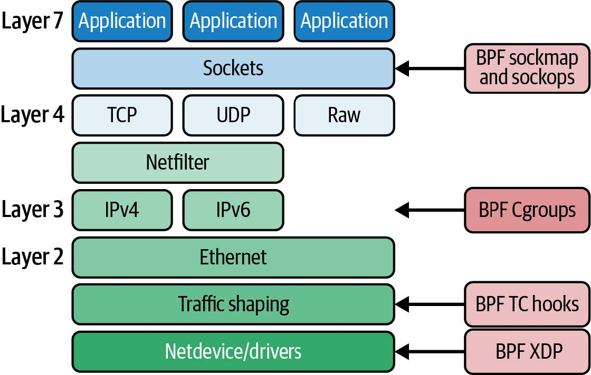

# 第七章 eBPF 程序和附加类型

在前面的章节中，您看到了很多 eBPF 程序的示例，并且可能注意到它们附加在不同类型的事件上。我展示了一些示例附加在 kprobe 上，但在其他示例中，我展示了处理新到达的网络数据包的 XDP 程序。这只是内核中众多附加点中的两个。在本章中，我们将更深入地了解不同类型的程序以及它们如何附加在不同的事件上。

> 提示
>
> 您可以使用 [github.com/lizrice/learning-ebpf](https://github.com/lizrice/learning-ebpf) 上的代码和说明构建并运行本章中的示例。本章的代码位于 _chapter7_ 目录中。
>
> 在撰写本文时，某些示例在 ARM 处理器上不受支持。查看 _chapter7_ 目录中的 _README_ 文件以获取更多详细信息和建议。

目前 [uapi/linux/bpf.h](https://elixir.bootlin.com/linux/v5.19.14/source/include/uapi/linux/bpf.h) 中列举了大约 30 种程序类型，以及 40 多种附加类型。附加类型更具体地定义了程序附加的位置；对于许多程序类型，可以从程序类型推断出附加类型，但某些程序类型可以附加到内核中的多个不同的点，因此还必须指定附加类型。

如您所知，本书并不是一本参考手册，因此我不会涵盖每种 eBPF 程序类型。无论如何，当您阅读本书时，很可能已经添加了新类型！

## 程序上下文参数

所有的 eBPF 程序都接受一个指针类型的上下文参数，但它指向的结构取决于触发它的事件类型。eBPF 程序员需要编写接受相应类型上下文的程序；如果事件是跟踪点而不是网络数据包，将上下文参数视为指向网络数据包是没有意义的。定义不同类型的程序使得验证器能够确保上下文信息得到适当处理，并强制执行关于哪些辅助函数是允许的规则。

所有的 eBPF 程序都接受一个指针作为上下文参数，但它所指向的结构体取决于触发该程序的事件类型。eBPF 程序员需要编写接受适当类型上下文的程序；如果事件是跟踪点而不是网络数据包，那么将上下文参数指向网络数据包是没有意义的。定义不同类型的程序可以让验证器确保上下文信息得到适当处理，并强制执行关于哪些辅助函数是允许的规则。

> 提示
>
> 要深入了解传递给不同 BPF 程序类型的上下文数据的详细信息，请查看 [Alan Maguire 在 Oracle 博客上发表的这篇文章](https://elixir.bootlin.com/linux/v5.19.14/source/include/uapi/linux/bpf.h)。
>
> （译者注：这个链接可能是错误的，作者订正后会修复）

## 辅助函数和返回值

正如您在上一章中看到的，验证器检查程序使用的所有辅助函数是否与其程序类型兼容。上一章中的示例演示了 XDP 程序中不允许使用 **bpf_get_current_pid_tgid()** 辅助函数。在接收数据包和触发 XDP 钩子时不涉及用户空间进程或线程，因此调用该函数来发现当前进程和线程 ID 在这种情况下毫无意义。

程序类型还决定了程序返回值的含义。还是以 XDP 为例，返回值会告诉内核，一旦 eBPF 程序处理完数据包，内核将如何处理它——这可能包括将其传递给网络协议栈、丢弃或重定向到其他接口。当 eBPF 程序是通过命中某个特定跟踪点（其中不涉及网络数据包）来触发时，这些返回代码没有任何意义。

有一个[关于辅助函数的手册](https://man7.org/linux/man-pages/man7/bpf-helpers.7.html)（由于 BPF 子系统的不断发展，手册可能并不完整，这也是合理的）。

您可以使用 **bpftool feature** 命令获取可用于您的内核版本中每种程序类型的辅助函数的列表。它显示了系统配置并列出了所有可用的程序类型和 map 类型，甚至列出了每种程序类型支持的所有辅助函数。

辅助函数被视为 UAPI（Linux 内核的外部稳定接口）的一部分。因此，一旦在内核中定义了辅助函数，即使内核的内部函数和数据结构发生变化，它在未来也不会改变。

尽管存在在不同内核版本之间可能发生变化的风险，但 eBPF 程序员有需求能够在 eBPF 程序中访问一些内部函数。这可以通过一种称为 BPF 内核函数或 [kfuncs](https://docs.kernel.org/bpf/kfuncs.html) 的机制实现。

## Kfuncs

Kfuncs 允许将内部内核函数注册到 BPF 子系统中，以便验证器允许它们从 eBPF 程序中调用。对于每个被允许调用特定 kfunc 的 eBPF 程序类型，都会进行相应的注册。

与辅助函数不同，kfunc 不提供兼容性保证，因此 eBPF 程序员必须考虑内核版本之间更改的可能性。

截止到本文撰写时，存在一组["核心" BPF kfuncs](https://docs.kernel.org/bpf/kfuncs.html#core-kfuncs)，其中包含允许 eBPF 程序获取和释放与任务（tasks）和控制组（cgroups）相关的内核引用的函数。

总结一下，eBPF 程序的类型决定了它可以附加到哪些事件上，进而定义了它所接收的上下文信息的类型。程序类型还定义了它可以调用的辅助函数和 kfuncs 的集合。

程序类型广泛地可分为两类：跟踪（tracing）（或性能（perf））程序类型和与网络相关的程序类型。让我们来看一些例子。

## 跟踪相关类型（Tracing）

那些附加到 kprobes、tracepoints、raw tracepoints、fentry/fexit probes 和 perf events 的程序，都旨在为内核中的 eBPF 程序提供一种高效的方式，将跟踪信息报告到用户空间中。这些跟踪相关的类型不会影响内核对事件的响应方式（不过，在第 9 章中，这方面已经有了一些创新！）。

这些程序有时被称为 "perf 相关" 程序。例如，**bpftool perf** 子命令可以让您查看附加到 perf 相关事件的程序，如下所示：

```bash
$ sudo bpftool perf show
pid 232272 fd 16: prog_id 392 kprobe func __x64_sys_execve offset 0
pid 232272 fd 17: prog_id 394 kprobe func do_execve offset 0
pid 232272 fd 19: prog_id 396 tracepoint sys_enter_execve
pid 232272 fd 20: prog_id 397 raw_tracepoint sched_process_exec
pid 232272 fd 21: prog_id 398 raw_tracepoint sched_process_exec
```

上面的输出是我在 _chapter7_ 目录中运行 _hello.bpf.c_ 文件中示例代码时看到的内容，其中附加了不同类型的程序到与 **execve()** 相关的各种事件上。在本节中，我将讨论所有这些类型，概括的说，这些程序包括：

- 附加到 **execve()** 系统调用入口点的 kprobe
- 附加到内核函数 **do_execve()** 的 kprobe
- 位于 **execve()** 系统调用入口处的跟踪点（tracepoint）
- 在 **execve()** 处理期间调用的原始跟踪点（raw tracepoint）的两个版本。正如您将在本节中看到的，其中之一是支持 BTF 的版本。

您需要 **CAP_PERFMON** 和 **CAP_BPF** 或 **CAP_SYS_ADMIN** 权限才能使用任何与跟踪相关的 eBPF 程序类型。

### Kprobes and Kretprobes

在第一章中，我讨论了 kprobes 的概念。您几乎可以将 kprobe 程序附加到内核的任何位置。（除了内核中出于安全原因不允许使用 kprobes 的少数部分。这些部分列在 /**sys/kernel/debug/kprobes/blacklist** 中。）通常情况下，它们使用 kprobes 附加到函数的入口，使用 kretprobes 附加到函数的出口，但是您也可以使用 kprobes 附加到函数入口后的某个指定偏移量的指令。如果您选择这样做（到目前为止我见过的唯一例子是 [cilium/ebpf 测试套件](https://github.com/cilium/ebpf/blob/365d07f530e5641a7fbeb3d487a692320891f776/link/kprobe_test.go#L56)。），您需要确信您运行的内核版本中有您希望附加到的指令，并且它位于您认为的位置上！附加到内核函数入口和出口点可能相对稳定，但是任意代码行可能在不同版本之间轻易被修改。

> 提示
>
> 在 **bpftool perf** 列出的示例输出中，您可以看到两个 kprobe 的偏移量均为 0。

当内核被编译时，还存在编译器可能选择对任何给定的内核函数进行"内联"的可能性；也就是说，编译器可能会在调用函数的地方直接插入函数的代码，而不是跳转到函数的入口。如果一个函数被内联了，那么您的 eBPF 程序将无法找到一个 kprobe 的入口点来附加。

#### 将 kprobes 附加到系统调用入口点

本章的第一个 eBPF 示例程序称为 **kprobe_sys_execve**，它是一个附加到 **execve()** 系统调用的 kprobe。该函数及其节定义如下：

```c
SEC("ksyscall/execve")
int BPF_KPROBE_SYSCALL(kprobe_sys_execve, char *pathname)
```

这与您在第 5 章中看到的内容相同。

附加到系统调用的一个原因是它们是稳定的接口，在内核版本之间不会发生变化（跟踪点也是如此，我们很快会介绍）。然而，出于我将在第 9 章中详细介绍的原因，不应该依赖系统调用的 kprobes 来进行安全工具的开发。

#### 将 kprobes 附加到其他内核函数

您可以找到很多基于 eBPF 的工具使用 kprobes 附加到系统调用的示例，但是，如前所述，kprobes 也可以附加到内核中的任何非内联函数。我在 _hello.bpf.c_ 中提供了一个示例，它将 kprobe 附加到函数 **do_execve()**，其定义如下：

```c
SEC("kprobe/do_execve")
int BPF_KPROBE(kprobe_do_execve, struct filename *filename)
```

由于 **do_execve()** 不是系统调用，因此此示例与前面的示例之间存在一些差异：

- SEC 名称的格式与附加到系统调用入口点的先前版本相同，但无需定义特定于平台的变体，因为 **do_execve()** 与大多数内核函数一样，对所有平台都是通用的。
- 我使用了 **BPF_KPROBE** 宏而不是 **BPF_KPROBE_SYSCALL** 宏。目的完全相同，只是后者处理系统调用参数。
- 还有另一个重要的区别：系统调用的路径名参数是指向字符串的指针(char \*)，但对于此函数，该参数为 **filename**，它是指向 **struct filename** 的指针，这是内核中使用的数据结构。

您可能很想知道，我是怎么知道用这种类型来表示这个参数的。我来告诉您。内核中的 **do_execve()** 函数有如下签名：

```c
int do_execve(struct filename *filename,
    const char __user *const __user *__argv,
    const char __user *const __user *__envp)
```

我选择忽略 **do_execve()** 参数 **\_\_argv** 和 **\_\_envp**，只声明 **filename** 参数，使用 **struct filename \*** 类型来匹配内核函数的定义。鉴于参数在内存中按顺序排列的方式，可以忽略最后 **n** 个参数，但如果您想使用后面的参数，则不能忽略列表中较早的参数。

这个 **filename** 结构体是在内核中定义的，它说明了 eBPF 编程是内核编程的一种方式：我必须查找 **do_execve()** 的定义才能找到它的参数，以及 **struct filename** 的定义。 **filename->name** 指向即将运行的可执行文件的名称。我使用以下行在示例代码中获取该名称：

```c
const char *name = BPF_CORE_READ(filename, name);
bpf_probe_read_kernel(&data.command, sizeof(data.command), name);
```

概括地说：系统调用 kprobe 的上下文参数是一个结构体，表示用户空间传递给系统调用的值。而 "常规"（非系统调用）kprobe 的上下文参数则也是一个结构体，但表示调用函数的内核代码传递给被调用函数的参数，因此该结构体取决于函数定义。

Kretprobes 与 kprobes 非常相似，不同之处在于它们在函数返回时触发，并且可以访问返回值而不是参数。

Kprobes 和 kretprobes 是一种合理的方式来钩入内核函数，但如果您正在运行较新的内核，还有一个较新的选项值得考虑。

### Fentry/Fexit

从内核版本 5.5 开始（适用于 x86 处理器；_BPF trampoline_ 支持在 Linux 6.0 之前不适用于 ARM 处理器），引入了一种更高效的机制来跟踪进入和退出内核函数的方式以及 _BPF trampoline_ 的概念。如果您正在使用足够新的内核，fentry/fexit 现在是首选的跟踪进入或退出内核函数的方法。您可以在 kprobe 或 fentry 类型的程序中编写相同的代码。

在 _chapter7/hello.bpf.c_ 中有一个名为 **fentry_execve()** 的 fentry 程序示例。我使用了 _libbpf_ 的宏 **BPF_PROG** 来声明这个 kprobe 的 eBPF 程序，这是另一个方便的封装，可以让您访问类型化的参数而不是通用的上下文指针，但这个版本适用于 fentry、fexit 和 tracepoint 程序类型。定义如下：

```c
SEC("fentry/do_execve")
int BPF_PROG(fentry_execve, struct filename *filename)
```

节名称告诉 _libbpf_ 在 **do_execve()** 内核函数的开头附加到 fentry 钩子。正如 kprobe 示例中一样，上下文参数反映了传递到要附加此 eBPF 程序的内核函数的参数。

Fentry 和 fexit 的附加点设计得比 kprobes 更高效，但当您想在函数结束时生成事件时，还有另一个优点：fexit 钩子可以访问函数的输入参数，而 kretprobe 不能。您可以在 libbpf-bootstrap 的示例中看到这样的例子。_kprobe.bpf.c_ 和 _fentry.bpf.c_ 是两个等效的示例，它们都钩入了 **do_unlinkat()** 内核函数。附加到 kretprobe 的 eBPF 程序具有以下签名：

```c
SEC("kretprobe/do_unlinkat")
int BPF_KRETPROBE(do_unlinkat_exit, long ret)
```

**BPF_KRETPROBE** 宏在 **do_unlinkat()** 函数退出时扩展为一个 kretprobe 程序。eBPF 程序只接收一个参数 **ret**，它保存着来自**do_unlinkat()** 函数的返回值。与此相比，看看 fexit 版本：

```c
SEC("fexit/do_unlinkat")
int BPF_PROG(do_unlinkat_exit, int dfd, struct filename *name, long ret)
```

在此版本中，程序不仅可以访问返回值 **ret**，还可以访问 **do_unlinkat()** 的输入参数，即 **dfd** 和 **name**。

### 跟踪点（Tracepoints）

[跟踪点](https://www.kernel.org/doc/html/v6.0/trace/events.html)是内核代码中标记的位置（我们稍后将介绍用户空间跟踪点）。它们并不专属于 eBPF，长期以来一直被用于生成内核跟踪输出以及类似 SystemTap 的工具中。与使用 kprobes 附加到任意指令不同，跟踪点在内核版本之间是稳定的（尽管较旧的内核可能没有较新版本中添加的全部跟踪点集）。

您可以通过查看 _/sys/kernel/tracing/available_events_ 来查看内核上可用的跟踪子系统集，如下所示：

```bash
$ cat /sys/kernel/tracing/available_events
tls:tls_device_offload_set
tls:tls_device_decrypted
...
syscalls:sys_exit_execveat
syscalls:sys_enter_execveat
syscalls:sys_exit_execve
syscalls:sys_enter_execve
...
```

我的 5.15 版本内核在此列表中定义了超过 1,400 个跟踪点。跟踪点 eBPF 程序的节定义应与其中一项匹配，以便 _libbpf_ 可以自动将其附加到跟踪点。定义的格式为 **SEC("tp/tracing subsystem/tracepoint name")**。

您将在 _chapter7/hello.bpf.c_ 文件中找到一个匹配 syscalls:sys_enter_execve 跟踪点的示例，当内核开始处理 **execve()** 调用时，该跟踪点就会被命中。节定义告诉 _libbpf_ 这是一个跟踪点程序，以及它应该附加到的位置，如下所示：

```c
SEC("tp/syscalls/sys_enter_execve")
```

跟踪点的上下文参数怎么样？我很快就会谈到，BTF 可以在这里帮助我们，但首先让我们考虑一下当 BTF 不可用时需要什么。每个跟踪点都有一个描述从中跟踪的字段的格式。作为示例，以下是 **execve()** 系统调用入口处的跟踪点的格式：

```bash
$ cat /sys/kernel/tracing/events/syscalls/sys_enter_execve/format
name: sys_enter_execve
ID: 622
format:
    field:unsigned short common_type; offset:0; size:2; signed:0;
    field:unsigned char common_flags; offset:2; size:1; signed:0;
    field:unsigned char common_preempt_count; offset:3; size:1; signed:0;
    field:int common_pid; offset:4; size:4; signed:1;
    field:int __syscall_nr; offset:8; size:4; signed:1;
    field:const char * filename; offset:16; size:8; signed:0;
    field:const char *const * argv; offset:24; size:8; signed:0;
    field:const char *const * envp; offset:32; size:8; signed:0;
print fmt: "filename: 0x%08lx, argv: 0x%08lx, envp: 0x%08lx",
((unsigned long)(REC->filename)), ((unsigned long)(REC->argv)),
((unsigned long)(REC->envp))
```

我利用这些信息在 _chapter7/hello.bpf.c_ 中定义了名为 **my*syscalls_enter* execve** 的匹配结构：

```c
struct my_syscalls_enter_execve {
    unsigned short common_type;
    unsigned char common_flags;
    unsigned char common_preempt_count;
    int common_pid;
    long syscall_nr;
    long filename_ptr;
    long argv_ptr;
    long envp_ptr;
};
```

不允许 eBPF 程序访问这些字段中的前四个。如果您尝试访问它们，程序将无法通过验证并显示 **invalid bpf_context access** 错误。

附加到此跟踪点的示例 eBPF 程序可以使用指向此类型的指针作为其上下文参数，如下所示：

```c
int tp_sys_enter_execve(struct my_syscalls_enter_execve *ctx) {
```

然后就可以访问这个结构体的内容了。例如，您可以按如下方式获取文件名指针：

```c
bpf_probe_read_user_str(&data.command, sizeof(data.command), ctx->filename_ptr);
```

使用跟踪点程序类型时，传递给 eBPF 程序的结构体已经被映射为一组原始参数。为了获得更好的性能，您可以使用原始跟踪点 eBPF 程序类型直接访问这些原始参数。节定义应该以 **raw_tp**（或 **raw_tracepoint**）开头，而不是 **tp**。您需要将参数从 **\_\_u64** 转换为跟踪点结构体使用的任何类型（当跟踪点是系统调用的入口时，这些参数取决于芯片架构）。

### 支持 BTF 的跟踪点

在前面的示例中，我编写了一个名为 **my_syscalls_enter_execve** 的结构体来定义 eBPF 程序的上下文参数。但是，当您在 eBPF 代码中定义结构体或解析原始参数时，存在代码可能与其运行的内核不匹配的风险。好消息是，您在第 5 章中遇到的 BTF 解决了这个问题。

借助 BTF 支持，vmlinux.h 中将定义一个与传递给跟踪点 eBPF 程序的上下文结构相匹配的结构。您的 eBPF 程序应使用节定义 SEC("tp_btf/tracepoint name")，其中跟踪点名称是 /sys/kernel/tracing/available_events 中列出的可用事件之一。 Chapter7/hello.bpf.c 中的示例程序如下所示：

在 BTF 支持下，将在 _vmlinux.h_ 中定义一个与传递给跟踪点 eBPF 程序的上下文结构体相匹配的结构体。您的 eBPF 程序应该使用节定义 **SEC("tp_btf/tracepoint name")**，其中跟踪点名称是 _/sys/kernel/tracing/available_events_ 中列出的可用事件之一。_chapter7/hello.bpf.c_ 中的示例程序如下：

```c
SEC("tp_btf/sched_process_exec")
int handle_exec(struct trace_event_raw_sched_process_exec *ctx)
```

如您所见，结构名称与跟踪点名称匹配，前缀为 **trace*event_raw*** 。

### 附加到用户空间

到目前为止，我已经展示了 eBPF 程序附加到内核源代码中定义的事件的示例。在用户空间代码中也有类似的附加点：uprobes 和 uretprobes 用于附加到用户空间函数的入口和出口，以及用户静态定义的跟踪点（user statically defined tracepoints，USDTs），用于附加到应用程序代码或用户空间库中指定的跟踪点。所有这些都使用 **BPF_PROG_TYPE_KPROBE** 程序类型。

> 提示
>
> 有许多附加到用户空间事件的程序的公共示例。以下是 BCC 项目的一些内容：
>
> - 附加到 u(ret)probe 的 bashreadline 和 funclatency 工具
> - BCC 中的 USDT 示例

如果您使用 _libbpf_，则 **SEC()** 宏允许您定义这些用户空间 probe 的自动附加点。您可以在 [_libbpf_ 文档](https://docs.kernel.org/bpf/libbpf/program_types.html)中找到节名称所需的格式。例如，要将 uprobe 附加到 OpenSSL 中 **SSL_write()** 函数的开头，您可以使用以下内容定义 eBPF 程序的节：

```c
SEC("uprobe/usr/lib/aarch64-linux-gnu/libssl.so.3/SSL_write")
```

检测用户空间代码时需要注意一些问题：

- 请注意，本例中共享库的路径是特定于架构的，因此可能需要相应的特定于架构的定义。
- 除非您能控制运行代码的机器，否则您无法知道将安装哪些用户空间库和应用程序。
- 应用程序可能是作为独立的二进制文件构建的，因此不会触发共享库中可能附加的任何 probe。
- 容器通常使用自己的文件系统副本运行，并在其中安装自己的依赖集。容器使用的共享库路径与主机上的共享库路径不同。
- 您的 eBPF 程序可能需要了解编写应用程序所使用的语言。例如，在 C 中，函数的参数通常使用寄存器传递，但在 Go 中，它们使用栈传递（直到 Go 1.17 版本，引入了新的基于寄存器的调用约定。尽管如此，我认为在未来一段时间内将会有使用旧版本构建的 Go 可执行文件流通。），因此保存寄存器信息的 **pt_args** 结构体可能用处不大。

也就是说，有很多有用的工具使用 eBPF 来检测用户空间应用程序。例如，您可以钩入 SSL 库来追踪加密信息的解密版本——我们将在下一章中更详细地探讨这一点。另一个例子是使用 Parca 等工具对应用程序进行持续性能分析。

### LSM

**BPF_PROG_TYPE_LSM** 程序附加到 _Linux 安全模块 (LSM) API_，这是内核中的一个稳定接口，最初供内核模块用来强制执行安全策略。正如您将在第 9 章中看到的那样，我将在其中更详细地讨论这一点，eBPF 安全工具现在也可以使用此接口。

**BPF_PROG_TYPE_LSM** 程序使用 **bpf(BPF_RAW_TRACEPOINT_OPEN)** 附加，并且在许多方面它们被视为跟踪程序。 **BPF_PROG_TYPE_LSM** 程序的一个有趣特征是返回值会影响内核的行为方式。非零返回值表示安全检查未通过，因此内核不会继续执行要求完成的任何操作。这与忽略返回值的 perf 相关程序类型有显着差异。

> 提示
>
> Linux 内核文档涵盖了 [LSM BPF 程序](https://www.kernel.org/doc/html/latest/bpf/prog_lsm.html)。

LSM 程序类型并不是唯一在安全方面发挥作用的类型。您将在下一节中看到的许多与网络相关的程序类型可用于网络安全，以允许或拒绝网络流量或与网络相关的操作。在第 9 章中，您还会看到更多有关 eBPF 用于安全目的的内容。

到目前为止，在本章中您已经了解了一组内核和用户空间跟踪程序类型如何实现整个系统的可见性。下一组要考虑的 eBPF 程序类型是那些让我们挂钩到网络协议栈的程序类型，不仅可以选择观察，还可以影响它处理收发数据的方式。

## 网络相关类型

有许多不同的 eBPF 程序类型用于在网络消息通过网络协议栈中的各个点时对其进行处理。图 7-1 显示了一些常用程序类型的附加位置。这些程序类型都需要拥有 **CAP_NET_ADMIN** 和 **CAP_BPF** 或 **CAP_SYS_ADMIN** 权限。

传递给这类程序的上下文是相关的网络信息，不过结构体类型取决于内核在网络协议栈中相关位置所拥有的数据。在协议栈底部，数据以第 2 层网络数据包的形式保存，基本上是一系列已经或准备"在网线上"传输的字节。在协议栈的顶层，应用程序使用套接字，内核创建套接字缓冲区来处理从这些套接字发送和接收的数据。



_图 7-1. 钩入网络协议栈各个点的 BPF 程序类型_

> 提示
>
> 网络分层模型超出了本书的范围，但它在许多其他书籍、文章和培训课程中有所涉及。我在[《容器安全》](https://www.oreilly.com/library/view/container-security/9781492056690/)（O'Reilly）的第 10 章中讨论过它。就本书而言，只需要知道第 7 层涵盖了面向应用程序使用的协议，比如 HTTP、DNS 或 gRPC；TCP 在第 4 层；IP 在第 3 层；以太网和 WiFi 在第 2 层。网络协议栈的一个作用是在这些不同的格式之间进行消息转换。

网络相关的程序类型与本章前面提到的跟踪相关程序类型之间的一个最大区别是，它们通常用于自定义联网行为。这涉及两个主要特性：

1. 使用 eBPF 程序的返回值来告诉内核如何处理网络数据包——这可能包括正常处理、丢弃或重定向到不同的目的地
2. 允许 eBPF 程序修改网络数据包、套接字配置参数等

下一章将举例说明如何利用这些特性构建强大的网络功能，现在先来了解一下 eBPF 程序类型的概况。

### 套接字（Sockets）

在协议栈顶部，这些网络相关程序类型的一个子集与套接字和套接字操作有关：

- **BPF_PROG_TYPE_SOCKET_FILTER** 是第一个加入内核的程序类型。从名称上看，您可能已经猜到它是用来过滤套接字的，但不太明显的是，这并不意味着要过滤发送到应用程序或从应用程序发送出来的数据。它是用来过滤套接字数据的*副本*，并将其发送给可观察性工具（如 tcpdump）。
- 套接字专用于第 4 层（TCP）连接。**BPF_PROG_TYPE_SOCK_OPS** 允许 eBPF 程序拦截套接字上发生的各种操作和行为，并为该套接字设置 TCP 超时值等参数。套接字只存在于连接的端点（译者注：端点主机，即两端的主机），而不存在于连接可能经过的任何中间件上。
- **BPF_PROG_TYPE_SK_SKB** 程序与一种特殊的 map 类型结合使用，该 map 类型可保存一组套接字引用，以提供所谓的[_套接字映射操作（sockmap operations）_](https://lwn.net/Articles/731133/)：在套接字层将流量重定向到不同的目的地。

### 流量控制（Traffic Control）

网络协议栈的下一层是 "TC"，即流量控制。Linux 内核中有一整套与 TC 相关的子系统，只要浏览一下 [tc 命令的 manpage](https://man7.org/linux/man-pages/man8/tc.8.html)，您就会知道它的复杂性以及对计算的重要性，它提供了深层次的灵活性和配置方式，以便对网络数据包的处理进行深入控制。

可以附加 eBPF 程序，为入口和出口流量的网络数据包提供自定义过滤器和分类器。这是 Cilium 项目的组成部分之一，我将在下一章介绍一些实例。如果等不及，[Quentin Monnet 的博客](https://qmonnet.github.io/whirl-offload/2020/04/11/tc-bpf-direct-action/)上也有一些很好的例子。这可以通过编程完成，但您也可以选择使用 tc 命令来操作这类 eBPF 程序。

### XDP

在第 3 章中，我们简单介绍了 XDP（eXpress Data Path）eBPF 程序。在那个例子中，我加载了 eBPF 程序，并使用以下命令将其连接到 **eth0** 接口：

```bash
bpftool prog load hello.bpf.o /sys/fs/bpf/hello
bpftool net attach xdp id 540 dev eth0
```

值得注意的是，XDP 程序附加到特定的接口（或虚拟接口）上，您可能会在不同的接口上附加不同的 XDP 程序。在第 8 章中，您将了解更多关于如何将 XDP 程序卸载到网卡或由网络驱动程序执行的更多信息。

XDP 程序是另一个可以使用 Linux 网络实用工具进行管理的程序实例——在本例中，使用的是 [iproute2 的 ip 工具](https://man7.org/linux/man-pages/man8/ip.8.html)的 link 子命令。加载程序并将其连接到 eth0 的大致等效命令如下：

```bash
$ ip link set dev eth0 xdp obj hello.bpf.o sec xdp
```

该命令从 **hello.bpf.o** 对象中读取标记为 **xdp** 节的 eBPF 程序，并将其连接到 **eth0** 网络接口。现在，该接口的 **ip link show** 命令包含了附加到该接口的 XDP 程序的一些信息：

```bash
2: eth0: <BROADCAST,MULTICAST,UP,LOWER_UP> mtu 1500 xdpgeneric qdisc fq_codel
state UP mode DEFAULT group default qlen 1000
    link/ether 52:55:55:3a:1b:a2 brd ff:ff:ff:ff:ff:ff
    prog/xdp id 1255 tag 9d0e949f89f1a82c jited
```

使用 **ip link** 像这样移除 XDP 程序：

```bash
$ ip link set dev eth0 xdp off
```

在下一章中，您将看到更多有关 XDP 程序及其应用的内容。

### 流量解析器（Flow Dissector）

流量解析器用于在网络协议栈的各个点从数据包的头部提取详细信息。**BPF_PROG_TYPE_FLOW_DISSECTOR** 类型的 eBPF 程序可以实现自定义的数据包解析。LWN 的这篇文章对如何[在 BPF 中编写网络流量解析器](https://lwn.net/Articles/764200/)进行了详细介绍。

### 轻量级隧道

**BPF*PROG_TYPE_LWT*\*** 程序类型系列可用于在 eBPF 程序中实现网络封装。这些程序类型也可以使用 **ip** 命令进行操作，但这次涉及的是 **route** 子命令。在实践中，这些命令并不常用。

### Cgroups

eBPF 程序可以附加到 cgroups（"control groups"的缩写）。_Cgroups_ 是 Linux 内核中的一个概念，用于限制特定进程或进程组可以访问的资源集。Cgroups 是将一个容器（或一个 Kubernetes pod）与另一个容器隔离开来的机制之一。将 eBPF 程序附加到 cgroup 上，可实现仅适用于该 cgroup 进程的自定义行为。所有进程都和一个 cgroup 关联，包括不在容器内运行的进程。

有多种与 cgroup 相关的程序类型，以及更多可以被附加的钩子。至少在撰写本文时，它们几乎都与网络有关，尽管还有一种 **BPF_CGROUP_SYSCTL** 程序类型可以附加到影响特定 cgroup 的 sysctl 命令上。

例如，有一些特定于 cgroups 的套接字相关的程序类型，即 **BPF_PROG_TYPE_CGROUP_SOCK** 和 **BPF_PROG_TYPE_CGROUP_SKB** 。eBPF 程序可以确定给定的 cgroup 是否被允许执行所请求的套接字操作或数据传输。这对于网络安全策略执行非常有用（我将在下一章中介绍）。套接字程序还可以欺骗调用进程，使其认为它们正在连接到特定的目标地址。

### 红外控制器（Infrared Controllers）

**BPF_PROG_TYPE_LIRC_MODE2** 类型的程序可以附加到红外控制器设备的文件描述符，以提供红外协议的解码。在撰写本文时，此程序类型需要 **CAP_NET_ADMIN**，但我认为这说明了将程序类型划分为与跟踪相关和网络相关并不能完全表达 eBPF 可以处理的各种不同应用程序。

## BPF 附加类型

附件类型为程序在系统中可以附加的位置提供了更细粒度的控制。对于某些程序类型，它们可以附加的钩子类型与程序类型之间存在一对一的关联，因此附加类型由程序类型隐式定义。例如，XDP 程序附加到网络协议栈中的 XDP 钩子。对于少数程序类型，还必须指定附加类型。

附件类型会决定哪些辅助函数有效，在某些情况下还会限制对部分上下文信息的访问。本章前面有一个例子，验证器给出了一个 **invalid bpf_context access** 错误。

您还可以在内核函数 [bpf_prog_load_check_attach](https://elixir.bootlin.com/linux/v5.19.17/C/ident/bpf_prog_load_check_attach)（定义于 [bpf/syscall.c](https://elixir.bootlin.com/linux/v5.19.17/source/kernel/bpf/syscall.c#L2284)）中查看哪些程序类型需要指定附加类型，以及哪些附加类型有效。

例如，下面是检查 **CGROUP_SOCK** 程序类型的附加类型的代码：

```c
case BPF_PROG_TYPE_CGROUP_SOCK:
    switch (expected_attach_type) {
    case BPF_CGROUP_INET_SOCK_CREATE:
    case BPF_CGROUP_INET_SOCK_RELEASE:
    case BPF_CGROUP_INET4_POST_BIND:
    case BPF_CGROUP_INET6_POST_BIND:
        return 0;
    default:
        return -EINVAL;
    }
```

该程序类型可在多个位置附加：创建套接字时、释放套接字时，或在 IPv4 或 IPv6 中完成绑定后。

另一个查找程序有效附加类型列表的地方是 [libbpf 文档](https://docs.kernel.org/bpf/libbpf/program_types.html)，您还可以在其中找到 _libbpf_ 可以理解的每个程序和附加类型的节名称。

## 总结

在本章中，您看到了各种 eBPF 程序类型用于附加到内核中的不同挂钩点。如果您想编写响应特定事件的代码，则需要确定适合挂钩该事件的程序类型。传递到程序中的上下文取决于程序类型，并且内核也可能根据程序的类型对程序的返回值做出不同的响应。

本章的示例代码主要关注与 perf 相关的（跟踪）事件。在接下来的两章中，您将看到用于网络和安全应用的不同 eBPF 程序类型的更多细节。

## 练习

本章的示例代码包括 kprobe、fentry、tracepoint、原始跟踪点和启用 BTF 的跟踪点程序，它们都附加到同一系统调用的入口处。如您所知，eBPF 跟踪程序可以附加到系统调用之外的许多其他地方。

1. 使用 strace 运行示例代码来捕获 **bpf()** 系统调用，如下所示：

   ```bash
   strace -e bpf -o outfile ./hello
   ```

   这将把每个 **bpf()** 系统调用的信息记录到一个名为"outfile"的文件中。在该文件中查找 **BPF_PROG_LOAD** 指令，并观察不同程序的 **prog_type** 字段如何变化。您可以通过跟踪中的 **prog_name** 字段来识别每个程序，并将其与 _chapter7/_
   _hello.bpf.c_ 中的源代码进行匹配。

2. 在 _hello.c_ 中的示例用户空间代码会加载在 **hello.bpf.o** 中定义的所有程序对象。作为编写 _libbpf_ 用户空间代码的练习，您可以修改示例代码，只加载和附加一个 eBPF 程序（选择您喜欢的任何一个），而不从 _hello.bpf.c_ 中删除这些程序。

3. 编写一个 kprobe 和/或 fentry 程序，在调用其他内核函数时触发。您可以查看 _/proc/kallsyms_，找到您的内核版本中可用的函数。

4. 编写一个常规的、原始的或启用 BTF 的跟踪点程序，该程序附加到某个其他内核跟踪点。您可以在 **/sys/kernel/tracing/available_events** 中找到可用的跟踪点。

5. 尝试将多个 XDP 程序附加到给定接口，并确认您不能这样做！您会看到如下所示的错误：

   ```bash
   libbpf: Kernel error message: XDP program already attached
   Error: interface xdpgeneric attach failed: Device or resource busy
   ```
