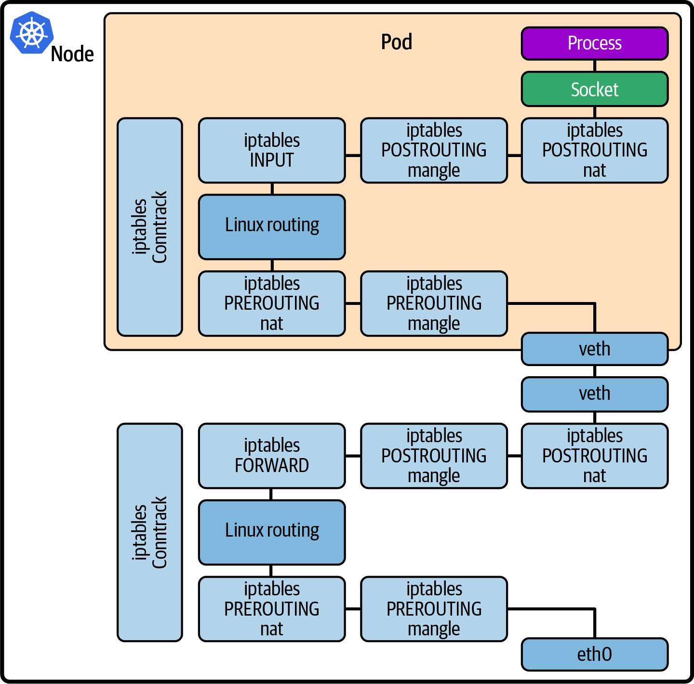

# 第八章 用于网络的 eBPF

正如第 1 章所述，eBPF的动态特性使我们能够定制内核的行为。在网络世界中，有许多期望的行为取决于应用程序。例如，电信运营商可能需要与电信专用协议（如 SRv6）对接；Kubernetes 环境可能需要与传统应用程序集成；专用硬件负载均衡器可以被在通用硬件上运行的XDP程序所替代。eBPF 允许程序员构建网络功能，以满足特定需求，而不必将其强加给所有上游内核用户。

基于 eBPF 的网络工具现在被广泛使用，并已被证明在大规模应用中非常有效。例如，CNCF 的 [Cilium 项目](https://cilium.io/)使用 eBPF 作为 Kubernetes 网络、独立负载均衡等方面的平台，广泛应用于各种行业的云原生采用者中。（截至撰写本文时，大约 100 个组织已在其 [USERS.md 文件](https://github.com/cilium/cilium/blob/main/USERS.md)中公开宣布使用 Cilium，不过这个数字正在快速增长。 Cilium 还被 AWS、Google 和 Microsoft 采用。）此外，Meta（前 Facebook ）也在大规模采用了 eBPF 技术，自2017年以来，所有进出 Facebook 的数据包都经过了XDP程序的处理。另一个公开且规模巨大的例子是 Cloudflare 使用 eBPF 来进行 DDoS（分布式拒绝服务）保护。

这些都是复杂的、可用于生产的解决方案，它们的细节远远超出了本书的范围，但是通过阅读本章中的示例，您可以了解如何构建此类 eBPF 网络解决方案。

> 提示
>
> 本章的代码示例位于 [github.com/lizrice/learning-ebpf](https://github.com/lizrice/learning-ebpf) 存储库的 *chapter8* 目录中。

## 数据包丢弃

有几种涉及丢弃特定传入数据包和允许其他数据包的网络安全功能。这些功能包括防火墙、DDoS保护和缓解致命数据包（packet-of-death）漏洞：

- 防火墙涉及根据源和目标 IP 地址和/或端口号，逐个数据包决定是否允许数据包。
- DDoS 防护增加了一些复杂性，可能要跟踪来自特定来源的数据包的到达速度，和/或检测数据包内容的某些特征，以确定攻击者或一组攻击者正试图用流量淹没接口。
- 致命数据包漏洞是一类内核漏洞，其中内核在处理按特定方式构造的数据包时未能安全处理。向服务器发送具有这种特定格式的数据包的攻击者可以利用该漏洞，可能导致内核崩溃。传统上，当发现这种内核漏洞时，需要安装修复的新内核，这又需要停机维护。但是，能检测并丢弃这些恶意数据包的 eBPF 程序可以动态安装，在不影响机器上运行的任何应用程序的情况下立即保护主机。

此类功能的决策算法超出了本书的范围，但让我们探讨一下附加到网络接口上的 XDP 钩子的 eBPF 程序如何丢弃某些数据包，这是实现这些用例的基础。

### XDP 程序返回值

网络数据包的到达会触发 XDP 程序。程序会检查数据包，检查完毕后，返回值会给出一个*决策*，指出下一步该如何处理该数据包：

- **XDP_PASS** 指示数据包应以正常方式发送到网络协议栈（如果没有 XDP 程序就会这样做）。
- **XDP_DROP** 会立即丢弃数据包。
- **XDP_TX** 将数据包从其到达的同一接口发送回去。
- **XDP_REDIRECT** 用于将其发送到不同的网络接口。
- **XDP_ABORTED** 的结果是丢弃数据包，但它的使用意味着出现错误或出现意外情况，而不是 "正常" 决定丢弃数据包。

对于某些用例（如防火墙），XDP 程序只需决定是继续传递数据包还是丢弃数据包。决定是否丢弃数据包的 XDP 程序大致如下：

```c
SEC("xdp")
int hello(struct xdp_md *ctx) {
    bool drop;
    drop = <examine packet and decide whether to drop it>;
    if (drop)
        return XDP_DROP;
    else
        return XDP_PASS;
}
```

XDP 程序还可以操纵数据包内容，但这一点我将在本章后面讨论。

每当一个入站网络数据包到达其所连接的接口时，XDP 程序就会被触发。**ctx** 参数是一个指向 **xdp_md** 结构体的指针，该结构体保存了传入数据包的元数据。让我们看看如何使用该结构来检查数据包的内容，从而得出决策（译者注：指示下一步如何处理数据包）。

### XDP 数据包解析

这是 **xdp_md** 结构体的定义：

```c
struct xdp_md {
    __u32 data;
    __u32 data_end;
    __u32 data_meta;
    /* Below access go through struct xdp_rxq_info */
    __u32 ingress_ifindex; /* rxq->dev->ifindex */
    __u32 rx_queue_index; /* rxq->queue_index */
    __u32 egress_ifindex; /* txq->dev->ifindex */
};
```

不要被前三个字段的 **__u32** 类型所迷惑，因为它们实际上是指针。 **data** 字段指示数据包在内存中的起始位置，**data_end** 显示数据包结束位置。正如您在第 6 章中看到的，要通过 eBPF 验证器，您必须显式检查对数据包内容的任何读取或写入是否在 data 到 data_end 的范围内。

数据包前面的内存中还有一个区域，位于 **data_meta** 和 **data** 之间，用于存储有关该数据包的元数据。该区域可用于协调多个 eBPF 程序，这些程序可能会在数据包通过网络协议栈的不同位置处理同一个数据包。

为了说明解析网络数据包的基础知识，示例代码中有一个名为 **ping()** 的 XDP 程序，每当检测到 ping (ICMP) 数据包时，它就会简单地生成一行跟踪。这是该程序的代码：

```c
SEC("xdp")
int ping(struct xdp_md *ctx) {
    long protocol = lookup_protocol(ctx);
    if (protocol == 1) // ICMP
    {
        bpf_printk("Hello ping");
    }
    return XDP_PASS;
}
```

您可以按照以下步骤查看该程序的运行情况：

1. 在 *chapter8* 目录下运行 **make**。这不仅仅构建代码；它还将 XDP 程序附加到环回接口（称为 **lo**）。
2. 在一个终端窗口中运行 **ping localhost**。
3. 在另一个终端窗口中，通过运行 **cat /sys/kernel/tracing/trace_pipe** 来观察跟踪管道中生成的输出。

您应该看到大约每秒生成两行跟踪，它们应该是这样的：

```c
ping-26622 [000] d.s11 276880.862408: bpf_trace_printk: Hello ping
ping-26622 [000] d.s11 276880.862459: bpf_trace_printk: Hello ping
ping-26622 [000] d.s11 276881.889575: bpf_trace_printk: Hello ping
ping-26622 [000] d.s11 276881.889676: bpf_trace_printk: Hello ping
ping-26622 [000] d.s11 276882.910777: bpf_trace_printk: Hello ping
ping-26622 [000] d.s11 276882.910930: bpf_trace_printk: Hello ping
```

每秒有两行跟踪，因为环回接口同时接收 ping 请求和 ping 响应。

您可以轻松修改此代码以丢弃 ping 数据包，方法是添加一行代码以在协议匹配时返回 **XDP_DROP**，如下所示：

```c
if (protocol == 1) // ICMP
{
    bpf_printk("Hello ping");
    return XDP_DROP;
}
return XDP_PASS;
```

如果您尝试这样做，您将看到类似于以下内容的输出每秒仅在跟踪输出中生成一次：

```c
ping-26639 [002] d.s11 277050.589356: bpf_trace_printk: Hello ping
ping-26639 [002] d.s11 277051.615329: bpf_trace_printk: Hello ping
ping-26639 [002] d.s11 277052.637708: bpf_trace_printk: Hello ping
```

环回接口收到 ping 请求，XDP 程序会丢弃该请求，因此该请求无法通过网络协议栈以得到响应。

在这个 XDP 程序中，大部分工作都是在一个名为 **lookup_protocol()** 的函数中完成的，该函数用于确定第 4 层协议类型。这只是一个示例，并不是解析网络数据包的高质量实现！但它足以让您了解 eBPF 中的解析是如何工作的。

接收到的网络数据包由一串字节组成，其布局如图 8-1 所示。


*图 8-1. IP 网络数据包的布局，首先是以太网报头，之后是 IP 报头，然后是第 4 层数据*

Lookup_protocol() 函数接收 ctx 结构体作为参数，该结构体保存有关此网络数据包在内存中的位置信息，并返回它在 IP 报头中找到的协议类型。代码如下：

```c
unsigned char lookup_protocol(struct xdp_md *ctx)
{
    unsigned char protocol = 0;
    // 局部变量 data 和 data_end 分别指向网络数据包的开始和结束位置。
    void *data = (void *)(long)ctx->data;
    void *data_end = (void *)(long)ctx->data_end;
    // 网络数据包应以以太网报头开始。
    struct ethhdr *eth = data;
    // 但您不能简单地认为这个网络数据包足够大，可以容纳以太网报头！验证器要求您明确检查这一点。
    if (data + sizeof(struct ethhdr) > data_end)
        return 0;

    // 以太网报头包含一个 2 字节字段，告诉我们第 3 层协议。
    if (bpf_ntohs(eth->h_proto) == ETH_P_IP)
    {   
        // 如果协议类型显示是 IP 数据包，则 IP 报头紧跟在以太网报头之后。
        struct iphdr *iph = data + sizeof(struct ethhdr);
        // 您不能假定网络数据包中有足够的空间容纳 IP 报头。验证器再次要求您明确检查。
        if (data + sizeof(struct ethhdr) + sizeof(struct iphdr) <= data_end)
            // IP 报头包含函数将返回给调用者的协议字节。
            protocol = iph->protocol;
    }
    // Return the protocol of this packet
    // 1 = ICMP
    // 6 = TCP
    // 17 = UDP     
    return protocol;
}
```

该程序使用的 **bpf_ntohs()** 函数可确保两个字节按照主机序排列。网络协议是大端字节序，但大多数处理器是小端字节序，这意味着它们以不同的顺序保存多字节值。此函数将从网络序转换为主机序（如有必要）。每当您从长度超过一个字节的网络数据包中的字段中提取值时，都应该使用此函数。

这里的简单示例展示了几行 eBPF 代码如何对网络功能产生巨大影响。不难想象，关于要传递哪些数据包和要丢弃哪些数据包的更复杂的规则可能会实现我在本节开头描述的功能：防火墙、DDoS 防护和致命数据包漏洞缓解。现在让我们考虑一下，如果在 eBPF 程序中具备修改网络数据包的能力，还能提供哪些更多功能。

## 负载均衡和转发

XDP 程序不仅限于检查数据包的内容。它们还可以修改数据包的内容。让我们考虑一下，如果您想建立一个简单的负载均衡器，将发送到特定 IP 地址的数据包传输到能够处理这些请求的多个后端服务器，会涉及到哪些问题。

GitHub 仓库（本示例基于我在 2021 年 eBPF 峰会上发表的题为 ["从零开始创建负载均衡器](https://www.youtube.com/watch?v=L3_AOFSNKK8)" 的演讲。在 15 分钟内构建 eBPF 负载均衡器！）中有一个这样的示例。这里的设置是一组在同一主机上运行的容器。有一个客户端、一个负载均衡器和两个后端，每个后端都在自己的容器中运行。如图 8-2 所示，负载均衡器接收来自客户端的流量并将其转发到两个后端容器之一。


图 8-2. 负载均衡器设置示例

负载均衡功能作为附加到负载均衡器 eth0 网络接口的 XDP 程序来实现。该程序的返回代码是 **XDP_TX**，表示数据包应从其进入的接口发送回。但在此之前，程序必须更新数据包报头中的地址信息。

虽然我认为它作为学习练习很有用，但这个示例代码距离生产就绪还非常非常远。例如，它使用硬编码地址，假定 IP 地址的精确设置如图 8-2 所示。它假设它收到的唯一 TCP 流量是来自客户端的请求或对客户端的响应。它还利用 Docker 设置虚拟 MAC 地址的方式进行欺骗，使用每个容器的 IP 地址作为每个容器的虚拟以太网接口的 MAC 地址的最后四个字节。从容器的角度来看，该虚拟以太网接口称为 eth0。

虽然我认为这是一个很有用的学习练习，但这个示例代码与真正的生产环境相差甚远。例如，它使用硬编码的地址，假设 IP 地址的设置与图 8-2 中显示的完全相同。它还假设它所接收到的 TCP 流量仅限于来自客户端的请求或针对客户端的响应。此外，它利用 Docker 设置虚拟 MAC 地址的方式来取巧，使用每个容器的 IP 地址作为每个容器虚拟以太网接口的MAC地址的最后四个字节。从容器的角度来看，该虚拟以太网接口被称为 eth0。

以下是示例负载均衡器代码中的 XDP 程序：

```c
SEC("xdp_lb")
int xdp_load_balancer(struct xdp_md *ctx)
{
    // 该函数的第一部分实际上与前面的示例相同：它定位数据包中的以太网报头，然后定位 IP 报头。
    void *data = (void *)(long)ctx->data;
    void *data_end = (void *)(long)ctx->data_end;
    
    struct ethhdr *eth = data;
    if (data + sizeof(struct ethhdr) > data_end)
        return XDP_ABORTED;
    if (bpf_ntohs(eth->h_proto) != ETH_P_IP)
        return XDP_PASS;
    
    struct iphdr *iph = data + sizeof(struct ethhdr);
    if (data + sizeof(struct ethhdr) + sizeof(struct iphdr) > data_end)
        return XDP_ABORTED;
    // 这次它将只处理 TCP 数据包，将收到的任何其他数据包传递给网络协议栈，就好像什么也没发生一样。
    if (iph->protocol != IPPROTO_TCP)
        return XDP_PASS;
    // 这里要检查源 IP 地址。如果该数据包不是来自客户端，我就认为它是发给客户端的响应。
    if (iph->saddr == IP_ADDRESS(CLIENT))
    {
        // 此代码在后端 A 和 B 之间生成伪随机选择。
        char be = BACKEND_A;
        if (bpf_get_prandom_u32() % 2)
            be = BACKEND_B;
        // 更新目标 IP 和 MAC 地址，以匹配所选的后端...
        iph->daddr = IP_ADDRESS(be);
        eth->h_dest[5] = be;
    }
    else
    {
        // ......或者，如果这是来自后端的响应（如果不是来自客户端，这里就是假设），则会更新目标 IP 和 MAC 地址以匹配客户端。
        iph->daddr = IP_ADDRESS(CLIENT);
        eth->h_dest[5] = CLIENT;
    }
    // 无论该数据包流向何处，都需要更新源地址，以便该数据包看起来像是源自负载均衡器。
    iph->saddr = IP_ADDRESS(LB);
    eth->h_source[5] = LB;
    iph->check = iph_csum(iph);
    return XDP_TX;
}
```

IP 报头包含根据其内容计算的校验和，并且由于源 IP 地址和目标 IP 地址均已更新，因此还需要重新计算并替换此数据包中的校验和。

> 提示
>
> 由于这是一本关于 eBPF 而不是网络的书，我没有深入研究细节，例如为什么 IP 和 MAC 地址需要更新，或者如果不更新会发生什么。如果您有兴趣，我[在 eBPF 峰会演讲的 YouTube 视频](https://www.youtube.com/watch?v=L3_AOFSNKK8)中详细介绍这一点，我最初是在该视频中编写了此示例代码。

与前面的例子一样，Makefile 文件不仅包含了编译代码的说明，还包含了使用 **bpftool** 加载 XDP 程序并将其附加到接口上的说明，就像这样：

```c
xdp: $(BPF_OBJ)
    bpftool net detach xdpgeneric dev eth0
    rm -f /sys/fs/bpf/$(TARGET)
    bpftool prog load $(BPF_OBJ) /sys/fs/bpf/$(TARGET)
    bpftool net attach xdpgeneric pinned /sys/fs/bpf/$(TARGET) dev eth0
```

这条 make 指令需要在负载均衡器容器内运行，这样 **eth0** 才能对应其虚拟以太网接口。这就引出了一个有趣的问题：eBPF 程序被加载到内核中，而内核只有一个；但附加点可能在特定的网络命名空间内，并且只能在该网络命名空间内可见。（如果您想探索这一点，请尝试 [eBPF Summit 2022 的 CTF Challenge 3](https://github.com/isovalent/eBPF-Summit-2022-CTF)。我不会在书中剧透，但您可以在 [Duffie Cooley 和我提供的攻略](https://www.youtube.com/watch?v=CBUIy0FzxFY)中看到解决方案。）

## XDP 卸载（XDP Offloading）

XDP的概念起源于一次关于猜测的讨论，讨论了如果您能够在网络卡上运行eBPF程序，在数据包进入内核的网络协议栈之前就能对其进行决策，这将会有多么有用。（请参阅 [Daniel Borkmann 的演讲 "Little Helper Minions for Scaling Microservices"](https://www.youtube.com/watch?v=99jUcLt3rSk&feature=youtu.be)，其中包括 eBPF 的历史，他在演讲中讲述了这件趣事。）有一些网卡支持完整的XDP卸载功能，它们确实可以在自己的处理器上运行eBPF程序来处理传入的数据包。这在图 8-3 中有所说明。


*图 8-3. 支持 XDP 卸载的网卡可以处理、丢弃和重传数据包，而不需要主机 CPU 做任何工作*

这就意味着，从同一物理接口丢弃或重定向回来的数据包（如本章前面的数据包丢弃和负载均衡示例），主机内核永远不会看到，主机上的 CPU 周期也不会用于处理这些数据包，因为所有工作都是在网卡上完成的。

即使物理网卡不支持完整的 XDP 卸载，许多 NIC 驱动程序也支持 XDP 钩子，这可以最大限度地减少 eBPF 程序处理数据包所需的内存复制。（Cilium 在 [BPF 和 XDP 参考指南](https://docs.cilium.io/en/v1.12/bpf/)中维护了[支持 XDP 的驱动程序列表](https://docs.cilium.io/en/latest/bpf/progtypes/#xdp)。）

这可以带来显著的性能优势，并使负载均衡等功能在通用硬件上非常高效地运行。（Ceznam 在这篇博文中分享了其团队在试用基于 eBPF 的负载平衡器时看到的性能提升数据。）

您已经了解了如何使用 XDP 处理入站网络数据包，并在它们到达计算机时尽快访问它们。 eBPF 还可用于处理网络协议栈中其他点的流量，无论其流向如何。让我们继续思考 TC 子系统中附加的 eBPF 程序。

## 流量控制（TC）

我在上一章中提到过流量控制。当网络数据包到达这一附加点时，它将以 **sk_buff** 的形式存在于内核内存中。在 TC 子系统中附加的 eBPF 程序会接收一个指向 sk_buff 结构体的指针作为上下文参数。

> 提示
>
> 您可能想知道为什么 XDP 程序不在其上下文中使用相同的结构。答案是，XDP 钩子发生在网络数据到达网络协议栈之前以及 **sk_buff** 结构体建立之前。

TC 子系统旨在调节网络流量的调度方式。例如，您可能希望限制每个应用程序的可用带宽，以便它们都能获得公平的机会。但在调度单个数据包时，带宽并不是一个非常有意义的术语，因为它是指发送或接收的平均数据量。某个特定的应用程序可能非常容易有突发流量，或者另一个应用程序可能对网络延迟非常敏感，因此 TC 可以对数据包的处理方式和优先级进行更精细的控制。（要更完整地了解 TC 及其概念，我推荐 Quentin Monnet 的文章[“Understanding tc ‘direct action’ mode for BPF”](https://qmonnet.github.io/whirl-offload/2020/04/11/tc-bpf-direct-action/)。）

引入 eBPF 程序是为了对 TC 内使用的算法进行自定义控制。但由于 eBPF 程序具有操纵、丢弃或重定向数据包的功能，因此也可用作复杂网络行为的构建模块。

网络协议栈中给定的网络数据流有两个方向：*入口*（ingress，从网络接口进入）或*出口*（egress，向网络接口输出）。eBPF 程序可以附加在任一方向上，并只影响该方向上的流量。与 XDP 不同的是，可以附加多个 eBPF 程序，并按顺序进行处理。

传统的流量控制分为*分类器*和单独的*操作*，分类器根据某些规则对数据包进行分类，而操作则根据分类器的输出决定如何处理数据包。可以有一系列分类器，它们都被定义为 *qdisc* 或排队规则（queuing discipline）的一部分。

eBPF 程序是作为分类器附加在程序上的，但它们也可以决定在同一程序中采取什么行动。该操作由程序的返回值（其值在 *linux/pkt_cls.h* 中定义）表示：

- **TC_ACT_SHOT** 告诉内核丢弃数据包。
- **TC_ACT_UNSPEC** 的行为就像 eBPF 程序尚未在此数据包上运行一样（因此它将被传递到序列中的下一个分类器（如果有））。
- **TC_ACT_OK** 告诉内核将数据包传递到网络协议栈的下一层。
- **TC_ACT_REDIRECT** 将数据包发送到不同网络设备的入口或出口路径。

让我们来看几个可在 TC 中附加程序的简单示例。第一个程序只是生成一行跟踪信息，然后告诉内核丢弃数据包：

```c
int tc_drop(struct __sk_buff *skb) {
    bpf_trace_printk("[tc] dropping packet\n");
    return TC_ACT_SHOT;
}
```

现在让我们考虑如何仅丢弃数据包的子集。此示例丢弃 ICMP (ping) 请求数据包，与本章前面看到的 XDP 示例非常相似：

```c
int tc(struct __sk_buff *skb) {
    void *data = (void *)(long)skb->data;
    void *data_end = (void *)(long)skb->data_end;
    if (is_icmp_ping_request(data, data_end)) {
        struct iphdr *iph = data + sizeof(struct ethhdr);
        struct icmphdr *icmp = data + sizeof(struct ethhdr) + sizeof(struct iphdr);
        bpf_trace_printk("[tc] ICMP request for %x type %x\n", iph->daddr, icmp->type);
        return TC_ACT_SHOT;
    }
    return TC_ACT_OK;
}
```

**sk_buff** 结构体具有指向数据包数据开始和结束的指针，这与 **xdp_md** 结构体非常相似，数据包的解析过程也大致相同。同样，要通过验证，必须明确检查对数据的任何访问是否在 **data** 和 **data_end** 之间的范围内。

您可能会想，既然 XDP 已经实现了同样的功能，为什么还要在 TC 层实现这样的功能呢？一个很好的理由是，您可以使用 TC 程序处理出口流量，而 XDP 只能处理入口流量。另一个原因是，由于 XDP 会在数据包到达时立即触发，因此此时并不存在与数据包相关的 **sk_buff** 内核数据结构。如果 eBPF 程序对内核为该数据包创建的 **sk_buff** 感兴趣或想对其进行操作，那么 TC 连接点是合适的。

> 提示
>
> 要更好地理解 XDP 与 TC eBPF 程序之间的区别，请阅读 Cilium 项目中[《BPF 和 XDP 参考指南》](https://docs.cilium.io/en/latest/bpf/#program-types)中的 "程序类型 "部分。

现在，让我们来看一个不只是丢弃某些数据包的例子。这个例子可以识别收到的 ping 请求，并作出 ping 响应：

```c
int tc_pingpong(struct __sk_buff *skb) {
    void *data = (void *)(long)skb->data;
    void *data_end = (void *)(long)skb->data_end;
    // is_icmp_ping_request() 函数解析数据包，不仅检查它是否是 ICMP 报文，还检查它是否是 echo (ping) 请求。
    if (!is_icmp_ping_request(data, data_end)) {
        return TC_ACT_OK;
    }
    
    struct iphdr *iph = data + sizeof(struct ethhdr);
    struct icmphdr *icmp = data + sizeof(struct ethhdr) + sizeof(struct iphdr);
    // 由于该函数将向发送方发送响应，因此需要交换源地址和目标地址。(如果您想了解其中的细节，可以阅读示例代码，其中还包括更新 IP 头校验和）。
    swap_mac_addresses(skb);
    swap_ip_addresses(skb);
    
    // Change the type of the ICMP packet to 0 (ICMP Echo Reply) (was 8 for ICMP Echo request)
    // 通过更改 ICMP 标头中的类型字段，将其转换为回显响应。
    update_icmp_type(skb, 8, 0);
    
    // Redirecting a clone of the modified skb back to the interface it arrived on
    // 该辅助函数通过接收数据包的接口 (skb- >ifindex)，将数据包的克隆发送回去。
    bpf_clone_redirect(skb, skb->ifindex, 0);
    // 由于辅助函数在发送响应之前克隆了数据包，因此原始数据包应被丢弃。
    return TC_ACT_SHOT;
}
```

在正常情况下，ping 请求会由内核的网络协议栈稍后处理，但这个小例子演示了如何用 eBPF 实现更广泛地替代网络功能。

如今，许多网络功能都是由用户空间服务处理的，但如果可以用 eBPF 程序来替代，很可能会大大提高性能。在内核中处理的数据包不需要通过协议栈的其他部分；数据包不需要传输到用户空间进行处理，而响应也不需要传回内核。更重要的是，两者可以并行运行——eBPF 程序可以为任何需要复杂处理而自己又无法处理的数据包返回 **TC_ACT_OK**，这样它就可以正常传递到用户空间服务。

对我来说，这是在 eBPF 中实现网络功能的一个重要方面。随着 eBPF 平台的发展（例如，最近的内核允许一百万条指令的程序），在内核中实现越来越复杂的网络功能成为可能。eBPF 中尚未实现的部分仍可由内核中的传统协议栈或用户空间处理。随着时间的推移，越来越多的功能可以从用户空间转移到内核中，eBPF 的灵活性和动态性意味着您不必等待它们成为内核发行版的一部分。您可以立即加载 eBPF 实现，就像我在第 1 章中讨论的那样。

我将在 "eBPF 和 Kubernetes 网络"节中再次介绍网络功能的实现。但首先，让我们考虑一下 eBPF 支持的另一种使用场景：检查加密流量的解密内容。

## 数据包加密和解密

如果应用程序使用加密技术来保护发送或接收的数据，那么在加密之前或解密之后，数据都会处于明文状态。回想一下，eBPF 可以将程序附加到机器上的几乎任何地方，所以如果您能挂钩到一个数据正在传输但尚未加密的点，或者刚刚解密后的点，这将允许您的 eBPF 程序观察到明文数据。无需提供任何证书来解密流量，就像传统的 SSL 检查工具一样。

在许多情况下，应用程序会使用 OpenSSL 或 BoringSSL 等用户空间库来加密数据。在这种情况下，流量在到达套接字时已经加密，套接字是网络流量的用户空间/内核边界。如果您想以未加密的形式追踪这些数据，可以使用附加到用户空间代码正确位置的 eBPF 程序。

### 用户空间 SSL 库

追踪加密数据包解密内容的一种常见方法是挂钩调用 OpenSSL 或 BoringSSL 等用户空间库。使用 OpenSSL 的应用程序通过调用 **SSL_write()** 函数发送加密数据，并使用 **SSL_read()** 检索通过网络接收的加密明文数据。通过 uprobes 将 eBPF 程序挂钩到这些函数中，应用程序可以在加密之前或解密之后以明文方式观察*使用此共享库的任何应用程序中*的数据。并且不需要任何密钥，因为应用程序已经提供了这些密钥。

在 Pixie 项目中，有一个名为 [openssl-tracer](https://github.com/pixie-io/pixie-demos/tree/410447afd6e566050e8bbf4060c66d76660cb30b/openssl-tracer) 的相当简单的示例，其中的 eBPF 程序位于一个名为 *openssl_tracer_bpf_funcs.c* 的文件中。（该示例还附有一篇博文，网址是 [https://blog.px.dev/ebpf-openssl-tracing](https://blog.px.dev/ebpf-openssl-tracing)。）下面是该代码中使用 perf 缓冲区向用户空间发送数据的部分（与本书前面的示例类似）：

```c
static int process_SSL_data(struct pt_regs* ctx, uint64_t id, enum ssl_data_event_type type, const char* buf) {
    ...
    bpf_probe_read(event->data, event->data_len, buf);
    tls_events.perf_submit(ctx, event, sizeof(struct ssl_data_event_t));
    return 0;
}
```

您可以看到，使用辅助函数 **bpf_probe_read()**，将 buf 中的数据读入一个 **event** 结构体，然后该 **event** 结构体被提交到 perf 缓冲区。

如果这些数据被发送到用户空间，那么我们有理由认为这一定是未加密格式的数据。那么，这个数据缓冲区是从哪里获得的呢？您可以通过查看 **process_SSL_data()** 函数的调用位置来解决这个问题。它在两个地方被调用：一个是读取数据的地方，另一个是写入数据的地方。图 8-4 展示了读取以加密形式到达本机的数据时发生的情况。

读取数据时，您需要向 **SSL_read()** 提供一个指向缓冲区的指针，当函数返回时，该缓冲区将包含未加密的数据。与 kprobes 类似，函数的输入参数（包括缓冲区指针）只有附加到入口点的 uprobe 才能使用，因为它们所在的寄存器很可能在函数执行期间被覆盖。直到函数退出时，缓冲区中的数据才可用，此时您可以使用 uretprobe 读取数据。


*图 8-4. eBPF 程序在 SSL_read() 的入口和出口处挂钩 uprobes，以便可以从缓冲区指针读取未加密的数据*

因此，本例遵循了 kprobes 和 uprobes 的常见模式（如图 8-4 所示），即入口探针使用 map 临时存储输入参数，出口探针可以从中获取这些参数。让我们从附加在 **SSL_read()** 开始的 eBPF 程序开始，看看实现这一功能的代码：

```c
// Function signature being probed:
// int SSL_read(SSL *s, void *buf, int num)
int probe_entry_SSL_read(struct pt_regs* ctx) {
    uint64_t current_pid_tgid = bpf_get_current_pid_tgid();
    ...
    // 如该函数的注释所述，缓冲区指针是传入 SSL_read() 函数的第二个参数，该探针将附加到该函数。PT_REGS_PARM2 宏从上下文中获取该参数。
    const char* buf = (const char*)PT_REGS_PARM2(ctx);
    // 缓冲区指针存储在哈希映射中，其键是当前进程和线程 ID，在函数开始时使用辅助函数 bpf_get_current_pid_tgif()获取。
    active_ssl_read_args_map.update(&current_pid_tgid, &buf);
    return 0;
}
```

这是出口探针的相应程序：

```c
int probe_ret_SSL_read(struct pt_regs* ctx) {
    uint64_t current_pid_tgid = bpf_get_current_pid_tgid();
    ...
    // 查找当前进程和线程 ID 后，以此为键从哈希 map 中获取缓冲区指针。
    const char** buf = active_ssl_read_args_map.lookup(&current_pid_tgid);
    if (buf != NULL) {
        // 如果这不是空指针，则调用 process_SSL_data()，也就是您之前看到的那个函数，它使用 perf 缓冲区将数据从该缓冲区发送到用户空间。
        process_SSL_data(ctx, current_pid_tgid, kSSLRead, *buf);
    }
    // 清理哈希 map 中的条目，因为每个入口调用都应与出口配对。
    active_ssl_read_args_map.delete(&current_pid_tgid);
    return 0;
}
```

本示例展示了如何跟踪用户空间应用程序收发的加密数据的明文版本。跟踪本身附在用户空间库上，而且不能保证每个应用程序都会使用给定的 SSL 库。BCC 项目包含一个名为 [sslsniff](https://github.com/iovisor/bcc/blob/master/tools/sslsniff.py) 的工具，它也支持 GnuTLS 和 NSS。但是，如果某人的应用程序使用其他加密库（甚至，如果他们选择了 "自行加密"），则 uprobes 根本就没有正确的挂钩位置，并且这些跟踪工具将无法工作。

还有更常见的原因导致这种基于 uprobe 的方法无法成功。与内核（每个 [虚拟] 机器只有一个内核）不同，用户空间库代码可能有多个副本。如果您使用的是容器，那么每个容器都可能有自己的一套所有库依赖关系。您可以挂钩这些库中的 uprobe，但您必须为要跟踪的特定容器指定正确的副本。另一种可能性是，应用程序可以静态链接，而不是使用共享的动态链接库，这样它就是一个独立的可执行文件。

## eBPF 和 Kubernetes 网络

虽然这本书不是关于 Kubernetes 的，但 eBPF 在 Kubernetes 网络中的应用非常广泛，它很好地说明了如何使用该平台来定制网络协议栈。

在 Kubernetes 环境中，应用程序部署在 *pod* 中。每个 pod 由一个或多个容器组成，这些容器共享内核命名空间和 cgroup，从而使 pod 相互隔离，并与运行它们的主机隔离。

在Kubernetes环境中，应用程序被部署在 *Pod* 中。每个 Pod 都是一组一个或多个共享内核命名空间和 cgroup 的容器，将 Pod 彼此隔离并与其运行的主机隔离。

特别是（就本章而言），一个 pod 通常有自己的网络命名空间和 IP 地址。（pod 可以在主机的网络命名空间中运行，这样它们就可以共享主机的 IP 地址，但通常不会这样做，除非 pod 中运行的应用程序有充分的理由需要这样做。）这意味着内核为该命名空间设置了一套网络协议栈结构，与主机和其他 pod 的网络协议栈结构分开。如图 8-5 所示，pod 通过虚拟以太网与主机相连，并分配了自己的 IP 地址。



*图 8-5. Kubernetes 中的网络路径*

从图 8-5 中可以看出，从机器外部发送到应用程序 pod 的数据包必须穿过主机上的网络协议栈、虚拟以太网连接并进入 pod 的网络命名空间，然后再穿过网络协议栈到达应用程序。

这两个网络协议栈在同一个内核中运行，因此数据包实际上要经过两次相同的处理。网络数据包要经过的代码越多，延迟就越高，因此如果能缩短网络路径，就有可能提高性能。

如图 8-6 所示，Cilium 等基于 eBPF 的网络解决方案可以挂钩到网络协议栈，从而覆盖内核的原本网络行为。


*图 8-6. 使用 eBPF 绕过 iptables 和 conntrack 处理*

特别是，eBPF 能够使用更有效的解决方案来替换 iptables 和 conntrack，以管理网络规则和连接跟踪。让我们讨论一下为什么这会显着提高 Kubernetes 的性能。

### 避免使用 iptables

Kubernetes 有一个名为 kube-proxy 的组件，它实现了负载均衡行为，允许多个 Pod 来满足对一个服务的请求。这是通过使用 iptables 规则来实现的。

Kubernetes 通过使用容器网络接口 (CNI) 为用户提供选择使用哪种网络解决方案的机会。一些 CNI 插件使用 iptables 规则来实现Kubernetes 中的 L3/L4 网络策略；也就是说，iptables 规则指示是否因为不符合网络策略而丢弃数据包。

虽然 iptables 对传统（precontainer，前容器）网络很有效，但在 Kubernetes 中使用时却有一些弱点。在这种环境中，pod 和它们的 IP 地址都是动态变化的，每次添加或删除 pod 时，iptables 规则都必须全部重写，这就影响了大规模运行时的性能。(谢海斌和 Quinton Hoole 在 2017 年 KubeCon 上的一次[演讲](https://www.youtube.com/watch?t=863&v=4-pawkiazEg&feature=youtu.be)描述了为 20,000 个服务更新一次 iptables 规则可能需要 5 个小时）。

iptables 的更新并不是唯一的性能问题：查找规则需要对表进行线性搜索，这是一个 O(n) 操作，随着规则数量线性增长。

Cilium 使用 eBPF 哈希表 map 来存储网络策略规则、连接跟踪和负载均衡器查找表，它可以替代 kube-proxy 的 iptables。在哈希表中查找条目和插入新条目都是近似 O(1) 操作，这意味着它们的扩展性要好得多。

您可以在 Cilium [博客](https://cilium.io/blog/2021/05/11/cni-benchmark/)上了解由此实现的基准性能改进。在同一篇文章中，您将看到 Calico（另一个具有 eBPF 选项的 CNI）在您选择其 eBPF 实现而不是 iptables 时也能获得更好的性能。 eBPF 为可扩展、动态 Kubernetes 部署提供了最佳性能的机制。

### 协调网络程序

像 Cilium 这样复杂的网络实现不可能编写成单个 eBPF 程序。如图 8-7 所示，它提供了多个不同的 eBPF 程序，这些程序与内核及其网络协议栈的不同部分挂钩。


*图 8-7. Cilium 由多个协调的 eBPF 程序组成，这些程序挂钩内核的不同点*

一般来说，Cilium 会尽快拦截流量，以缩短每个数据包的处理路径。从应用程序 pod 传出的信息在套接字层截获，尽可能靠近应用程序。来自外部网络的入站数据包使用 XDP 进行拦截。那么附加的连接点有哪些呢？

Cilium支持不同的组网模式，以适应不同的环境。对此的完整描述超出了本书的范围（您可以在 [Cilium.io](https://cilium.io/) 上找到更多信息），但我将在这里给出一个简短的概述，以便您可以了解为什么有这么多不同的 eBPF 程序！

Cilium有一个简单的、扁平的网络模式，它为集群中的所有 Pod 从相同的 CIDR 中分配 IP 地址，并直接在它们之间路由流量。此外，还有一些不同的隧道模式。在隧道模式下，发往不同节点上的 Pod 的流量被封装在一个消息中，该消息发往目标节点的 IP 地址，在目标节点上解封装后，进行最后一跳发往 Pod。根据数据包的目的地是本地容器、本地主机、本网络上的另一个主机还是一个隧道，将调用不同的eBPF程序来处理流量。

在图 8-7 中，您可以看到多个 TC 程序处理进出不同设备的流量。这些设备代表了数据包可能流经的真实和虚拟网络接口：

- Pod 网络的接口（Pod 与主机之间虚拟以太网连接的一端）
- 网络隧道的接口
- 主机上物理网络设备的接口
- 主机自己的网络接口

> 提示
>
> 如果您有兴趣进一步了解数据包如何在 Cilium 中流动的更多信息，Arthur Chiao 写了这篇详细而有趣的博文：["Life of a Packet in Cilium: Discovering the Pod-to-Service Traffic Path and BPF Processing Logics"](https://arthurchiao.art/blog/cilium-life-of-a-packet-pod-to-service/)。

附加在内核中不同点的不同 eBPF 程序使用 eBFP map 和流经网络协议栈时附加到网络数据包的元数据进行通信（我在 XDP 示例中讨论访问网络数据包时提到过）。这些程序不仅仅将数据包路由到目的地；它们还用于根据网络策略丢弃数据包（就像您在前面的示例中看到的那样）。

### 网络策略执行

在本章开头，您已经看到 eBPF 程序如何丢弃数据包，这意味着它们根本无法到达目的地。这是网络策略执行的基础，无论我们考虑的是 "传统 "防火墙还是云原生防火墙，在概念上都是一样的。策略根据数据包的来源和/或目的地信息来决定是否丢弃数据包。

在传统环境中，IP 地址会在很长一段时间内分配给特定服务器，但在 Kubernetes 中，IP 地址是动态变化的，今天为特定应用程序 Pod 分配的地址很可能会在明天完全不同的应用程序中重复使用。这就是为什么传统防火墙在云原生环境中并不是非常有效。每次 IP 地址更改时都手动重新定义防火墙规则是不切实际的。

相反，Kubernetes 支持 NetworkPolicy 资源的概念，它根据特定 Pod 的标签而不是基于其 IP 地址定义防火墙规则。虽然这种资源类型是 Kubernetes 原生功能，但实际上并不是由 Kubernetes 自身实现的。相反，这个功能是委托给您使用的任何 CNI 插件来处理的。如果您选择的 CNI 不支持 NetworkPolicy 资源，那么您配置的任何规则都将被忽略。另一方面，CNIs 可以自由配置自定义资源，从而相比原生 Kubernetes 定义允许的网络策略配置，允许更复杂的网络策略配置。例如，Cilium 支持基于 DNS 的网络策略规则，因此您可以根据 DNS 名称（例如，“example.com”）而不是 IP 地址来定义流量是否被允许。您还可以为各种第 7 层协议定义策略，例如允许或拒绝对特定 URL 的 HTTP GET 调用，但不允许POST调用。

> 提示
>
> Isovalent 的免费实践实验室[“Cilium 入门”](https://isovalent.com/labs/getting-started-with-cilium/)将引导您定义第 3/4 层和第 7 层的网络策略。另一个非常有用的资源是 [networkpolicy.io](https://networkpolicy.io/) 的网络策略编辑器，它可以直观地呈现网络策略的效果。

正如我在本章前面所讨论的，可以使用 iptables 规则来丢弃流量，这也是一些 CNI 实施 Kubernetes NetworkPolicy 规则的方法。Cilium 使用 eBPF 程序来丢弃不符合当前规则集的流量。在本章前面的章节中，我们已经看到了丢弃数据包的示例，希望您对这种方法的工作原理已经有了大致的概念模型。

Cilium 使用 Kubernetes 标识来确定特定网络策略规则是否适用。标签定义了哪些 pod 属于 Kubernetes 服务的一部分，同样，标签也定义了 Cilium 对 pod 的安全标识。以这些服务标识为索引的 eBPF 哈希表可实现非常高效的规则查找。

### 加密的连接

许多组织都要求通过加密应用程序之间的流量来保护其部署和用户数据。这可以通过在每个应用程序中编写代码来实现，以确保它们建立安全连接，通常使用双向传输层安全性协议（mutual Traffic Layer Security，mTLS）作为 HTTP 或 gRPC 连接的基础。建立这些连接首先需要确定连接两端的应用程序的身份（通常通过交换证书来实现），然后对它们之间的数据流进行加密。

在 Kubernetes 中，可以将需求从应用程序卸载到服务网格（service mesh）层或底层网络本身。关于服务网格的全面讨论超出了本书的范围，但您可能会对我写的一篇关于新协议栈的文章感兴趣：["eBPF 如何简化服务网格"](https://thenewstack.io/how-ebpf-streamlines-the-service-mesh/)。在这里，让我们把注意力集中在网络层，以及 eBPF 如何将加密需求推向内核。

确保 Kubernetes 集群内流量加密的最简单方法是使用透明加密。之所以称为 "透明"，是因为它完全是在网络层进行的，从操作角度来看非常轻便。应用程序本身根本不需要知道加密，也不需要设置 HTTPS 连接；这种方法也不需要在 Kubernetes 下运行任何额外的基础设施组件。

目前有两种常用的内核加密协议：IPsec 和 WireGuard^(R)^，Cilium 和 Calico CNI 在 Kubernetes 网络中都支持这两种协议。讨论这两个协议之间的差异超出了本书的范围，但关键在于它们在两台机器之间建立了一条安全隧道。CNI 可以选择通过该安全隧道连接 pod 的 eBPF 端点。

> 提示
>
> [Cilium博客](https://cilium.io/blog/2021/05/20/cilium-110/#wireguard)上有一篇很好的文章，介绍了 Cilium 如何使用 WireGuard^(R)^ 和 IPsec 来提供节点间的加密流量。这篇文章还简要介绍了两者的性能特点。

安全隧道是使用两端节点的身份来建立的。这些身份由 Kubernetes 管理，因此操作员的管理负担很小。对于许多用途来说，这就足够了，因为它能确保集群中的所有网络流量都经过加密。透明加密还可以不加修改地与网络策略（NetworkPolicy）一起使用，后者使用 Kubernetes 身份来管理流量是否可以在集群中的不同端点之间流动。

有些企业运行的是多租户环境，需要强大的多租户边界，而且必须使用证书来识别每个应用程序端点。在每个应用程序中处理这个问题是一个很大的负担，因此最近将其卸载到服务网格层，但这需要部署一整套额外的组件，造成额外的资源消耗、延迟和操作复杂性。

eBPF 目前正在启用一种[新方法](https://isovalent.com/blog/post/cilium-service-mesh/#h-mtls-for-any-network-protocol)，它建立在透明加密的基础上，但使用 TLS 进行初始证书交换和端点验证，这样身份就可以代表单个应用程序，而不是它们所运行的节点，如图 8-8 所示。


*图 8-8. 已验证应用程序身份之间的透明加密*

一旦完成身份验证步骤，内核中的 IPsec 或 WireGuard^(R)^ 将用于加密这些应用程序之间的流量。这样做有很多好处。它允许第三方证书和身份管理工具（如 cert-manager 或 SPIFFE/SPIRE）处理身份认证部分，而网络则负责加密，因此对应用程序来说完全透明。Cilium 支持通过 SPIFFE ID（而不仅仅是 Kubernetes 标签）指定端点的 NetworkPolicy 定义。也许最重要的是，这种方法可用于任何在 IP 数据包中传输的协议。与只适用于基于 TCP 的连接的 mTLS 相比，这是一个很大的进步。

本书没有足够的篇幅深入探讨 Cilium 的所有内部结构，但我希望这部分内容能帮助您了解 eBPF 是如何成为构建复杂网络功能（如功能齐全的 Kubernetes CNI）的强大平台。

## 总结

在本章中，您将看到 eBPF 程序连接到网络协议栈的各个不同点。我展示了基本数据包处理的示例，希望这些示例能让您了解 eBPF 如何创建强大的网络功能。您还看到了这些网络功能的一些实际例子，包括负载均衡、防火墙、安全缓解和 Kubernetes 网络。

## 练习和进一步阅读

以下是一些了解 eBPF 网络用例范围的方法：

1. 修改示例 XDP 程序 **ping()**，使其为 ping 响应和 ping 请求生成不同的跟踪信息。在网络数据包中，ICMP 头紧跟在 IP 头之后（就像 IP 头紧跟在以太网头之后一样）。您可能需要使用 *linux/icmp.h* 中的 **struct icmphdr**，并查看类型字段是 ICMP_ECHO 还是 ICMP_ECHOREPLY。
2. 如果您想进一步深入 XDP 编程，我推荐 xdp-project 的 [xdp-tutorial](https://github.com/xdp-project/xdp-tutorial)。
3. 使用 BCC 项目中的 [sslsniff](https://github.com/iovisor/bcc/blob/master/tools/sslsniff.py) 查看加密流量的内容。
4. 使用 [Cilium 网站](https://cilium.io/get-started/)上链接的教程和实验室来探索 Cilium。
5. 使用 [*networkpolicy.io*](https://networkpolicy.io/) 上的编辑器可视化 Kubernetes 部署中网络策略的效果。

