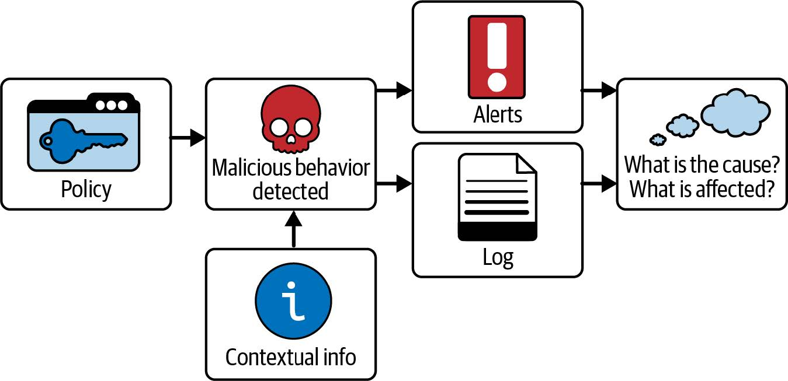
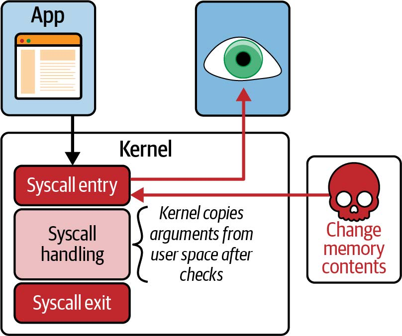
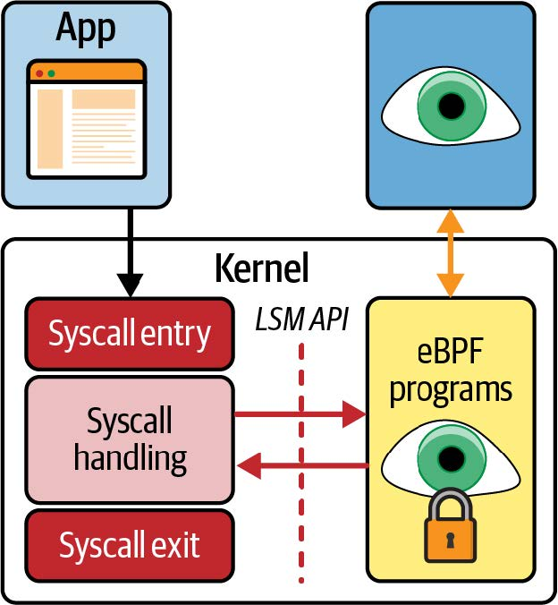
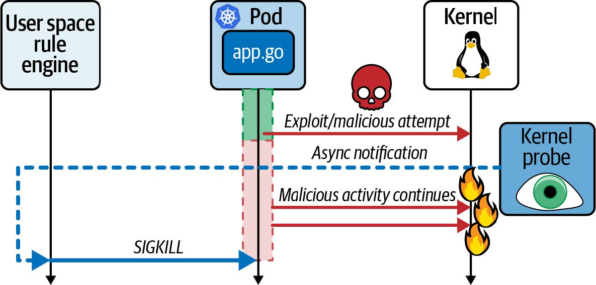
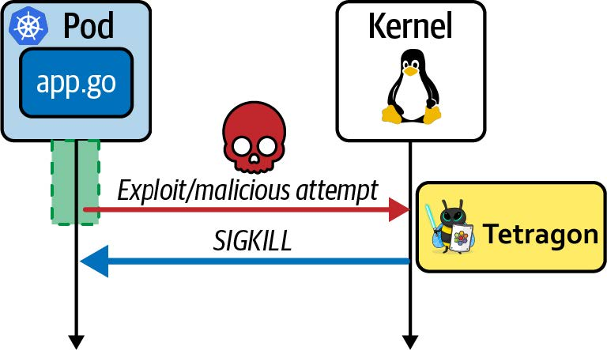

# 第九章 用于安全的 eBPF

您已经看到 eBPF 如何用于观察整个系统的事件，并将这些事件的相关信息报告给用户空间工具。在本章中，您将了解如何在事件检测概念的基础上创建基于 eBPF 的安全工具，以检测甚至阻止恶意活动。首先，我将帮助您理解安全与其他类型的可观察性的不同之处。

> 提示
>
> 本章的示例代码位于 [GitHub 代码库](http://github.com/lizrice/learning-ebpf)的 _chapter9_ 目录中。

## 安全可观察性需要策略和背景

安全工具与报告事件的可观察性工具的区别在于，安全工具需要能够区分正常情况下的预期事件和可能正在发生恶意活动的事件。例如，假设有一个应用程序在正常处理过程中会向本地文件写入数据。假设该应用程序将写入 _/home/\<username>/\<filename>_，那么从安全角度来看，您不会对这种活动感兴趣。但是，如果应用程序写入 Linux 中的许多敏感文件位置之一，您会希望得到通知。例如，它不太可能需要修改存储在 _/etc/passwd_ 中的密码信息。

策略不仅要考虑系统正常运行时的正常行为，还要考虑预期的错误路径行为。例如，如果物理磁盘满了，应用程序可能会开始发送网络信息，提醒用户注意这种情况。这些网络信息不应被视为安全事件——尽管它们不寻常，但并不可疑。考虑到错误路径可能会给创建有效策略带来挑战，我们将在本章稍后讨论这一挑战。

定义什么是预期行为，什么非预期行为是策略的工作。安全工具会将活动与策略进行比较，并在活动超出策略范围、变得可疑时采取一些行动。这种行动通常包括生成安全事件日志，该日志通常会被发送到安全信息事件管理（SIEM）平台。它还可能向人员发出警报，要求调查所发生的事件。

调查人员获得的上下文信息越多，就越有可能找出事件的根本原因，并确定这是否是一次攻击、哪些组件受到了影响、攻击是如何发生的、何时发生的以及谁应对此负责。如图 9-1 所示，要能够回答此类问题，需要一种工具从单纯的日志记录转变为名副其实的“安全可观察性”。



_图 9-1. 为实现安全可观察性，在检测到策略外事件时还需要上下文信息_

让我们来探讨一下 eBPF 程序用于检测和执行安全事件的一些方法。如您所知，eBPF 程序可以附加到各种事件上，而多年来常用于安全的一组事件是系统调用。我们将从系统调用开始讨论，但正如您所看到的，系统调用可能并不是使用 eBPF 实现安全工具的最有效方法。本章稍后我们将介绍一些更新、更复杂的方法。

## 使用系统调用处理安全事件

系统调用是用户空间应用程序与内核之间的接口。如果能限制一个应用程序所能使用的系统调用，就能限制它所能做的事情。例如，如果阻止应用程序执行 `open*()` 系列的系统调用，它就无法打开文件。如果您有一个应用程序，而您不希望它打开文件，那么您可能想创建这种限制，这样即使该应用程序被入侵，它也无法恶意打开文件。如果您在过去几年中一直在使用 Docker 或 Kubernetes，那么您很有可能已经接触过一种使用 BPF 限制系统调用的安全工具：seccomp。

### Seccomp

seccomp 是 "安全计算（SECure COMPuting）"的缩写。在其原始或 "严格" 模式下，seccomp 用于将进程可使用的系统调用限制为一个很小的子集：`read()`、`write()`、`_exit()` 和 `sigreturn()`。这种严格模式的目的是允许用户运行不受信任的代码（也许是从互联网上下载的程序），而不会让这些代码做恶意的事情。

严格模式的限制性很强，许多应用程序需要使用更大的系统调用集，但这并不意味着它们需要全部 400 个或更多系统调用。因此，采用一种更灵活的方法来限制任何特定应用程序可以使用的调用集是有意义的。这就是我们大多数来自容器领域的人都遇到过的 seccomp 风格背后的原因，它称为 seccomp-bpf 更为恰当。这种 seccomp 模式没有使用其允许的固定系统调用子集，而是使用 BPF 代码来过滤允许和不允许的系统调用。

在 seccomp-bpf 中，加载了一组充当过滤器的 BPF 指令。每次调用系统调用时，都会触发过滤器。过滤器代码可以访问传递给系统调用的参数，以便它可以根据系统调用本身和传递给它的参数做出决策。结果是一组可能的行动之一，包括：

- 允许系统调用继续进行
- 将错误代码返回给用户空间应用程序
- 杀死线程
- 通知用户空间应用程序 (seccomp-unotify)（从内核版本 5.0 开始）

> 提示
>
> 如果您想尝试编写自己的 BPF 过滤器代码，Michael Kerrisk 在 [https://man7.org/training/download/secisol_seccomp_slides.pdf](https://man7.org/training/download/secisol_seccomp_slides.pdf) 上提供了一些很好的示例。

传递给系统调用的一些参数是指针，而 seccompbpf 中的 BPF 代码无法解引用这些指针。这就限制了 seccomp 配置文件的灵活性，因为它在决策过程中只能使用值参数。此外，它必须在进程启动时应用——您不能修改正在应用于给定应用程序进程的配置文件。

您很可能在没有编写 BPF 代码的情况下使用了 seccomp-bpf，因为该代码通常源自人类可读的 seccomp 配置文件。 [Docker 的默认配置文件](https://github.com/moby/moby/blob/master/profiles/seccomp/default.json)就是一个很好的例子。这是一个通用配置文件，旨在可用于几乎任何正常的容器化应用程序。这不可避免地意味着它允许大多数系统调用，而只不允许少数不太可能适合任何应用程序的系统调用，`reboot()` 就是一个很好的例子。

[Aqua Security 指出](https://blog.aquasec.com/aqua-3.2-preventing-container-breakouts-with-dynamic-system-call-profiling)，大多数容器化应用程序使用的系统调用次数在 40 到 70 次之间。为了提高安全性，最好使用针对每个特定应用程序使用限制性更强的配置文件，只允许实际使用的系统调用。

### 生成 Seccomp 配置文件

如果您让一般的应用程序开发人员告诉您他们的程序会调用哪些系统调用，您很可能会得到一个茫然的表情。这并没有侮辱的意思。只是大多数开发人员使用的编程语言所提供的高层抽象与系统调用的细节相去甚远。例如，他们可能知道自己的应用程序打开了哪些文件，但不太可能告诉您这些文件是用 `open()` 还是 `openat()` 打开的。因此，如果您要求开发人员在编写应用程序代码的同时，手工制作一个适当的 seccomp 配置文件，您不大可能得到肯定的答复。

自动化是未来的方向：其想法是使用一种工具来记录应用程序的系统调用集。在早期，seccomp 配置文件通常使用 `strace` 来收集应用程序调用的系统调用集。（例如，请参阅 Jess Frazelle 的这篇文章，他为 Docker 开发了默认的 seccomp 配置文件：[“如何使用新的 Docker Seccomp 配置文件”](https://blog.jessfraz.com/post/how-to-use-new-docker-seccomp-profiles)。）在云原生时代，这并不是一个好的解决方案，因为没有简单的方法将 strace 指向特定的容器或 Kubernetes pod。如果能以 JSON 格式（Kubernetes 和兼容 OCI 的容器运行时可以将其作为输入）生成配置文件，而不仅仅是系统调用列表，那将会更有帮助。有几款工具可以做到这一点，它们使用 eBPF 收集所有被调用系统调用的信息：

- [Inspektor Gadget](https://www.inspektor-gadget.io/) 包含一个 seccomp 分析器，可让您为 Kubernetes pod 中的容器生成自定义 seccomp 配置文件。（Inspektor Gadget 的 seccomp 分析器的文档相当枯燥，但 [Jose Blanquicet 的视频概述更容易理解](https://www.youtube.com/watch?v=K-mEyso42Ag)。）
- Red Hat 以 [OCI 运行时钩子（OCI runtime hook）](https://github.com/containers/oci-seccomp-bpf-hook)的形式创建了 seccomp 分析器。

使用这些分析器时，您需要运行应用程序一定的任意时间，以生成包含其可能合法调用的全部系统调用列表的配置文件。如本章前文所述，该列表需要包含错误路径。如果您的应用程序在错误条件下无法正常运行，因为它需要调用的系统调用被阻止了，这可能会导致更大的问题。由于 seccomp 配置文件所处理的抽象级别比大多数开发人员所熟悉的要低，因此很难手动审查它们是否涵盖了所有正确的情况。

以 OCI 运行时钩子为例，一个 eBPF 程序被[附加到 `syscall_enter` 原始跟踪点](https://github.com/containers/oci-seccomp-bpf-hook/blob/c378484c2917e4273ed859644cf0fe3754400624/ebpf.go#L58)，并维护一个 eBPF map，以跟踪[哪些系统调用已被观测到](https://github.com/containers/oci-seccomp-bpf-hook/blob/c378484c2917e4273ed859644cf0fe3754400624/ebpf.go#L41)。该工具的用户空间部分使用 Go 语言编写，并使用 [iovisor/gobpf](https://github.com/iovisor/gobpf) 库。(我将在第 10 章讨论该库和其他用于 eBPF 的 Golang 库）。

以下是 OCI 运行时钩子中将 eBPF 程序加载到内核并附加到跟踪点的[代码行](https://github.com/containers/oci-seccomp-bpf-hook/blob/7f40ff45a29d8ce1d96076e770edf1c62e6eb137/oci-seccomp-bpf-hook.go#L222)（为简洁起见，省略了几行）：

```go
// 这一行做了一件非常有趣的事情：它将 eBPF 源代码中名为 $PARENT_PID 的变量替换为一个数字进程 ID。这是一种常见的模式，表明该工具将为每个被检测的进程加载单独的 eBPF 程序。
src := strings.Replace(source, "$PARENT_PID", strconv.Itoa(pid), -1)
m := bcc.NewModule(src, []string{})
defer m.Close()
...
// 在这里，一个名为 enter_trace 的 eBPF 程序会被加载到内核中。
enterTrace, err := m.LoadTracepoint("enter_trace")
...
// enter_trace 程序会附加到跟踪点 raw_syscalls:sys_enter。这是任何系统调用入口处的跟踪点，您在前面的示例中已经遇到过。每当任何用户空间代码进行系统调用时，都会触发这个跟踪点。
if err := m.AttachTracepoint("raw_syscalls:sys_enter", enterTrace); err != nil
{
    return fmt.Errorf("error attaching to tracepoint: %v", err)
}
```

这些分析器使用附加到 `sys_enter` 的 eBPF 代码来跟踪已使用的系统调用集，并生成 seccomp 配置文件，与 seccomp 一起使用，后者负责执行配置文件的实际工作。我们将考虑的下一类 eBPF 工具也附加到 `sys_enter`，但它们使用系统调用来跟踪应用程序的行为，并将其与安全策略进行比较。

### 系统调用跟踪安全工具（Syscall-Tracking Security Tools）

最著名的系统调用跟踪安全工具是 CNCF 项目 [Falco](https://falco.org/)，它提供安全警报。默认情况下，Falco 是作为内核模块安装的，但也有 eBPF 版本。用户可以定义[规则](https://falco.org/docs/rules/)来确定哪些事件与安全相关，当发生与规则中定义的策略不符的事件时，Falco 可以生成各种格式的警报。

内核模块驱动程序和基于 eBPF 的驱动程序都会附加到系统调用。如果检查 [GitHub 上的 Falco eBPF 程序](https://github.com/falcosecurity/libs/blob/master/driver/bpf/probe.c)，您会看到类似下面这样的行，它们将探针附加到原始系统调用的入口和出口点（以及其他一些事件，如页面故障）：

```c
BPF_PROBE("raw_syscalls/", sys_enter, sys_enter_args)

BPF_PROBE("raw_syscalls/", sys_exit, sys_exit_args)
```

由于 eBPF 程序可以动态加载，并能检测由已有进程触发的事件，因此 Falco 等工具可将策略应用于已在运行的应用程序工作负载。用户可以修改所应用的规则集，而无需修改应用程序或其配置。这与 seccomp 配置文件形成鲜明对比，后者必须在应用程序进程启动时应用。

遗憾的是，这种使用系统调用入口点的安全工具存在一个问题：TOCTOU（Time Of Check to Time Of Use） 问题。

当 eBPF 程序在系统调用入口点被触发时，它可以访问用户空间传递给该系统调用的参数。如果这些参数是指针，内核在对这些数据进行操作之前需要将指向的数据复制到自己的数据结构中。如图 9-2 所示，在 eBPF 程序检查数据之后、内核复制数据之前，攻击者有机会修改该数据。因此，执行系统调用的数据可能与 eBPF 程序捕获的数据不同。（Rex Guo 和 Junyuan Zeng 在 DEFCON 29 题为 ["Phantom Attack: Evading System Call Monitoring"](https://media.defcon.org/DEF%20CON%2029/DEF%20CON%2029%20presentations/Rex%20Guo%20Junyuan%20Zeng%20-%20Phantom%20Attack%20-%20%20Evading%20System%20Call%20Monitoring.pdf) 的演讲中讨论了如何利用这个窗口：Leo Di Donato 和 KP Singh 在题为 ["LSM BPF Change Everything"](https://www.youtube.com/watch?v=l8jZ-8uLdVU&feature=youtu.be) 的演讲中更详细地介绍了它对 Falco 的影响。）



_图 9-2. 攻击者可以在内核访问系统调用参数之前更改它们_

如果不是因为 seccomp-bpf 中不允许程序解引用用户空间指针，所以根本无法检查数据，同样的攻击窗口也适用于 seccomp-bpf。

TOCTOU 问题确实适用于 seccomp_unotify，这是 seccomp 最近新增的一种模式，可向用户空间报告违规行为。[seccomp_unotify 的手册](https://man7.org/linux/man-pages/man2/seccomp_unotify.2.html#NOTES)明确指出："因此，应该绝对清楚，seccomp 用户空间通知机制*不能*用来执行安全策略！"

系统调用入口点对于可观察性目的可能非常方便，但对于严格的安全工具来说，这确实不够。

[Sysmon for Linux 工具](https://github.com/Sysinternals/SysmonForLinux)通过附加到系统调用的入口点和出口点来解决 TOCTOU 窗口问题。一旦调用完成，它就会查看内核的数据结构，以获得准确的视图。例如，如果系统调用返回一个文件描述符，那么附加到出口的 eBPF 程序就可以通过查看相关进程的文件描述符表，获取文件描述符所代表对象的正确信息。虽然这种方法可以准确记录与安全相关的活动，但无法阻止操作的发生，因为在进行检查时系统调用已经完成。

为了确保检查的信息与内核执行的信息一致，eBPF 程序应该附加到参数复制到内核内存后发生的事件。遗憾的是，由于系统调用代码对数据的处理方式不同，内核中并没有一个共同的位置来完成这项工作。不过，有一个定义明确的接口可以安全地附加 eBPF 程序：Linux 安全模块（LSM）API。这就需要一个相对较新的 eBPF 功能：BPF LSM。

## BPF LSM

LSM 接口提供了一组钩子，每个钩子都在内核即将对内核数据结构进行操作之前触发。钩子调用的函数可以决定是否允许操作继续进行。该接口最初是为了允许安全工具以内核模块的形式实现而提供的； BPF LSM 对此进行了扩展，以便 eBPF 程序可以附加到相同的挂钩点，如图 9-3 所示。



_图 9-3. 使用 LSM BPF，eBPF 程序可由 LSM 钩子事件触发_

[内核源代码](https://elixir.bootlin.com/linux/latest/source/include/linux/lsm_hooks.h)中记录了数百个 LSM 挂钩。需要说明的是，系统调用与 LSM 挂钩之间并不是一一对应的，但如果某个系统调用有可能从安全角度做一些有趣的事情，那么处理该系统调用就会触发一个或多个挂钩。

这是附加到 LSM 挂钩的 eBPF 程序的一个简单示例。此示例在 `chmod` 命令处理期间调用（“chmod”代表“更改模式（change modes）”，主要用于更改文件的访问权限）：

```c
SEC("lsm/path_chmod")
int BPF_PROG(path_chmod, const struct path *path, umode_t mode)
{
    bpf_printk("Change mode of file name %s\n", path->dentry->d_iname);
    return 0;
}
```

这个示例只是简单地跟踪了文件名，并始终返回 0，但您可以想象，真正的实现会利用参数来决定是否允许这种模式的改变。如果返回值为非 0，则不允许进行此更改，因此内核不会继续执行。值得注意的是，像这样完全在内核内部进行策略检查的性能非常高。

`BPF_PROG()` 的 `path` 参数是代表文件的内核数据结构体，而 `mode` 参数则是期望的新模式值。您可以从 `path->dentry->d_iname` 字段看到被访问文件的名称。

LSM BPF 是在内核 5.7 版本中添加的，这意味着（至少在撰写本文时）许多受支持的 Linux 发行版还无法使用它，但我预计在接下来的几年中，许多厂商都会开发使用该接口的安全工具。在 LSM BPF 被广泛使用之前，还有另一种可行的方法，Cilium Tetragon 开发人员就使用了这种方法。

## Cilium Tetragon

[Tetragon](https://github.com/cilium/tetragon) 是 Cilium 项目（也是 CNCF 的一部分）的一部分。Tetragon 的方法是建立一个框架，将 eBPF 程序附加到 Linux 内核中的任意函数上，而不是附加到 LSM API 钩子上。

Tetragon 设计用于 Kubernetes 环境，该项目定义了一种名为 _TracingPolicy_ 的自定义 Kubernetes 资源类型。它用于定义 eBPF 程序应附加的一组事件、eBPF 代码需要检查的条件以及满足条件时应采取的行动。以下是 TracingPolicy 示例的摘录：

```
spec:
    kprobes:
    - call: "fd_install"
...
        matchArgs:
        - index: 1
            operator: "Prefix"
            values:
            - "/etc/"
...
```

该策略定义了一组用于附加程序的 kprobe，其中第一个是内核函数 fd_install。这是内核中的内部函数。让我们来探讨一下为什么要附加到这样一个函数。

### 附加到内部内核函数

系统调用接口和 LSM 接口在 Linux 内核中被定义为稳定接口；也就是说，它们不会以向后不兼容的方式发生变化。如果您今天编写的代码使用了这些接口中的函数，那么它们将在未来版本的内核中继续工作。在构成 Linux 内核的 3000 万行代码中，这些接口只占很小一部分。这些代码库中的部分代码是事实上的稳定代码，即使它们没有被官方宣布为稳定代码；它们已经很久没有改变过了，而且将来也不太可能改变。

编写附加到尚未正式稳定的内核函数的 eBPF 程序是完全合理的，因为这些程序在未来相当长的一段时间内都有可能正常工作。此外，鉴于新内核版本通常需要数年时间才能广泛部署，因此可以肯定的是，有足够的时间来解决任何可能出现的不兼容问题。

Tetragon 的贡献者包括许多内核开发人员，他们利用自己对内核内部结构的了解，确定了一些安全的好地方，可以将 eBPF 程序附加到这些地方，以达到有用的安全目的。有几个[示例的 TracingPolicy 定义](https://github.com/cilium/tetragon/tree/main/crds/examples)就利用了这些知识。这些示例监控的安全事件包括文件操作、网络活动、程序执行和权限更改——所有这些都是恶意行为者在攻击中会做的事情。

让我们再来看一下附加到 fd_install 的策略定义示例。fd "代表 "文件描述符"，[该函数源代码中的注释](https://elixir.bootlin.com/linux/latest/source/fs/file.c#L587)告诉我们，该函数 "在 fd 数组中安装一个文件指针"。当文件被打开时就会发生这种情况，在内核中填充完文件的数据结构后就会调用该函数。这是检查文件名的安全位置——在前面的 TracingPolicy 示例中，只有以"/etc/"开头的文件名才会引起注意。

与 LSM BPF 程序一样，Tetragon eBPF 程序也可以访问上下文信息，从而完全在内核中做出安全决定。与向用户空间报告所有特定类型的事件不同，安全相关事件可以在内核中进行过滤，只有超出策略范围的事件才会向用户空间报告。

### 预防性安全

大多数基于 eBPF 的安全工具都使用 eBPF 程序来检测恶意事件，这些事件会通知用户空间应用程序，然后该应用程序可以采取行动。正如您在图 9-4 中看到的，用户空间应用程序执行的任何操作都是异步发生的，到那时可能为时已晚——也许数据可能已被泄露，或者攻击者可能已将恶意代码持久保存到磁盘上。



_图 9-4. 从内核到用户空间的异步通知允许攻击有一定时间继续进行_

在内核版本 5.3 及更高版本中，有一个名为 `bpf_send_signal()` 的 BPF 辅助函数。 Tetragon 使用此功能来实现预防性安全。如果策略定义了 Sigkill 操作，则任何匹配事件都将导致 Tetragon eBPF 代码生成 SIGKILL 信号，该信号终止尝试超出策略操作的进程。如图 9-5 所示，这是同步发生的；也就是说，内核正在执行的、被 eBPF 代码判定为超出策略的活动将被阻止完成。



_图 9-5. Tetragon 通过从内核发送 SIGKILL 信号来同步杀死恶意进程_

Sigkill 策略需要谨慎使用，因为配置不正确的策略可能会导致不必要地终止应用程序，但它是 eBPF 用于安全目的的一个非常强大的功能。一开始，您可以在 "审计（audit）"模式下运行，该模式会生成安全事件，但不会应用 SIGKILL 强制，直到您确信该策略不会破坏任何东西。

如果您想了解更多有关使用 Cilium Tetragon 检测安全事件的信息，Natália Réka Ivánkó 和 Jed Salazar 撰写的题为 ["Security Observability with eBPF "](https://www.oreilly.com/library/view/security-observability-with/9781492096719/)的报告将为您提供更详细的信息。

## 网络安全

第 8 章讨论了如何有效利用 eBPF 来实施网络安全机制。总结如下：

- 防火墙和 DDoS 保护非常适合早期附加在网络数据包入口路径中的 eBPF 程序。由于 XDP 程序有可能卸载到硬件，恶意数据包甚至可能永远不会到达 CPU！
- 为了实施更复杂的网络策略，例如确定哪些服务可以相互通信的 Kubernetes 策略，如果数据包被确定为不符合策略，附加到网络协议栈上各点的 eBPF 程序就可以丢弃这些数据包。

网络安全工具通常以预防模式使用，丢弃数据包，而不仅仅是审计恶意活动。这是因为坏人很容易发动与网络有关的攻击；如果给设备一个暴露在互联网上的公共 IP 地址，用不了多久就会看到可疑的流量，因此企业不得不使用预防性措施。

相比之下，许多企业在审计模式下使用入侵检测工具，并依靠取证来确定可疑事件是否真的是恶意的，以及需要采取哪些补救措施。如果某个安全工具过于生硬并且容易检测到误报，那么它需要在审计模式而非预防模式下运行也就不足为奇了。我认为，eBPF 能够使安全工具变得更加复杂，控制更加精细、准确。正如我们今天认为防火墙在预防模式下已经足够精确一样，我们将看到越来越多的预防工具将作用于其他非网络事件。这甚至可能包括将基于 eBPF 的控件打包为应用程序产品的一部分，以便它可以提供自己的运行时安全性。

## 总结

在本章中，您了解了 eBPF 在安全领域的应用是如何演变的，从对系统调用的低级别检查，发展到更加复杂的使用方式，例如用于安全策略检查、内核事件过滤和运行时执行的 eBPF 程序。

在将 eBPF 用于安全目的方面仍然存在着许多积极的开发工作。我相信在未来几年，我们将看到这个领域的工具不断发展，并广泛被采纳和应用。
