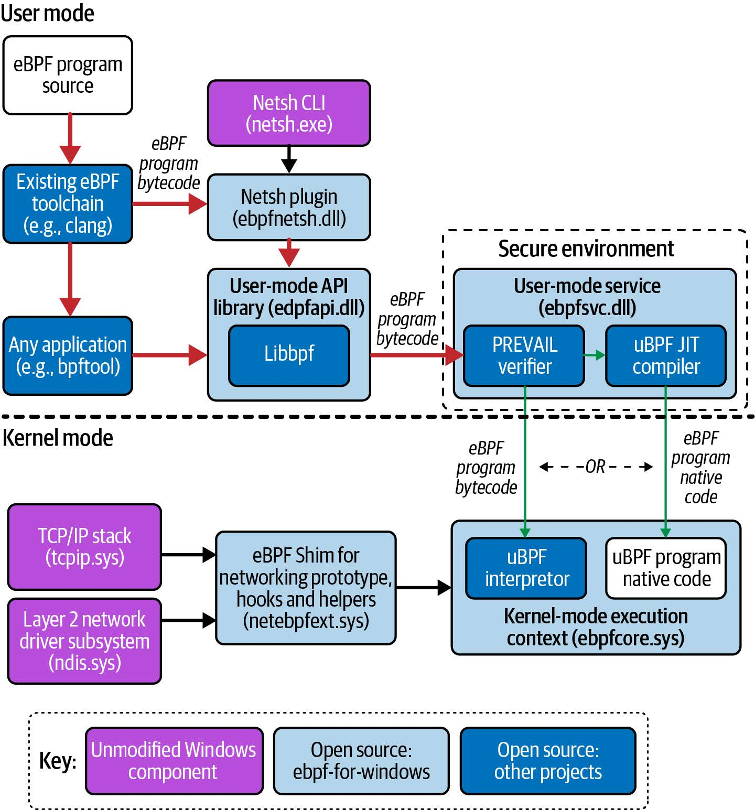

# 第十一章 eBPF 的未来演变

eBPF 尚未完成！与大多数软件一样，它在 Linux 内核中也在不断开发中，而且还在不断被添加到 Windows 操作系统中。在本章中，我们将探讨这项技术未来可能的发展方向。

自从 BPF 在 Linux 内核中引入以来，它已经发展成为一个拥有自己邮件列表和维护者的子系统。（向 Meta 公司的 Alexei Starovoitov 和 Andrii Nakryiko 以及 Isovalent 公司的 Daniel Borkmann 致敬，他们负责维护 Linux 内核中的 BPF 子树。）随着 eBPF 的普及和兴趣扩展到 Linux 内核社区之外，创建一个中立的机构来协调各方的合作变得很有意义。这个机构就是 eBPF 基金会。

## eBPF 基金会

[eBPF 基金会](https://ebpf.io/foundation)由 Google、Isovalent、Meta（当时称为 Facebook）、微软和 Netflix 于 2021 年在 Linux 基金会的支持下成立。该基金会作为一个中立机构，可以持有资金和知识产权，以便各个商业公司可以相互合作。

其目的不是要改变 Linux 内核社区和 Linux BPF 子系统贡献者开发 eBPF 技术的方式。基金会的活动由 BPF 指导委员会指导，该委员会完全由构建该技术的技术专家组成，包括 Linux 内核 BPF 维护者和其他核心 eBPF 项目的代表。

eBPF 基金会专注于 eBPF 作为技术平台以及支持 eBPF 开发的生态系统的发展。那些构建在 eBPF 之上并寻求中立管理机构的项目可能会在其他基金会中找到更合适的归属。例如，Cilium、Pixie 和 Falco 都是云原生计算基金会（CNCF）的一部分，这是有道理的，因为它们都旨在在云原生环境中使用。

除了现有的 Linux 维护者之外，这种合作的关键驱动力之一是 Microsoft 对在 Windows 操作系统中开发 eBPF 的兴趣。这就需要定义 eBPF 标准（Dave Thaler 在 Linux Plumbers Conference 上介绍了这项[标准化工作的现状](https://lpc.events/event/16/contributions/1355/attachments/973/2027/ebpf-standarization.pdf)），以便为一种操作系统编写的程序可以在另一种操作系统上使用。这项工作是在 eBPF 基金会的赞助下完成的。

## 支持 Windows 的 eBPF

Microsoft [支持 Windows 的 eBPF](https://microsoft.github.io/ebpf-for-windows/) 的工作正在顺利进行。当我在 2022 年最后几个月写这篇文章时，已经有[功能演示](https://github.com/microsoft/ebpf-for-windows-demo)展示了在 Windows 上运行的 Cilium Layer 4 负载均衡和基于 eBPF 的连接跟踪。

我之前提到过，eBPF 编程是内核编程，乍看起来，一个在 Linux 内核中运行并且可以访问 Linux 内核数据结构的程序，在其他完全不同的操作系统中也能运行可能会让人感到不直观。但实际上，在实践中，特别是涉及到网络编程时，所有操作系统之间会有很多共同之处。无论是在 Windows 还是 Linux 机器上创建的网络数据包，其结构是相同的，而且网络栈的各层需要以相同的方式进行处理。

您还会记得，eBPF 程序由一组字节码指令组成，这些指令由内核中的虚拟机（VM）处理。虚拟机也可以在 Windows 中实现！

图 11-1 显示了支持 Windows 的 eBPF 的架构概览，摘自该项目的 [GitHub 仓库](https://github.com/microsoft/ebpf-for-windows)。从图中可以看出，Windows 版 eBPF 重用了现有 eBPF 生态系统中的一些开源组件，如 libbpf 和 Clang 中用于生成 eBPF 字节码的支持。Linux 内核是以 GPL 许可的，而 Windows 是专有的，因此 Windows 项目不能重用 Linux 内核实现校验器的任何部分。（非要这样做也可以，但这样做需要微软同时发布 GPL 许可证下的 Windows 源代码）相反，它使用了 [PREVAIL 校验器](https://vbpf.github.io/)和 [uBPF JIT 编译器](https://github.com/iovisor/ubpf)（两者都是许可授权的，因此可以被更广泛的项目和组织使用）。

图 11-1. 适用于 Windows 的 eBPF 架构概览，改编自 [https://github.com/microsoft/ebpf-for-windows#architectural-overview](https://github.com/microsoft/ebpf-for-windows#architectural-overview)

一个有趣的区别是，eBPF 代码是在用户空间的 Windows 安全环境中进行验证和 JIT 编译的，而不是在内核中（图 11-1 中内核中的 uBPF 解释器仅用于调试构建，不用于生产环境）。

期望每个在 Linux 上编写的 eBPF 程序都能在 Windows 上运行是不现实的。但这与让 eBPF 程序在不同版本的 Linux 内核上运行所面临的挑战并无太大区别：即使支持 CO-RE，内核的内部数据结构也可能发生变化，不同版本之间也可能添加或删除数据结构。eBPF 程序员的工作就是优雅地处理这些可能性。

说到 Linux 内核的变化，未来几年我们预计 eBPF 会发生哪些变化？

## Linux eBPF 演变

自 3.15 以来，eBPF 的功能几乎与内核的每个版本同步发展。如果您想知道任何特定版本都有哪些功能，BCC 项目会提供一份[有用的列表](https://github.com/iovisor/bcc/blob/master/docs/kernel-versions.md)。当然，我也期待未来几年会有更多新功能加入。

预测即将发生的事情的最好方法就是倾听正在研究的人的意见。例如，在 2022 年 Linux Plumbers 大会上，eBPF 维护者 Alexei Starovoitov 发表了演讲，讨论了他期望看到 eBPF 程序使用的 C 语言如何发展。（Alexei Starovoitov 在[此视频](https://www.youtube.com/watch?v=K08YCgALHDo)中讨论了 BPF 从受限 C 语言到扩展且安全的 C 语言的历程）我们已经看到 eBPF 从支持几千条指令发展到几乎无限的复杂性，并增加了对循环的支持和不断增加的 BPF 辅助函数集。随着附加功能被添加到所支持的 C 中，并且在验证器的支持下，eBPF C 语言可以发展到具有开发内核模块的所有灵活性，但又具有 eBPF 的安全性和动态加载特性。

正在讨论和开发的 eBPF 新特性和新功能的其他一些想法包括：

- _签名的 eBPF 程序_
  - 软件供应链安全是过去几年的热门话题，其中一个关键要素是能够验证您打算运行的程序是否来自预期的来源，并且没有被篡改。一种通常的实现方式是验证伴随程序的加密签名。您可能认为内核可以在 eBPF 程序的验证步骤中执行此操作，但不幸的是，这并不简单！正如您在本书中看到的，用户空间加载器会动态地调整程序，包含有关 map 位置和 CO-RE 相关信息，从签名的角度来看，这很难与恶意修改区分开来。这是 eBPF 社区[急于找到解决方案](https://lpc.events/event/16/contributions/1357/)的一个问题。
- _长效内核指针_
  - eBPF 程序可以使用辅助函数或 kfunc 获取内核对象的指针，但指针仅在程序执行期间有效。指针不能存储在 map 中供以后检索。支持[类型化指针（typed pointer support）](https://lwn.net/Articles/900749/)的想法将使这一领域更具灵活性。
- _内存分配_
  - 对于 eBPF 程序来说，简单地调用内存分配函数（如 `kmalloc()`）并不安全，但有[一项建议](https://lwn.net/ml/bpf/20220623003230.37497-1-alexei.starovoitov@gmail.com/)提出了一种 eBPF 专用的替代方法。

您什么时候能够利用新出现的 eBPF 功能？作为终端用户，您能够利用的功能取决于您在生产中运行的内核版本，正如我在第 1 章中讨论的那样，内核版本可能需要几年的时间才能成为 Linux 的稳定发行版。作为个人，您可能会选择最新版本的内核，但绝大多数运行服务器部署的组织都使用稳定的、受支持的版本。 eBPF 程序员必须考虑到，如果他们编写的代码利用了内核中添加的最新功能，那么这些功能在未来几年内不太可能在大多数生产环境中使用。一些组织可能有足够紧迫的需求，值得更快地推出新的内核版本，以便尽早采用新的 eBPF 功能。

例如，在另一场关于[构建未来网络](https://www.youtube.com/watch?v=Kvdh78TURck)的前瞻性演讲中，Daniel Borkmann 讨论了一项名为 _Big TCP_ 的功能。该功能在 Linux 5.19 版本中加入，通过在内核中批量处理网络数据包，使网络速度达到 100 GBit/s（甚至更快）。大多数 Linux 发行版在几年内都不会支持这么新的内核，但对于处理大量网络流量的专业机构来说，也许值得尽早升级。今天在 eBPF 和 Cilium 中添加 Big TCP 支持意味着大规模用户可以使用它，尽管我们大多数人暂时还无法启用它。

由于 eBPF 允许动态调整内核代码，因此我们有理由期待它被用于解决 "现场" 问题。在第 9 章中，您了解到如何使用 eBPF 来减少内核漏洞；此外，使用 eBPF 来帮助支持硬件设备（如鼠标、键盘和游戏控制器等[人机接口设备](https://lwn.net/Articles/909109/)）的工作也在进行中。这项工作是在现有支持的基础上进行的

## eBPF 是一个平台，而不是一个特性

大约十年前，最热门的新技术是容器，似乎每个人都在谈论容器是什么以及容器会带来哪些优势。如今，eBPF 也处于类似的阶段，大量的会议演讲和博文——我在本书中提到过其中的几篇，都在夸大 eBPF 的好处。如今，容器已成为许多开发人员日常生活的一部分，无论是使用 Docker 或其他容器运行时在本地运行代码，还是将代码部署到 Kubernetes 环境中。eBPF 是否也会成为每个人的常规工具包的一部分？

我相信答案是否定的——或者至少不是直接的。大多数用户不会直接编写 eBPF 程序或使用 `bpftool` 等实用程序手动操作它们。但他们会定期与使用 eBPF 构建的工具进行交互，无论是性能测量、调试、网络、安全、跟踪，还是尚未使用 eBPF 实现的大量其他功能。用户可能不知道他们正在使用 eBPF，就像他们可能不知道当他们使用容器时，他们正在使用命名空间和 cgroup 等内核功能一样。

如今，了解 eBPF 的项目和供应商都在强调他们对 eBPF 的使用，因为 eBPF 功能强大、优势众多。随着基于 eBPF 的项目和产品获得越来越多的关注和市场份额，eBPF 正在成为基础架构工具的默认技术平台。

eBPF 编程知识现在是并将继续是一种广受欢迎但相对稀有的技能，就像当今的内核开发比开发业务应用程序或游戏要少得多一样。如果您喜欢深入研究较低级别的系统并希望构建必要的基础设施工具，那么 eBPF 技能将为您提供很好的帮助。我希望这本书对您的 eBPF 之旅有所帮助！

## 进一步阅读

在本书中，我提供了具体文章和文档页面的参考资料。下面列出了一些其他资源，希望对您的 eBPF 之旅有所帮助：

- eBPF 社区网站 [ebpf.io](https://ebpf.io/)
- [Cilium 文档](https://docs.cilium.io/en/stable/)中的 BPF 和 XDP 参考资料
- [关于 BPF 的 Linux 内核文档](https://docs.kernel.org/bpf/index.html)
- 关于使用 eBPF 进行性能评估和可观察性的[Brendan Gregg 网站](https://www.brendangregg.com/)
- [Andrii Nakryiko 的网站](https://nakryiko.com/)，特别是有关 CO-RE 和 libbpf 的更多信息
- [Lwn.net](https://lwn.net/)，一个很棒的关于 Linux 内核更新的资源，包括 BPF 子系统
- [Elixir.bootlin.com](https://elixir.bootlin.com/linux/latest/source)，您可以在其中浏览 Linux 源代码
- [eCHO](https://www.youtube.com/playlist?list=PLDg_GiBbAx-mY3VFLPbLHcxo6wUjejAOC)，每周一次的现场直播，涉及 eBPF 和 Cilium 社区的各种主题（本文作者是该直播的定期演讲者）。

## 结论

恭喜您完成了这本书！

我希望通过阅读《学习 eBPF》这本书，您能深入了解 eBPF 的强大功能。也许它能激励您自己编写 eBPF 代码，或者尝试使用我讨论过的一些工具。如果您已经决定进行一些 eBPF 编程，我希望这本书能让您对如何开始有一些信心。如果您在阅读本书的过程中完成了练习，那就太棒了！

如果您对 eBPF 感兴趣，有很多方法可以让您参与到社区中来。最好的起点是 [ebpf.io](https://ebpf.io/) 网站。这将为您提供最新的新闻、项目、活动和事件，同时还提供了 [eBPF Slack](http://ebpf.io/slack) 频道，在这里您可以找到具有专业知识的人回答您的任何问题。

欢迎您对本文提出反馈、评论和任何修改意见。您可以通过本书附带的 GitHub 存储库提供意见：[github.com/lizrice/learning-ebpf](https://github.com/lizrice/learning-ebpf)。我也很乐意直接听取您的意见。您可以在互联网上的许多地方通过 @lizrice 找到我。
