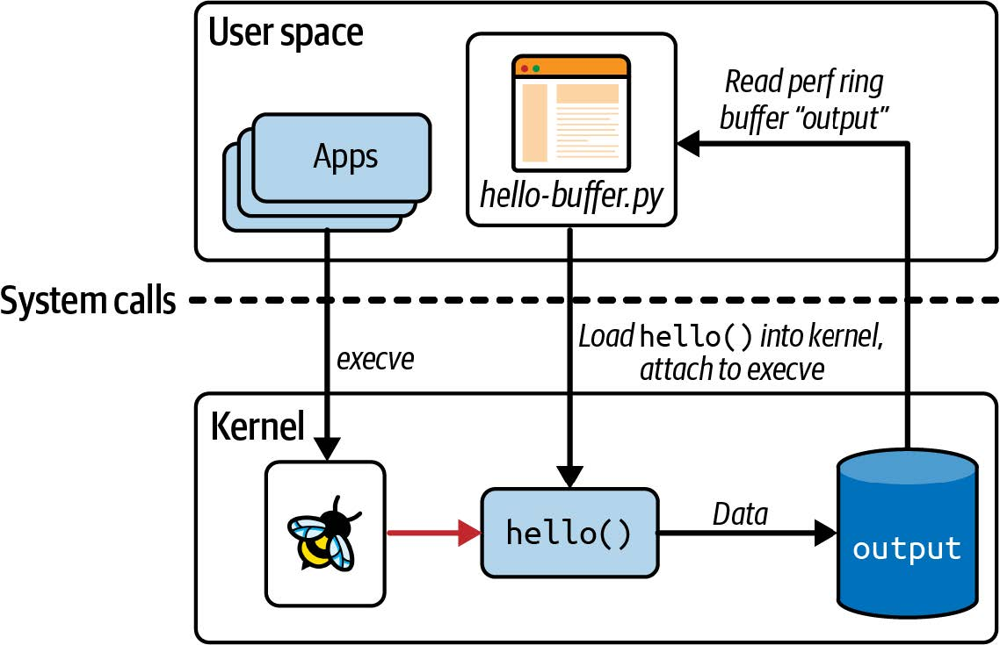

# 第 2 章 eBPF 的 Hello World

在上一章中，我讨论了 eBPF 的强大之处，但如果您尚未具体理解运行 eBPF 程序的真正含义，那也没有关系。在本章中，我将通过一个简单的“Hello World”示例，让您更好地了解它。

正如您在阅读本书时会了解到的，有几种不同的库和框架可用于编写 eBPF 应用程序。作为热身，我将向您展示从编程角度来看可能最易于理解的方法：使用[BCC Python 框架](https://github.com/iovisor/bcc)。这提供了一种非常简单的方式来编写基本的 eBPF 程序。出于我将在第 5 章中介绍的原因，对于分发给其他用户的生产应用程序，这不一定是我推荐的方法，但对于初学者来说非常棒。

正如您在阅读本书时将了解到的，编写 eBPF 应用程序有多种不同的库和框架。作为热身，我将向您展示从编程角度来看最容易上手的方法：[BCC Python 框架](https://github.com/iovisor/bcc)。这提供了一种非常简单的方法来编写基本的 eBPF 程序。出于我将在第 5 章中介绍的原因，对于分发给其他用户的生产应用程序，这不一定是我推荐的方法，但它非常适合于入门。

> [!NOTE]
>
> 如果您想亲自尝试这些代码，可以在 [https:// github.com/lizrice/learning-ebpf](https://github.com/lizrice/learning-ebpf) 的 chapter2 目录中找到。
>
> 您可以在[https://github.com/iovisor/bcc](https://github.com/iovisor/bcc) 找到 BCC 项目，并在 [https://github.com/iovisor/bcc/blob/master/INSTALL.md](https://github.com/iovisor/bcc/blob/master/INSTALL.md) 上找到安装 BCC 的说明。

## BCC 的 “Hello World”

下面是 _hello.py_ 的全部源代码，这是一个使用 BCC 的 Python 库编写的 eBPF “Hello World”应用程序[^1]：

```python
#!/usr/bin/python3
from bcc import BPF

program = r"""
int hello(void *ctx) {
    bpf_trace_printk("Hello World!");
    return 0;
}
"""

b = BPF(text=program)
syscall = b.get_syscall_fnname("execve")
b.attach_kprobe(event=syscall, fn_name="hello")

b.trace_print()
```

这段代码由两部分组成：将在内核中运行的 eBPF 程序，和将 eBPF 程序加载到内核并读取其生成的跟踪信息的一些用户空间代码。如图 2-1 所示，_hello.py_ 是该应用程序的用户空间部分，而 `hello()` 是在内核中运行的 eBPF 程序。


_图 2-1. “Hello World” 的用户空间和内核组件_

让我们深入了解源代码的每一行，以便更好地理解它。

第一行表明这是 Python 代码，可以运行它的程序是 Python 解释器 （_/usr/bin/python_）。

eBPF 程序本身是用 C 代码编写的，具体如下：

```c
int hello(void *ctx) {
    bpf_trace_printk("Hello World!");
    return 0;
}
```

这个 eBPF 程序所做的只是使用一个辅助函数 `bpf_trace_printk()` 来写一条消息。辅助函数是“扩展（extended）”BPF 与其“经典（classic）”前身的另一个区别特征。它们是一组 eBPF 程序可以调用与系统交互的函数；我将在第 5 章进一步讨论它们。目前，您可以将其视为打印一行文本。

整个 eBPF 程序在 Python 代码中被定义为一个名为 program 的字符串。该 C 程序需要先进行编译才能执行，但 BCC 会为您处理好。 （您将在下一章中看到如何自己编译 eBPF 程序）您所需要做的就是在创建 BPF 对象时将此字符串作为参数传递，如下行所示：

整个 eBPF 程序在 Python 代码中定义为一个名为 `program` 的字符串。这个 C 程序需要在执行之前进行编译，但 BCC 为您处理了这一点。（您将在下一章中看到如何自己编译 eBPF 程序。）您所需要做的就是在创建 BPF 对象时将此字符串作为参数传入，如下所示：

```python
b = BPF(text=program)
```

eBPF 程序需要附加到一个事件上，在这个例子中，我选择附加到系统调用 `execve` 上，这是用于执行程序的系统调用。无论何时，在这台机器上启动新程序，都会调用 `execve()`，从而触发 eBPF 程序。虽然“execve()”名称是 Linux 中的标准接口，但实现它的内核函数的名称取决于芯片架构，但 BCC 提供了一种方便的方法来查找我们运行的机器的函数名称：

```python
syscall = b.get_syscall_fnname("execve")
```

现在，`syscall`代表我要使用`kprobe`附加到的内核函数的名称（第 1 章已经介绍了`kprobe`的概念）[^2]。您可以像这样将`hello`函数附加到该事件上：

```python
b.attach_kprobe(event=syscall, fn_name="hello")
```

此时，eBPF 程序被加载到内核中并附加到一个事件上，因此只要机器上启动新的可执行文件时，该程序就会被触发。 Python 代码中剩下要做的就是读取内核输出的跟踪信息并将其输出到屏幕上：

```python
b.trace_print()
```

这个 `trace_print()` 函数将无限循环（直到您停止程序，例如通过 **`Ctrl+C`**），显示所有跟踪信息。

图 2-2 说明了这段代码。Python 程序编译 C 代码，将其加载到内核，并将其附加到 execve 系统调用的 kprobe 上。无论何时在这台（虚拟）机器上调用 `execve()`，都会触发 eBPF 程序 `hello()` ，后者会将一行跟踪信息写入一个特定的伪文件中。（稍后在本章中我会介绍该伪文件的位置。）Python 程序从伪文件中读取跟踪消息并显示给用户。


_图 2-2. "Hello World" 的操作_

## 运行 "Hello World"

运行这个程序，根据您使用的（虚拟）机器上发生的情况，您可能会立即看到生成的跟踪信息，因为其他进程可能正在执行带有 `execve` 系统调用的程序[^3]。如果没有看到任何输出，请打开第二个终端并执行您喜欢的任何命令[^4]，您将看到 “Hello World” 生成的相应跟踪信息：

```bash
$ hello.py
b' bash-5412 [001] .... 90432.904952: 0: bpf_trace_printk: Hello World'
```

> [!NOTE]
>
> 由于 eBPF 非常强大，因此需要特殊权限才能使用它。权限会自动分配给 root 用户，因此最简单的方法是以 root 身份运行 eBPF 程序，或使用 `sudo` 命令。为清晰起见，本书中的示例命令不会包含 `sudo`，但如果您遇到“Operation not permitted”错误，首先要检查的是您是否以非特权用户身份尝试运行 eBPF 程序。
>
> `CAP_BPF` 是在内核版本 5.8 中引入的，它赋予了一些执行 eBPF 操作（如创建某些类型的映射）的足够权限。然而，您可能还需要额外的权限：
>
> - 加载跟踪程序需要 `CAP_PERFMON` 和 `CAP_BPF`。
> - 加载网络程序需要 `CAP_NET_ADMIN` 和 `CAP_BPF`。
>
> 关于这方面的详细信息，请参阅 Milan Landaverde 的博客文章 [“CAP_BPF 简介（Introduction to CAP_BPF）”](https://mdaverde.com/posts/cap-bpf/)。

一旦 eBPF 程序 _hello_ 加载并附加到一个事件，就可以被预先存在的进程生成的事件触发。这应该进一步巩固了您在第 1 章中学到的几点：：

- eBPF 程序可用于动态更改系统行为。无需重新启动机器或重启现有进程。eBPF 代码一旦附加到事件上，就会立即生效。
- 无需更改其他应用程序，即可使它们对 eBPF 可见。无论您在该机器上的哪个终端访问，如果您在其中运行可执行文件，它将使用 `execve()` 系统调用，而如果您将 _hello_ 程序附加到该系统调用，它将被触发生成跟踪输出。同样，如果您有一个运行可执行文件的脚本，它也会触发 eBPF 程序 _hello_。您无需更改终端的 shell、脚本或正在运行的可执行文件。

跟踪输出不仅显示了 `"Hello World"` 字符串，还显示了一些关于触发 eBPF 程序 _hello_ 运行的事件的附加上下文信息。在本节开头显示的示例输出中，执行 `execve` 系统调用的进程 ID 为 5412，并且它正在运行 `bash` 命令。对于跟踪消息，这些上下文信息作为内核跟踪基础结构的一部分被添加（这并不是 eBPF 所特有的），但正如您将在本章稍后看到的，也可以在 eBPF 程序中检索到这样的上下文信息。

您可能会想知道 Python 代码是如何知道从哪里读取跟踪输出的。答案并不复杂——内核中的 `bpf_trace_printk()` 辅助函数总是将输出发送到同一个预定义的伪文件位置：_/sys/kernel/debug/tracing/trace_pipe_。您可以通过使用 `cat` 查看其内容来确认这一点；您需要 root 权限才能访问它。

对于简单的 “Hello World” 示例或基本的调试目的来说，一个单一的跟踪管道（trace pipe）位置是可以接受的，但也非常有限。输出格式几乎没有灵活性，并且只支持字符串输出，因此对于传递结构化信息并不是特别有用。或许最重要的是，整个（虚拟）机器上只有这样一个位置。如果同时运行多个 eBPF 程序，它们都会将跟踪输出写入同一个跟踪管道，这对操作人员来说可能会非常混乱。

有一种获取 eBPF 程序信息的更好方法：使用 eBPF 映射（eBPF Map）。

## BPF 映射（eBPF Maps）

*映射（map）*是一种数据结构，可以从 eBPF 程序和用户空间访问。映射是将扩展 BPF 与其经典前身区分开来的一个重要特性。（您可能会认为这意味着它们通常被称为 “eBPF 映射（eBPF maps）”。但实际上，您会经常看到 “BPF 映射（BPF maps）”。通常，这两个术语可以互换使用。）

映射可以用于在多个 eBPF 程序之间共享数据，或在用户空间应用程序与内核中运行的 eBPF 代码之间进行通信。典型的用途包括：

- 用户空间写入配置信息，以便 eBPF 程序检索
- eBPF 程序存储状态，供另一个 eBPF 程序（或未来运行的同一程序）检索
- eBPF 程序将结果或指标写入映射，以供用户空间应用程序检索并展示结果

在 Linux 的 [_uapi/linux/bpf.h_ 文件](https://elixir.bootlin.com/linux/v5.15.86/source/include/uapi/linux/bpf.h#L878)中定义了各种类型的 BPF 映射，并且[内核文档](https://docs.kernel.org/bpf/maps.html)中也有一些关于它们的信息。一般来说，它们都是键-值存储，在本章中，您将看到哈希表（hash tables）、perf 和环形缓冲区（ring buffers）、eBPF 程序数组（arrays of eBPF programs）等映射的示例。

有些映射类型被定义为数组，其键类型始终为 4 字节索引；其他映射是哈希表，可以使用任意数据类型作为键。

有些映射类型针对特定类型的操作进行了优化，例如[先进先出队列](https://docs.kernel.org/bpf/map_queue_stack.html)、[后进先出栈](https://docs.kernel.org/bpf/map_queue_stack.html)、[最近最少使用的数据存储](https://docs.kernel.org/bpf/map_hash.html)、[最长前缀匹配](https://docs.kernel.org/next/bpf/map_lpm_trie.html)和[布隆过滤器](https://docs.kernel.org/bpf/map_bloom_filter.html)（一种概率数据结构，旨在提供非常快速的元素存在性检查）。

有些 eBPF 映射类型保存特定类型对象的信息。例如，[sockmaps](https://lwn.net/Articles/731133/) 和 [devmaps](https://docs.kernel.org/bpf/map_devmap.html) 保存有关套接字和网络设备的信息，并被网络相关的 eBPF 程序用来重定向流量。程序数组映射（program array map）存储一组索引的 eBPF 程序（正如您将在本章稍后看到的），这用于实现尾调用（tail calls），即一个程序可以调用另一个程序。甚至还有一种 [map-of-maps 类型](https://docs.kernel.org/bpf/map_of_maps.html)，支持存储关于映射的信息。

有些映射类型有 per-CPU 变体，即每个 CPU 核心对于该映射都有各自的版本，并且内核使用不同的内存块来存储它们。这可能会让您担心*非* per-CPU 映射的并发问题，即多个 CPU 核心可能会同时访问同一个映射。内核版本 5.1 中添加了对（某些）映射的自旋锁支持，我们将在第 5 章中回到这个话题。

下一个示例（[GitHub 仓库](https://github.com/lizrice/learning-ebpf)中的 _chapter2/hello-map.py_）展示了一些使用哈希表映射（hash table map）的基本操作。它还演示了 BCC 提供的一些方便的抽象，使映射的使用变得非常容易。

### 哈希表映射（Hash Table Map）

像本章前面的示例一样，这个 eBPF 程序将附加到 `execve` 系统调用的入口处的 kprobe。它将用键值对填充哈希表，其中键是用户 ID，值是该用户 ID 下运行的进程调用 `execve` 的次数。实际上，这个示例将显示不同用户运行程序的次数。

首先，让我们看一下 eBPF 程序本身的 C 代码：

```c
BPF_HASH(counter_table);  // 1

int hello(void *ctx) {
    u64 uid;
    u64 counter = 0;
    u64 *p;

    uid = bpf_get_current_uid_gid() & 0xFFFFFFFF;  // 2
    p = counter_table.lookup(&uid);  // 3
    if (p != 0) {  // 4
        counter = *p;
    }
    counter++;  // 5
    counter_table.update(&uid, &counter);  // 6
    return 0;
}
```

1. `BPF_HASH()` 是一个 BCC 宏，用于定义一个哈希表映射。
2. `bpf_get_current_uid_gid()` 是一个辅助函数，用于获取触发此 kprobe 事件的进程的用户 ID。用户 ID 保存在返回的 64 位值的低 32 位中。（高 32 位保存组 ID，但在这里，该部分被屏蔽掉。）
3. 在哈希表中查找与用户 ID 匹配的键条目。它返回指向哈希表中对应值的指针。
4. 如果该用户 ID 有条目，将 `counter` 变量设置为哈希表中的当前值（由 `p` 指向）。如果哈希表中没有该用户 ID 的条目，指针将为 `0`，`counter` 值将保持为 `0`。
5. 无论当前的 `counter` 值是多少，它都会增加一。
6. 用该用户 ID 的新 `counter` 值更新哈希表。

仔细看一下访问哈希表的代码行：

```c
p = counter_table.lookup(&uid);
```

以及后面的：

```c
counter_table.update(&uid, &counter);
```

如果您在想“这不是标准的 C 代码！”，那么没错，您绝对是正确的。C 语言不支持在结构体上定义这样的方法[^5]。这是一个很好的例子，说明了 BCC 的 C 版本实际上是一种类 C 语言，BCC 在将代码发送到编译器之前会对其进行重写。BCC 提供了一些便捷的快捷方式和宏，将其转换为“标准”的 C 代码。

就像前面的例子一样，C 代码被定义为一个名为 `program` 的字符串。该程序被编译、加载到内核，并附加到 `execve` 的 kprobe，方式与之前的 “Hello World” 示例完全相同：

```python
b = BPF(text=program)
syscall = b.get_syscall_fnname("execve")
b.attach_kprobe(event=syscall, fn_name="hello")
```

这次在 Python 端需要做更多的工作来读取哈希表中的信息：

```python
while True:  # 1
    sleep(2)
    s = ""
    for k,v in b["counter_table"].items():  # 2
        s += f"ID {k.value}: {v.value}\t"
    print(s)
```

1. 这段代码会无限循环，每两秒钟查看一次输出并显示。
2. BCC 自动创建一个 Python 对象来表示哈希表。该代码循环遍历所有值并将其打印到屏幕上。

当您运行此示例时，您将需要第二个终端窗口，您可以在其中运行一些命令。这是我获得的一些示例输出，在右侧用我在另一个终端中运行的命令进行了注释：

运行此示例时，您需要第二个终端窗口，来运行一些命令。以下是我获得的示例输出，在右侧注释了我在另一个终端中运行的命令：

```bash
Terminal 1                  Terminal 2
$ ./hello-map.py
                            [blank line(s) until I run something]
ID 501: 1                   ls
ID 501: 1
ID 501: 2                   ls
ID 501: 3   ID 0: 1         sudo ls
ID 501: 4   ID 0: 1         ls
ID 501: 4   ID 0: 1
ID 501: 5   ID 0: 2         sudo ls
```

这个示例每两秒生成一行输出，无论是否发生任何事情。在该输出的末尾，哈希表包含两个条目：

- `key=501, value=5`
- `key=0, value=2`

在第二个终端中，我的用户 ID 为 501。运行 `ls` 命令时，该用户 ID 下的 `execve` 计数器会增加。当我运行 `sudo ls` 时，会导致两次 `execve` 调用：一次是以用户 ID 501 执行 `sudo`；另一次是以 root 的用户 ID 0 执行 `ls`。

在这个例子中，我使用了哈希表来将数据从 eBPF 程序传递到用户空间。（我也可以使用数组类型的 Map，因为键是整数；而哈希表允许您使用任意类型作为键）当数据自然地以键值对的形式存在时，哈希表非常方便，但用户空间的代码必须定期轮询表来获取数据。Linux 内核已经支持了 [perf 子系统](https://perf.wiki.kernel.org/index.php/Main_Page)，用于从内核向用户空间发送数据，而且 eBPF 还包括对 perf 缓冲区（perf buffers）和其后继者 BPF 环形缓冲区（BPF ring buffers）的支持。让我们来看一下。

### Perf 和环形缓冲区映射（Ring Buffer Maps）

在本节中，我将描述一个稍微复杂一些的 “Hello World” 示例，该示例使用 BCC 的 `BPF_PERF_OUTPUT` 功能，将数据写入到一个 perf 环形缓冲区映射（perf ring buffer map）中。

> [!NOTE]
>
> 如果您使用的是 5.8 或更高版本的内核，现在通常更推荐使用 “BPF 环形缓冲区（BPF ring buffers）” 这一新构造，而不是 BPF perf 缓冲区（BPF perf buffers）。Andrii Nakryiko 在他的 [BPF 环形缓冲区（BPF ring buffers）](https://nakryiko.com/posts/bpf-ringbuf/)博客文章中讨论了它们之间的区别。您将在第 4 章中看到 BCC 的 `BPF_RINGBUF_OUTPUT` 的示例。

<div style="border: 1px solid #ccc; padding: 10px;">
<div style="text-align: center; margin-bottom: 10px;"><b>Ring Buffers</b></div>
	<p>环形缓冲区并不是 eBPF 独有的，但我会解释一下，以防您之前没有接触过。您可以将环形缓冲区想象为一个在逻辑上组织成环形的内存片段，具有独立的“写”指针和“读”指针。任意长度的数据写入写指针所在的位置，数据的长度信息包含在该数据的头部中。写指针移动到该数据的末尾，为下一个写操作做好准备。</p>
    <p>同样，对于读操作，数据从读指针所在的位置读取，使用头部来确定要读取的数据量。读指针沿着与写指针相同的方向移动，指向下一个可用的数据片段。如图 2-3 所示，显示了一个具有三个不同长度可读项的环形缓冲区。</p>
    <p>如果读指针追上了写指针，意味着没有数据可读。如果写操作会使写指针超过读指针，数据将不会被写入，并且<i>丢弃计数器（drop counter）</i>会增加。读操作包括丢弃计数器，以指示自上次成功读取以来是否有数据丢失。</p>
    <p>如果读写操作完全以相同的速率恒定地进行，并且总是包含相同的数据量，理论上您可以使用一个刚好容纳这些数据大小的环形缓冲区。在大多数应用中，读取、写入之间或两者之间的时间会有所不同，因此需要调整缓冲区大小以应对这些变化。</p>
    <p>
        
        <div style="text-align: center; "><i>图 2-3. 一个环形缓冲区</i></div>
    </p>
</div>

您可以在 Learning eBPF [GitHub 仓库](http://github.com/lizrice/learning-ebpf)的`chapter2/hello-buffer.py`中找到此示例的源代码。与本章早期展示的第一个“Hello World”示例一样，该版本在每次使用`execve()`系统调用时都会将字符串“Hello World”写入屏幕。它还会查找每个调用 execve()的进程 ID 和命令名称，以便您能够获得类似于第一个示例的输出。这为我提供了展示几个 BPF 辅助函数的机会。

您可以在 Learning eBPF [GitHub 仓库](https://github.com/lizrice/learning-ebpf)的 _chapter2/hello-buffer.py_ 中找到此示例的源代码。与本章开头看到的第一个 “Hello World” 示例一样，该版本将在每次使用 `execve()` 系统调用时将字符串 "Hello World" 写到屏幕上。此外，它还会查找每个调用 `execve()` 的进程 ID 和命令名称，以便您能够获得类似于第一个示例的输出。这给了我展示更多 BPF 辅助函数的机会。

这是将加载到内核的 eBPF 程序：

```c
BPF_PERF_OUTPUT(output);  // 1
struct data_t {  // 2
   int pid;
   int uid;
   char command[16];
   char message[12];
};

int hello(void *ctx) {
   struct data_t data = {};  // 3
   char message[12] = "Hello World";

   data.pid = bpf_get_current_pid_tgid() >> 32;  // 4
   data.uid = bpf_get_current_uid_gid() & 0xFFFFFFFF;  // 5

   bpf_get_current_comm(&data.command, sizeof(data.command));  // 6
   bpf_probe_read_kernel(&data.message, sizeof(data.message), message);  // 7
   output.perf_submit(ctx, &data, sizeof(data));  // 8

   return 0;
}
```

1. BCC 定义了用于创建映射的宏 `BPF_PERF_OUTPUT`，该映射用于将消息从内核传递到用户空间。我将这个映射命名为 `output`。
2. 每次运行 `hello()` 时，代码都会写入一个结构体的数据。以下是该结构体的定义，包含进程 ID、当前运行命令的名称和一条文本消息。
3. `data` 是一个局部变量，保存要提交的数据结构，而 `message` 保存 `"Hello World"` 字符串。
4. `bpf_get_current_pid_tgid()` 是一个辅助函数，用于获取触发此 eBPF 程序运行的进程 ID。它返回一个 64 位值，其中进程 ID 位于高 32 位[^6]。
5. `bpf_get_current_uid_gid()` 是您在前一个示例中看到的用于获取用户 ID 的辅助函数。
6. 同样，`bpf_get_current_comm()` 是一个辅助函数，用于获取执行 `execve` 系统调用的进程中正在运行的可执行文件（或“命令”）的名称。这是一个字符串，而不是像进程和用户 ID 那样的数值，在 C 语言中您不能简单地使用 `=` 赋值字符串。您必须将字符串应写入的字段的地址 `&data.command` 作为参数传递给辅助函数。
7. 对于这个示例，每次的消息都是 `"Hello World"`。`bpf_probe_read_kernel()` 将其复制到数据结构体中的正确位置。
8. 此时，数据结构体已经填充了进程 ID、命令名称和消息。调用 `output.perf_submit()` 将这些数据放入映射中。

就像第一个“Hello World”示例一样，这个 C 程序被分配给 Python 代码中的一个名为 program 的字符串。接下来是其余的 Python 代码：

```python
b = BPF(text=program)  # 1
syscall = b.get_syscall_fnname("execve")
b.attach_kprobe(event=syscall, fn_name="hello")

def print_event(cpu, data, size):  # 2
   data = b["output"].event(data)
   print(f"{data.pid} {data.uid} {data.command.decode()} {data.message.decode()}")

b["output"].open_perf_buffer(print_event)  # 3
while True:  # 4
   b.perf_buffer_poll()
```

1. 编译 C 代码，将其加载到内核中，并附加到 `syscall` 事件，与之前看到的“Hello World”版本相同。
2. `print_event` 是一个回调函数，它将在屏幕上输出一行数据。BCC 进行了一些繁重的工作，以便可以简单地通过 `b["output"]` 引用映射，并使用 `b["output"].event()` 从中获取数据。
3. `b["output"].open_perf_buffer()` 打开 perf 环形缓冲区。该函数将 `print_event` 作为参数，以定义在缓冲区中有数据可读取时使用的回调函数。
4. 现在，该程序将无限循环[^7]，轮询 perf 环形缓冲区。如果有任何可用数据，`print_event` 将被调用。

运行此代码，我们会得到类似于原来“Hello World”的输出：

```bash
$ sudo ./hello-buffer.py
11654 node Hello World
11655 sh Hello World
...
```

与以前一样，您可能需要打开第二个终端连接到相同的（虚拟）机器，并运行一些命令来触发输出。

与原来“Hello World”示例的最大区别在于，它不再使用一个中央跟踪管道（central trace pipe），而是通过一个名为 `output` 的环形缓冲区映射传递数据，该映射是由此程序创建供其自身使用的，如图 2-4 所示。



_图 2-4.使用 perf 环形缓冲器从内核向用户空间传递数据_

您可以使用 `cat /sys/kernel/debug/tracing/trace_pipe` 来验证信息没有传递到跟踪管道（trace pipe）。

除了展示环缓冲区映射的使用外，此示例还展示了一些 eBPF 辅助函数，用于检索触发 eBPF 程序运行的事件的上下文信息。这里您已经看到辅助函数获取用户 ID、进程 ID 和当前命令的名称。如第七章所述，程序类型和触发事件的类型决定了可用的上下文信息集合以及可用于检索信息的有效辅助函数集合。

上下文信息的可用性使得 eBPF 代码在可观测性方面极具价值。每当事件发生时，eBPF 程序不仅可以报告事件发生的事实，还可以报告触发事件的相关信息。由于所有这些信息都可以在内核内收集，而无需同步上下文切换到用户空间，因此性能也非常高。

在本书中，您将看到更多使用 eBPF 辅助函数收集其他上下文数据的示例，以及一些 eBPF 程序更改上下文数据甚至阻止事件发生的示例。

### 函数调用

您已经看到 eBPF 程序可以调用内核提供的辅助函数，但如果您想将编写的代码分割成多个函数呢？在软件开发中，通常被认为是良好的实践[^8]是将常见代码提取到一个函数中，然后从多个地方调用它，而不是一遍又一遍地重复相同的代码行。但在早期，eBPF 程序不允许调用辅助函数以外的其他函数。为了解决这个问题，程序员通常会指示编译器“始终内联（always inline）”他们的函数，如下所示：

```c
static __always_inline void my_function(void *ctx, int val)
```

通常，源代码中的一个函数会导致编译器发出一个跳转指令，这会使执行跳转到构成被调用函数的指令集合（然后在该函数完成时跳转回来）。您可以在图 2-5 的左侧看到这种情况的示意图。右侧显示了内联函数时的情况：没有跳转指令；相反，在调用函数内直接包含函数的指令副本。


_图 2-5. 非内联函数和内联函数的指令布局_

如果函数从多个地方调用，那么在编译后的可执行文件中将会有多个该函数的指令副本。（有时编译器可能选择内联某个函数以进行优化，这也是为什么您可能无法将 kprobe 附加到某些内核函数的原因之一。我将在第 7 章中再次讨论这个问题。）

如果从多个地方调用该函数，这会导致在编译后的可执行文件中包含多个该函数指令的副本。（有时编译器可能会出于优化目的，选择内联一个函数。这也是为什么您可能无法附加 kprobe 到某些内核函数的原因之一。在第七章中，我会再提到这一点。）

从 Linux 内核 4.16 和 LLVM 6.0 开始，解除了需要将函数内联的限制，以便 eBPF 程序员可以更自然地编写函数调用。然而，这个名为“BPF to BPF function calls”或“BPF 子程序”的特性目前不受 BCC 框架支持，所以我们将在下一章中回顾它。（当然，如果函数是内联的，您仍然可以继续在 BCC 中使用函数。）

从 Linux 内核 4.16 和 LLVM 6.0 开始，解除了要求函数内联的限制，因此 eBPF 程序员可以更自然地编写函数调用。然而，目前 BCC 框架不支持“BPF 到 BPF 函数调用（BPF to BPF function calls）”或“BPF 子程序（BPF subprograms）”这一特性，因此我们将在下一章中再讨论它。（当然，如果函数是内联的，您仍然可以在 BCC 中继续使用它们。）

在 eBPF 中，还有另一种机制可以将复杂功能分解成更小的部分：尾调用（tail calls）。

### 尾调用（Tail Calls）

正如 [ebpf.io](https://ebpf.io/what-is-ebpf/#tail--function-calls) 所描述的那样，“尾调用可以调用并执行另一个 eBPF 程序，并替换执行上下文，类似于 `execve()` 系统调用对常规进程的操作。”换句话说，尾调用完成后执行不会返回给调用者。

> [!NOTE]
>
> [尾调用](https://www.baeldung.com/cs/tail-vs-non-tail-recursion)绝不仅仅限于 eBPF 编程。尾调用的总体动机是避免在函数递归调用时一遍又一遍地增加栈帧，这最终可能导致栈溢出错误。如果您可以安排代码在最后调用递归函数，那么调用函数关联的栈帧实际上没有任何作用了。（译者注：在一个函数的最后一条语句调用递归函数，那么当前这个函数的栈帧也就没有什么用了，信息都已经传递给新的函数了。）尾调用允许调用一系列函数而不增加栈。这在 eBPF 中特别有用，因为[栈被限制为 512 字节](https://elixir.bootlin.com/linux/v5.19.17/source/include/linux/filter.h#L86)。

尾调用使用 `bpf_tail_call()` 辅助函数来完成，其签名如下：

```c
long bpf_tail_call(void *ctx, struct bpf_map *prog_array_map, u32 index)
```

该函数的三个参数的含义如下：

- `ctx` 允许从调用的 eBPF 程序传递上下文到被调用程序。
- `prog_array_map` 是一个`BPF_MAP_TYPE_PROG_ARRAY`类型的 eBPF 映射，用于保存一组文件描述符，这些描述符用于标识 eBPF 程序。
- `index` 表示应调用该组 eBPF 程序中的哪个程序。。

这个辅助函数有点不寻常，因为如果它成功执行，将永远不会返回。当前运行的 eBPF 程序的栈会被被调用的程序替换。如果指定的程序不存在于映射中，则可能会失败。在这种情况下，调用程序会继续执行。

用户空间代码必须（像往常一样）将所有 eBPF 程序加载到内核中，并设置程序数组映射（program array map）。

让我们看一个使用 BCC 编写的简单 Python 示例；您可以在[GitHub 仓库](https://github.com/lizrice/learning-ebpf)中的 _chapter2/hello-tail.py_ 找到代码。主 eBPF 程序附加到所有系统调用公共入口点的跟踪点（tracepoint）上。这个程序使用尾调用来跟踪特定系统调用操作码的消息。如果给定操作码没有尾调用，程序会跟踪一个通用消息。

如果您使用 BCC 框架，可以通过稍微简化的形式进行尾调用：

```c
prog_array_map.call(ctx, index)
```

在将代码传递到编译步骤之前，BCC 会将这一行重写为：

```c
bpf_tail_call(ctx, prog_array_map, index)
```

以下是 eBPF 程序及其尾调用的源代码：

```c
BPF_PROG_ARRAY(syscall, 300);  // 1

int hello(struct bpf_raw_tracepoint_args *ctx) {  // 2
    int opcode = ctx->args[1];  // 3
    syscall.call(ctx, opcode);  // 4
    bpf_trace_printk("Another syscall: %d", opcode);  // 5
    return 0;
}

int hello_exec(void *ctx) {  // 6
    bpf_trace_printk("Executing a program");
    return 0;
}

int hello_timer(struct bpf_raw_tracepoint_args *ctx) {  // 7
    int opcode = ctx->args[1];
    switch (opcode) {
        case 222:
            bpf_trace_printk("Creating a timer");
            break;
        case 226:
            bpf_trace_printk("Deleting a timer");
            break;
        default:
            bpf_trace_printk("Some other timer operation");
            break;
    }
    return 0;
}

int ignore_opcode(void *ctx) {  // 8
    return 0;
}
```

1. BCC 提供了一个 `BPF_PROG_ARRAY` 宏，用于轻松定义`BPF_MAP_TYPE_PROG_ARRAY` 类型的映射。我将该映射命名为 `syscall`，并设置了 300 个条目[^9]，对于这个示例来说应该足够了。
2. 在您稍后将看到的用户空间代码中，我将把这个 eBPF 程序附加到 `sys_enter` 原始跟踪点（raw tracepoint），任何系统调用都会触发该程序。附加到原始跟踪点的 eBPF 程序接收的上下文以 `bpf_raw_tracepoint_args` 结构体的形式传递。
3. 对于 `sys_enter`，原始跟踪点参数包括用于标识正在进行的系统调用的操作码（opcode）。
4. 在这里，我们对程序数组中键与操作码匹配的条目进行尾调用。BCC 在将源代码传递给编译器之前，会将这一行代码重写为对 `bpf_tail_call()` 辅助函数的调用。
5. 如果尾调用成功，这一行跟踪操作码值的代码将永远不会被执行。我用它来为映射中没有对应程序条目的操作码提供一个默认的跟踪行。
6. `hello_exec()` 是一个将加载到 `syscall` 程序数组映射中的程序。当操作码表示系统调用为 `execve()` 时，它将作为尾调用执行。它只是生成一行跟踪，告诉用户一个新程序正在执行。
7. `hello_timer()` 是另一个将加载到 `syscall` 程序数组中的程序。在本例中，它将被程序数组中的多个条目引用。
8. `ignore_opcode()` 是一个什么都不做的尾调用程序。我将它用于不希望生成任何跟踪的系统调用。

现在让我们看看加载和管理这一组 eBPF 程序的用户空间代码：

```python
b = BPF(text=program)
b.attach_raw_tracepoint(tp="sys_enter", fn_name="hello")  # 1

ignore_fn = b.load_func("ignore_opcode", BPF.RAW_TRACEPOINT)  # 2
exec_fn = b.load_func("hello_exec", BPF.RAW_TRACEPOINT)
timer_fn = b.load_func("hello_timer", BPF.RAW_TRACEPOINT)

prog_array = b.get_table("syscall")
prog_array[ct.c_int(59)] = ct.c_int(exec_fn.fd)  # 3
prog_array[ct.c_int(222)] = ct.c_int(timer_fn.fd)
prog_array[ct.c_int(223)] = ct.c_int(timer_fn.fd)
prog_array[ct.c_int(224)] = ct.c_int(timer_fn.fd)
prog_array[ct.c_int(225)] = ct.c_int(timer_fn.fd)
prog_array[ct.c_int(226)] = ct.c_int(timer_fn.fd)

# 忽略一些经常出现的系统调用
prog_array[ct.c_int(21)] = ct.c_int(ignore_fn.fd)
prog_array[ct.c_int(22)] = ct.c_int(ignore_fn.fd)
prog_array[ct.c_int(25)] = ct.c_int(ignore_fn.fd)
...

b.trace_print()
```

1. 这次，用户空间代码不是附加到 kprobe，而是将主 eBPF 程序附加到 `sys_enter` 跟踪点。
2. 调用`b.load_func()`会为每个尾调用程序返回一个文件描述符。注意，尾调用需要与其父程序具有相同的程序类型——在此示例中是 `BPF.RAW_TRACEPOINT`。同时需要指出的是，每个尾调用程序本身也是一个独立的 eBPF 程序。
3. 用户空间代码在 `syscall` 映射中创建条目。不必为每个可能的操作码都填充条目；如果某个特定操作码没有条目，这只是意味着不会执行尾调用。此外，多个条目指向同一个 eBPF 程序是完全可以的。在这种情况下，我希望 `hello_timer()` 尾调用被执行以处理一组与计时器相关的系统调用。
4. 系统中的某些系统调用被系统频繁地运行，如果为每个系统调用都生成一行跟踪信息，会导致跟踪输出混乱到无法阅读的程度。对于某些系统调用，我使用了`ignore_opcode()` 尾调用来处理。
5. 将跟踪输出打印到屏幕上，直到用户终止程序。

运行此程序会为（虚拟）机器上运行的每个系统调用生成跟踪输出，除非操作码对应的条目链接到 `ignore_opcode()` 尾调用。以下是从另一个终端运行 `ls` 命令的示例输出（为了可读性省略了一些细节）：

```bash
./hello-tail.py
b' hello-tail.py-2767 ... Another syscall: 62'
b' hello-tail.py-2767 ... Another syscall: 62'
...
b'          bash-2626 ... Executing a program'
b'          bash-2626 ... Another syscall: 220'
...
b'         <...>-2774 ... Creating a timer'
b'         <...>-2774 ... Another syscall: 48'
b'         <...>-2774 ... Deleting a timer'
...
b'            ls-2774 ... Another syscall: 61'
b'            ls-2774 ... Another syscall: 61'
...
```

具体执行的系统调用并不是重点，但您可以看到不同的尾调用被调用并生成跟踪消息。您还可以看到，对于在尾调用程序映射中没有对应条目的操作码，会生成默认消息 `Another syscall`。

> [!NOTE]
>
> 请查阅 Paul Chaignon 关于不同内核版本上[BPF 尾调用代价](https://pchaigno.github.io/ebpf/2021/03/22/cost-bpf-tail-calls.html)的博客文章。

自内核版本 4.2 起，eBPF 开始支持尾调用，但在很长一段时间内，尾调用与 BPF 到 BPF 函数调用（BPF to BPF function calls）是不兼容的。这一限制在内核版本 5.10 中被解除[^10]。

尾调用最多可以链式组合达到 33 次，再加上每个 eBPF 程序的指令复杂度限制为 100 万条指令，这意味着如今的 eBPF 程序员在编写完全在内核中运行的非常复杂的代码方面有很大的灵活性。

## 总结

希望通过展示一些具体的 eBPF 程序示例，本章可以帮助您巩固在内核中运行、由事件触发的 eBPF 代码的思维模型。您还看到了使用 BPF 映射从内核向用户空间传递数据的示例。

使用 BCC 框架隐藏了许多关于程序如何构建、加载到内核以及附加到事件的细节。在下一章中，我将向您展示编写“Hello World”的另一种方法，并深入探讨这些隐藏的细节。

## 练习

如果您想进一步探索 "Hello World"，这里有一些可选的活动，您可能想尝试一下（或思考一下）：

1. 修改 eBPF 程序 _hello-buffer.py_，使其对奇数和偶数进程 ID 输出不同的跟踪消息。

2. 修改 _hello-map.py_，使 eBPF 代码由多个系统调用触发。例如， `openat()` 常用于打开文件，`write()` 用于向文件写入数据。您可以先将 _hello_ eBPF 程序附加到多个系统调用 kprobes。然后尝试为不同的系统调用修改 eBPF 程序 _hello_ 的版本，证明您可以从多个不同的程序访问同一个映射。

3. eBPF 程序 _hello-tail.py_ 是一个附加到 `sys_enter` 原始跟踪点的示例。*任何*系统调用被调用时，都会触发该跟踪点。修改 _hello-map.py_ ，通过将其附加到相同的 `sys_enter` 原始跟踪点，展示每个用户 ID 发出的总系统调用的数量。
   以下是我做出该修改后得到的一些示例输出：

   ```bash
   $ ./hello-map.py
   ID 104: 6   ID 0: 225
   ID 104: 6   ID 101: 34  ID 100: 45  ID 0: 332   ID 501: 19
   ID 104: 6   ID 101: 34  ID 100: 45  ID 0: 368   ID 501: 38
   ID 104: 6   ID 101: 34  ID 100: 45  ID 0: 533   ID 501: 57
   ```

4. [BCC 提供的 `RAW_TRACEPOINT_PROBE` 宏](https://github.com/iovisor/bcc/blob/master/docs/reference_guide.md#7-raw-tracepoints)简化了附加到原始跟踪点的过程，它会告诉用户空间 BCC 代码自动将其附加到指定的跟踪点。尝试在 _hello-tail.py_ 中使用它，如下所示：

   - 将 `hello()` 函数的定义替换为 `RAW_TRACEPOINT_PROBE(sys_enter)`。
   - 从 Python 代码中移除显式的附加调用 `b.attach_raw_tracepoint()`。

   您应该会看到 BCC 自动附加，并且程序工作正常。这是 BCC 提供的许多方便宏的一个示例。

5. 您可以进一步修改 _hello_map.py_，使哈希表中的键标识特定的系统调用（而不是特定的用户）。输出将显示整个系统中该系统调用被调用的次数。

[^1]: 我最初为一个名为“eBPF 编程初学者指南”的讲座编写了这段代码。您可以在 [https://github.com/lizrice/ebpf-beginners](https://github.com/lizrice/ebpf-beginners) 找到原始代码以及幻灯片和视频的链接。
[^2]: 从 5.5 版本的内核开始，有一种更高效的方式来将 eBPF 程序附加到函数上，这种方式使用 fentry（以及相应的 fexit，代替 kretprobe 用于函数的退出）。我会在本书后面的章节中讨论这个话题，但现在为了使本章的示例尽可能简单，我仍然使用 kprobe。
[^3]: 我经常使用 VSCode 远程连接到云中的虚拟机。这台虚拟机上运行了大量的 Node 脚本，生成了很多来自这个“Hello World”应用的跟踪信息。
[^4]: 一些命令（比如 `echo` 是一个常见的例子）可能是 shell 内置命令，这些命令作为 shell 进程的一部分运行，而不是执行一个新的程序。因此，这些命令不会触发 `execve()` 事件，所以不会生成跟踪信息。
[^5]: C++ 支持，但 C 不支持。
[^6]: 低 32 位是*线程组 ID（thread group ID）*。对于单线程进程，这与进程 ID 相同；对于多线程进程，额外的线程会被分配不同的 ID。GNU C 库的文档对[进程 ID 和线程组 ID ](https://www.gnu.org/software/libc/manual/html_node/Process-Identification.html)之间的区别有很好的描述。
[^7]: 这只是示例代码，所以我不担心在键盘中断或其他细节上的清理工作！
[^8]: 这一原则通常被称为“DRY”（“Don’t Repeat Yourself”），由[《程序员修炼之道》（The Pragmatic Programmer）](https://media.pragprog.com/titles/tpp20/dry.pdf)推广。
[^9]: 在 Linux 中有大约 300 个系统调用，由于在这个示例中我没有使用最近添加的系统调用，所以这个数量已经足够了。
[^10]: 从 BPF 子程序中进行尾调用需要 JIT 编译器的支持，您将在下一章中遇到这个概念。在我用来编写本书示例的内核版本中，只有 x86 的 JIT 编译器支持这一功能，尽管[在 6.0 版本的内核中，ARM 也添加了对这一功能的支持](https://git.kernel.org/pub/scm/linux/kernel/git/torvalds/linux.git/commit/?id=d4609a5d8c70d21b4a3f801cf896a3c16c613fe1)。
